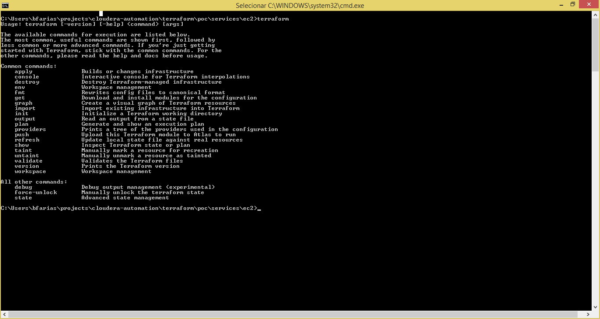

[Documentação](../../../documentacao.md) > [Automacao](../../automacao.md) > [TerraForm](../terraform.md)

# 1 - Terraform - instalacao no windows

1. Faça o Download  
   <https://www.terraform.io/downloads.html>
2. Descompacte o arquivo em um diretório de sua preferência  
   C:\Users\bfarias\tools\terraform
3. Altere a variável de ambiente para que o executável do terraform fique acessível ao cmd (<https://stackoverflow.com/questions/1618280/where-can-i-set-path-to-make-exe-on-windows>)
4. No cmd, digite o seguinte comando

   ```bash
   terraform
   ```



Pronto, o terraform está instalado.

Referência:<https://www.terraform.io/intro/getting-started/install.html>
