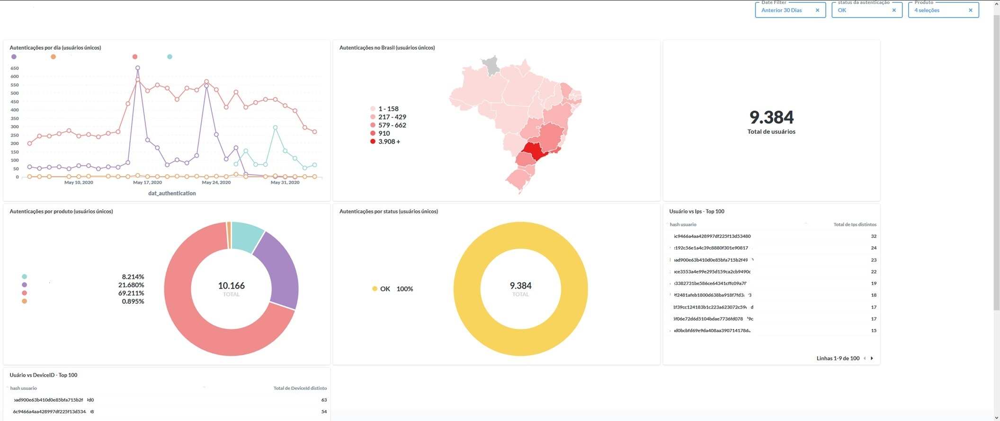

[Documentação](../../documentacao.md) > [AWS](../aws.md)

# Data Lake

Plataforma analítica na qual é possível centralizar diversas fontes de dados, permitindo com isso a exploração e a geração de hipóteses.

**Fonte de dados** : Todas as fontes de dados (bases relacionais e não relacionais, arquivos de logs e eventos) do UOLCS que podem se integrar com o Data Lake. Atualmente, as seguintes origens estão integradas:

| Origem        | Descrição                                                                      | Tipo de origem   |
|:--------------|:-------------------------------------------------------------------------------|:-----------------|
| **Gaudi**     | Sistema de autenticação do UOL.                                                | Arquivo de log   |
| **Sap Hana**  | DW oficial do UOLCS.                                                           | RDBMS            |
| **AWS**       | Dados de custo da AWS, que são capturados via api                              | API              |
| **Icustomer** | Ferramenta de CRM para mídias sociais da Plusoft                               | API              |
| **Jira**      | Ferramenta que permite o monitoramento de tarefas e acompanhamento de projetos | API              |
| **UOL Play**  | Dados de consumo do produto UOL Play                                           | API              |

**Ingestão de dados**: Tecnologias utilizadas na ingestão de dados

| Tecnologia   | Descrição                                                                             | Administração      |
|:-------------|:--------------------------------------------------------------------------------------|:-------------------|
| **Logstash** | Reponsável pelo envio dos eventos de autenticação em tempo real para o Kafka.         | Platcorp Segurança |
| **Spark**    | Atualmente utilizamos o spark (EMR) para cargas em lote e processamentos de dados Raw | BigData            |

**Kafka:** O papel do Kafka na arquitetura é permitir a integração de fontes de dados com o Data Lake ou deste com outros sistemas. Com a sua arquitetura distribuída permite que manutenções sejam realizadas na nossa infra sem que os produtores/consumidores sejam afetados, ou, devido ao seu alto throughput, seja capaz de receber uma carga elevada de dados (efeito de um ataque no Gaudi, por exemplo). Atualmente, somente o Gaudi posta eventos no cluster (~4mil por segundo).

**Kafka Connect:** É um framework de código aberto desenvolvido para padronizar a integração de diversos sistemas de dados com o Apache Kafka, ou vice-versa. Nesta arquitetura o connect é utilizado para sincronizar os dados do kafka com o S3 (camada raw), permitindo assim ter um tempo de retenção controlado no Kafka e ter o dado disponível em um storage barato caso haja necessidade de reprocessamento.

**S3:** O Amazon Simple Storage Service (Amazon S3) é um serviço de armazenamento que oferece alta disponibilidade e um baixo custo ($); os dados armazenados no S3 são criptografados através do [KMS](https://aws.amazon.com/pt/kms/) e somente são acessados por aplicações autorizadas

| Bucket                   | Descrição                                                                                                                                                                                                                                                                                                                                             |
|:-------------------------|:------------------------------------------------------------------------------------------------------------------------------------------------------------------------------------------------------------------------------------------------------------------------------------------------------------------------------------------------------|
| **uol-datalake-raw**     | A finalidade deste bucket é armazenar os dados da **camada Raw**, provenientes do **Kafka** ou **Spark**.                                                                                                                                                                                                                                             |
| **uol-datalake-staging** | Storage utilizado para armazenar os dados temporários que foram processados e subirão para o Redshift, ou para armazenar dados sem valor confirmado para o negócio, mas que serão explorados via Redshfit Spectrum. Se o resultado da exploração for positivo e houver a necessidade de ter o dado atualizado, este deverá ser carregado no Redshfit. |
| **uol-datalake-archive** | Armazena dados antigos que não são tão importantes para o negócio, permitindo que o storage do cluster Redshift seja aproveitado para outros casos.                                                                                                                                                                                                   |

**Redshift:**O Amazon Redshift é um banco de dados gerenciado pela AWS que oferece uma engine SQL muito eficiente para consultas analíticas complexas que requerem um poder de processamento elevado. Nesta arquitetura, é utilizado para ter o dado que vem da camada Raw sempre estruturado e atualizado (possibilita a atualização de registros, o que não é possível no S3), permitindo a sua exploração com performance

| Nome do Cluster                                                                                                | Perfil da instância   |   Num de instâncias |
|:---------------------------------------------------------------------------------------------------------------|:----------------------|--------------------:|
| [o](https://console.aws.amazon.com/redshiftv2/home?region=us-east-1#cluster-details?cluster=olago-prd)lago-prd | dc2.large             |                   9 |
| olago-qa                                                                                                       | dc2.large             |                   1 |

**Redshift Spectrum:**O Spectrum permite a execução de consultas contra dados estruturados e semiestruturados que estão armazenados no S3, ou seja, fora do Redshift. Na arquitetura em questão, a sua utilização se dá em operações de [Unload](https://docs.aws.amazon.com/pt_br/redshift/latest/dg/r_UNLOAD.html) entre a camada RAW e Staging e também no acesso aos dados arquivados.

****Apache Airflow:****O Airflow é uma plataforma para orquestrar e monitorar pipelines de dados. Por permitir o desenvolvimento dos fluxos de forma programática (em python, o que o torna bem flexível) e por ter integração com as principais tecnologias de bigdata, por ora foi escolhido como principal ferramenta de orquestração do time.

**Apache Spark**: O [Apache Spark](https://aws.amazon.com/big-data/what-is-spark/) é um sistema de processamento distribuído de código aberto usado para cargas de trabalho de bigdata. O Apache Spark utiliza o armazenamento em cache na memória e a execução otimizada para obter alta performance, além de oferecer suporte ao processamento geral de lotes, análise de streaming, Machine Learning, bancos de dados orientados a grafos e consultas ad hoc. Na infra de BigData, é utilizado para fazer cargas em lote na camada Raw, isto é, capturando os dados de um RDBMS, por exemplo, e os levando para o bucket **uol-datalake-raw**, além de permitir o processamento de dados em qualquer outra camada do Data Lake.

**Aws Glue:**No momento o Glue é utilizado apenas como repositório de metadados (S3 e Redshift).

**Apache Livy:**O Livy permite a interação por meio de uma interface REST com um cluster do EMR executando o Spark, para que operações como submit e kill sejam executadas de maneira remota. Com isso, foi possível integrar o Airflow com o Spark.

**Grafana:** Utilizado para monitoração da Infra, o que permite criar alarmes para o time em caso de anormalidade.

**CloudWatch:** Captura log de praticamente todos os recursos da Aws. No momento, apenas utilizamos o CLoudWatch como fonte de dados para o grafana.

**Terraform:** Permite ter a infraestrutura em código, o que facilita manutenções, entregas e garante uma maior rastreabilidade das mudanças; todos os recursos que são administrados pelo time de BigData na AWS foram criados via Terraform;

**Data Warehouse(DW):**  É um repositório central de informações que podem ser analisadas para tomar decisões. Diferente de um Data Lake, um DW geralmente exige que os dados sejam organizados em forma tabular (tabelas), porém alguns aplicativos, como big data, podem acessar dados mesmo que sejam "semiestruturados" ou não estruturados.

**[Metabase](https://metabase.intranet:3000/):** Front-End open source que permite a exploração de dados via Redshift

