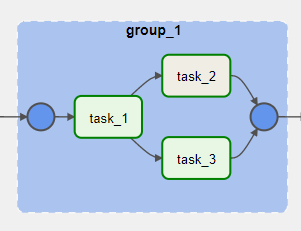
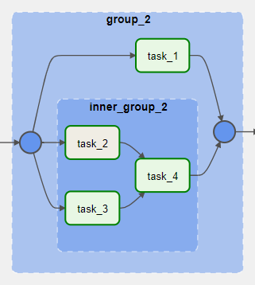

[Documentação](../../../../../documentacao.md) > [AWS](../../../../aws.md) > [Data Lake](../../../data-lake.md) > [Apache Airflow](../../apache-airflow.md) > [Dicas-airflow](../dicas-airflow.md)

# Utilizando Task Groups

A partir do versão 2.0 do airflow, é possível realizar o agrupamento de tasks e criar fluxos modulares de pipeline através de ***task groups***. Antes da versão 2.0 essas funcionalidades eram alcançadas através de sub dags. No entanto, devido a problemas de perfomance, implementação e consistencia a utilização de subdags caiu em desuso.

Criando **Task Group**

Declaração de Import para utilizar Task Group

```py
from airflow.utils.task_group import TaskGroup
```

No exemplo a seguir é instanciado o task group com o comando ***with***e fornecido o ***group\_id***com o nome do agrupamento. Na sequencia são criadas 3 tasks (1 sequencial e 2 paralelas) e associadas ao task group.

```py
# Início da definição da Task Group 1
    with TaskGroup( group_id="group_1", 
                    tooltip="Agrupamento 1" ) as group_1:
        task_1 = DummyOperator(task_id="task_1")
        task_2 = BashOperator(task_id="task_2", bash_command='echo 1')
        task_3 = DummyOperator(task_id="task_3")

        task_1 >> [task_2, task_3]
# Fim da definição da Task Group 1
```

Resultado do agrupamento:



No próximo exemplo é instanciado o task group com o comando ***with***e criado um task group aninhado fornecendo outro comando ***with*** dentro do agrupamento.

```py
# Início da definição da Task Group 2
    with TaskGroup( group_id="group_2", 
                    tooltip="Agrupamento 2") as group_2:

        task_1 = DummyOperator(task_id="task_1")

        # Início da definição da Task Group 3 interna a task group 2
        with TaskGroup("inner_group_2", tooltip="Agrupamento Interno 2") as inner_group_2:
            task_2 = BashOperator(task_id="task_2", bash_command='echo 1')
            task_3 = DummyOperator(task_id="task_3")
            task_4 = DummyOperator(task_id="task_4")

            [task_2, task_3] >> task_4
        # Fim da definição da Task Group 3 interna a task group 2

# Fim da definição da Task Group 2
```

Resultado do agrupamento:


