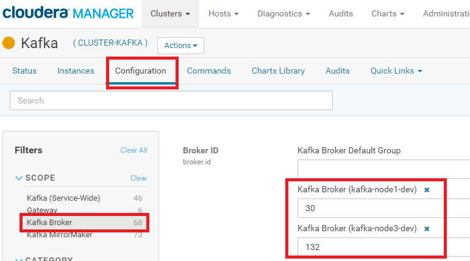

[Documentação](../../../../../documentacao.md) > [AWS](../../../../aws.md) > [Data Lake](../../../data-lake.md) > [Apache Kafka](../../apache-kafka.md) > [Comandos Kafka](../comandos-kafka.md)

# Adicionar/remover brokers do cluster

Neste exemplo, temos três brokers no cluster (kafka-node1-dev, kafka-node2-dev e kafka-node3-dev) e vamos remover a kafka-node2-dev, deixando apenas 2 máquinas do cluster.

1. Identifique o ID dos brokers (nodes do cluster que serão manipulados). Para isso, acesse o Cloudera Manager , clique no serviço "Kafka" → "Configuration", e no filtro "Scope" da lateral esquerda, selecione "Kafka Broker", e anote o broker.id referente a cada máquina.

   Identificando o broker.id

   

   No nosso caso, ficou assim:

   | Nome da máquina   |   broker.id |                   |
   |:------------------|------------:|:------------------|
   | kafka-node1-dev   |          30 | manter no cluster |
   | kafka-node2-dev   |          32 | remover           |
   | kafka-node3-dev   |         132 | manter no cluster |
2. Acesse uma das maquina via SSH, e execute o comando abaixo para listar os tópicos existentes no cluster

   **Identificando os topicos do cluster**

   ```bash
   #o zookeeper está instalado na kafka-node1-dev, e utiliza a porta 2181

   kafka-topics --list --zookeeper kafka-node1-dev:2181
   ```
3. Neste exemplo, vamos considerar que temos apenas o tópico "topico\_teste", então vamos utilizar o comando "describe" que irá mostrar o numero de partições, fator de replicação e como cada partição está distribuida pelo cluster

   ```bash
   kafka-topics --describe --topic topico_teste --zookeeper kafka-node1-dev:2181

   #RESULTADO
   #como podemos ver, este tópico está distribuido entre as tres maquinas, inclusive na broker 32 que queremos remover.

   Topic:topico_teste      PartitionCount:8        ReplicationFactor:2     Configs:
   Topic: topico_teste     Partition: 0    Leader: 132     Replicas: 132,30        Isr: 30,132
   Topic: topico_teste     Partition: 1    Leader: 30      Replicas: 30,32 Isr: 32,30
   Topic: topico_teste     Partition: 2    Leader: 32      Replicas: 32,132        Isr: 32,132
   Topic: topico_teste     Partition: 3    Leader: 132     Replicas: 132,32        Isr: 32,132
   Topic: topico_teste     Partition: 4    Leader: 30      Replicas: 30,132        Isr: 30,132
   Topic: topico_teste     Partition: 5    Leader: 32      Replicas: 32,30 Isr: 32,30
   Topic: topico_teste     Partition: 6    Leader: 132     Replicas: 132,30        Isr: 30,132
   Topic: topico_teste     Partition: 7    Leader: 30      Replicas: 30,32 Isr: 32,30

   ```
4. Crie um arquivo com o nome "topics.json" e cole o seguinte conteudo:

   **vi topics.json**

   ```bash
   { "version": 1,
     "topics": [
        {"topic": "topico_teste"}
     ]
   }


   ```
5. Vamos utilizar o "kafka-reassign-partitions" passando a lista dos brokers que continuação no cluster (30 e 132) e deverão receber as partições do broker 32. Essa ferramenta irá gerar um JSON com a configuração atual e outro com a proposta de como as partições serão distribuidas, considerando a nova lista de brokers

   ```bash
   kafka-reassign-partitions --zookeeper kafka-node1-dev:2181 --generate --topics-to-move-json-file topics.json --broker-list 30,132

   #RESULTADO:
   Current partition replica assignment
   {"version":1,"partitions":[{"topic":"topico_teste","partition":6,"replicas":[132,30],"log_dirs":["any","any"]},{"topic":"topico_teste","partition":1,"replicas":[30,32],"log_dirs":["any","any"]},{"topic":"topico_teste","partition":0,"replicas":[132,30],"log_dirs":["any","any"]},{"topic":"topico_teste","partition":3,"replicas":[132,32],"log_dirs":["any","any"]},{"topic":"topico_teste","partition":2,"replicas":[32,132],"log_dirs":["any","any"]},{"topic":"topico_teste","partition":7,"replicas":[30,32],"log_dirs":["any","any"]},{"topic":"topico_teste","partition":4,"replicas":[30,132],"log_dirs":["any","any"]},{"topic":"topico_teste","partition":5,"replicas":[32,30],"log_dirs":["any","any"]}]}

   Proposed partition reassignment configuration
   {"version":1,"partitions":[{"topic":"topico_teste","partition":6,"replicas":[132,30],"log_dirs":["any","any"]},{"topic":"topico_teste","partition":1,"replicas":[30,132],"log_dirs":["any","any"]},{"topic":"topico_teste","partition":0,"replicas":[132,30],"log_dirs":["any","any"]},{"topic":"topico_teste","partition":3,"replicas":[30,132],"log_dirs":["any","any"]},{"topic":"topico_teste","partition":2,"replicas":[132,30],"log_dirs":["any","any"]},{"topic":"topico_teste","partition":7,"replicas":[30,132],"log_dirs":["any","any"]},{"topic":"topico_teste","partition":4,"replicas":[132,30],"log_dirs":["any","any"]},{"topic":"topico_teste","partition":5,"replicas":[30,132],"log_dirs":["any","any"]}]}


   ```
6. Copie o conteúdo gerado no item anterior, e crie um novo arquivo chamado "reassignment.json" com o JSON da configuração proposta

   **vi reassignment.json**

   ```bash
   {"version":1,"partitions":[{"topic":"topico_teste","partition":6,"replicas":[132,30],"log_dirs":["any","any"]},{"topic":"topico_teste","partition":1,"replicas":[30,132],"log_dirs":["any","any"]},{"topic":"topico_teste","partition":0,"replicas":[132,30],"log_dirs":["any","any"]},{"topic":"topico_teste","partition":3,"replicas":[30,132],"log_dirs":["any","any"]},{"topic":"topico_teste","partition":2,"replicas":[132,30],"log_dirs":["any","any"]},{"topic":"topico_teste","partition":7,"replicas":[30,132],"log_dirs":["any","any"]},{"topic":"topico_teste","partition":4,"replicas":[132,30],"log_dirs":["any","any"]},{"topic":"topico_teste","partition":5,"replicas":[30,132],"log_dirs":["any","any"]}]}
   ```
7. Agora vamos utilizar a mesma ferramenta "kafka-reassign-partitions" para executar a configuração contida no "reassignment.json"

   ```bash
   kafka-reassign-partitions --zookeeper kafka-node1-dev:2181 --execute --reassignment-json-file reassignment.json


   #RESULTADO
   Current partition replica assignment

   {"version":1,"partitions":[{"topic":"topico_teste","partition":6,"replicas":[132,30],"log_dirs":["any","any"]},{"topic":"topico_teste","partition":1,"replicas":[30,32],"log_dirs":["any","any"]},{"topic":"topico_teste","partition":0,"replicas":[132,30],"log_dirs":["any","any"]},{"topic":"topico_teste","partition":3,"replicas":[132,32],"log_dirs":["any","any"]},{"topic":"topico_teste","partition":2,"replicas":[32,132],"log_dirs":["any","any"]},{"topic":"topico_teste","partition":7,"replicas":[30,32],"log_dirs":["any","any"]},{"topic":"topico_teste","partition":4,"replicas":[30,132],"log_dirs":["any","any"]},{"topic":"topico_teste","partition":5,"replicas":[32,30],"log_dirs":["any","any"]}]}

   Save this to use as the --reassignment-json-file option during rollback
   ```
8. Pronto! Utilize o comando abaixo para verificar se todas as partições foram remanejadas com sucesso (se houver algum item como "is still in progress", espere um pouco e re-execute até que todos estejam como "completed successfully")

   ```bash
   kafka-reassign-partitions --zookeeper kafka-node1-dev:2181 --verify --reassignment-json-file reassignment.json


   #RESULTADO
   Status of partition reassignment:
   Reassignment of partition topico_teste-4 completed successfully
   Reassignment of partition topico_teste-5 completed successfully
   Reassignment of partition topico_teste-2 completed successfully
   Reassignment of partition topico_teste-6 completed successfully
   Reassignment of partition topico_teste-1 is still in progress
   Reassignment of partition topico_teste-3 completed successfully
   Reassignment of partition topico_teste-7 is still in progress
   Reassignment of partition topico_teste-0 completed successfully
   ```
9. E por fim, só por desencargo, execute o "describe" do topico novamente para verificar se está tudo conforme esperado, e o broker pode ser desligado do cluster 

   **broker 32 não é mais referenciado **

   ```bash
   kafka-topics --describe --topic topico_teste --zookeeper kafka-node1-dev:2181


   #RESULTADO
   Topic:topico_teste      PartitionCount:8        ReplicationFactor:2     Configs:
   Topic: topico_teste     Partition: 0    Leader: 132     Replicas: 132,30        Isr: 30,132
   Topic: topico_teste     Partition: 1    Leader: 30      Replicas: 30,132        Isr: 30,132
   Topic: topico_teste     Partition: 2    Leader: 132     Replicas: 132,30        Isr: 132,30
   Topic: topico_teste     Partition: 3    Leader: 132     Replicas: 30,132        Isr: 132,30
   Topic: topico_teste     Partition: 4    Leader: 30      Replicas: 132,30        Isr: 30,132
   Topic: topico_teste     Partition: 5    Leader: 30      Replicas: 30,132        Isr: 30,132
   Topic: topico_teste     Partition: 6    Leader: 132     Replicas: 132,30        Isr: 30,132
   Topic: topico_teste     Partition: 7    Leader: 30      Replicas: 30,132        Isr: 30,13
   ```

Fonte: <https://gquintana.github.io/2016/10/17/Scaling-Kafka.html>
