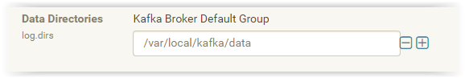

[Documentação](../../../../../documentacao.md) > [AWS](../../../../aws.md) > [Data Lake](../../../data-lake.md) > [Apache Kafka](../../apache-kafka.md) > [Comandos Kafka](../comandos-kafka.md)

# Remover um topic na marra depois dele ter sido marcado para deletion

**Desligue o serviço do Kafka**

**entrar no zookeeper via ssh**

```bash
zookeeper-client -server kafka-node1-dev:2181,kafka-node2-dev:2181,kafka-node3-dev:2181
 
#digitar os comandos abaixo (substituindo o ${TOPIC}, pelo nome do topico que voce deseja remover)
rmr /admin/delete_topics/${TOPIC}
ls /config/topics/${TOPIC}
rmr /config/topics/${TOPIC}
ls /brokers/topics/${TOPIC}
rmr /brokers/topics/${TOPIC}
```

Depois, entrar no Cloudera Manager e procurar pela config log.dirs do Kafka



Entre em cada uma das maquinas do Kafka (no nosso caso eram topicos antigos que só existiam nas maquinas antigas, antes da migração)

**Acesse o diretorio de logs via SSH**

```bash
cd /var/local/kafka/data/
ls

agora rode este comando para remover todos os diretorios do topico: rm -r ${DATADIR}/${TOPIC}-*
sudo rm -r /var/local/kafka/data/topico_teste-*


```

**Ligar o serviço do Kafka**

Agora se rodar o comando para listar os topicos, aqueles que antes estavam como "marked for deletion" terão desaparecido 

```bash
kafka-topics --list --zookeeper kafka-node1-dev:2181,kafka-node2-dev:2181,kafka-node3-dev:2181
```
