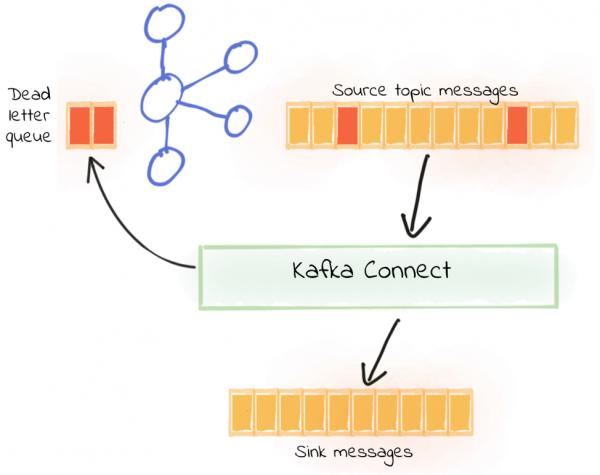

[Documentação](../../../../../documentacao.md) > [AWS](../../../../aws.md) > [Data Lake](../../../data-lake.md) > [Apache Kafka](../../apache-kafka.md) > [Kafka-Connect](../kafka-connect.md)

# Tratando erros do Kafka Connect com Kafkacat

Existe uma ferramenta open-source bem bacana chamada Kafkacat, que serve para debugar os producers e consumers do Kafka. Ela é inclusive mencionada pela Confluent, mas é mantida pela mesma.  
<https://docs.confluent.io/current/app-development/kafkacat-usage.html>

**[Neste post do blog da Confluent](https://www.confluent.io/blog/kafka-connect-deep-dive-error-handling-dead-letter-queues/#:~:text=Kafka%20Connect%20can%20be%20configured,the%20pipeline%20keeps%20on%20running.)**, tem uma explicação de como evitar que uma mensagem com erro mate o seu connector, definind o parametro "errors.tolerance", cujo valor default é "none" para "all"

```bash
errors.tolerance = all
errors.deadletterqueue.topic.name = NOME-TOPICO_QUE-RECEBERA_AS-MSG-COM-ERRO
```

Dessa forma, quando entrar uma mensagem com erro no seu tópico Kafka, o Connect vai joga-la para um outro tópico especifico de erros, e as mensagens OK continuam seguindo o fluxo normal, conforme a imagem abaixo:

[](https://www.confluent.io/blog/kafka-connect-deep-dive-error-handling-dead-letter-queues/#:~:text=Kafka%20Connect%20can%20be%20configured,the%20pipeline%20keeps%20on%20running.)

> [!TIP]
> Utilize o Docker local para chamar o Kafkacat
>
>  
>
> Tentei usar o kafkacat em uma instancia propria para isso, mas a parte de extração do header (que é o que interessava mais) não estava disponivel ainda no package de instalação, você tinha que fazer um build customizado e dava erro (muita gente reclamando na internet), e a forma mais simples de usar esse cara, é via Docker, que já os recursos necessários e é só rodar o comandinho na sua docker local e ser feliz. 
>
> docker run --rm edenhill/kafkacat:1.5.0 -b <LISTA DOS BROKERS>:9092 -t <NOME DO SEU TOPICO DE ERRO> -C -f '\nKey (%K bytes): %k Value (%S bytes): %s Timestamp: %T Partition: %p Offset: %o Headers: %h\n'
>
> docker run --rm edenhill/kafkacat:1.5.0 -b 10.80.4.17:9092,10.80.4.51:9092,10.80.4.225:9092 -t cleide\_teste.error -C -f '\nKey (%K bytes): %k Value (%S bytes): %s Timestamp: %T Partition: %p Offset: %o Headers: %h\n'

Mais informações sobre o Kafkacat em <https://github.com/edenhill/kafkacat>
