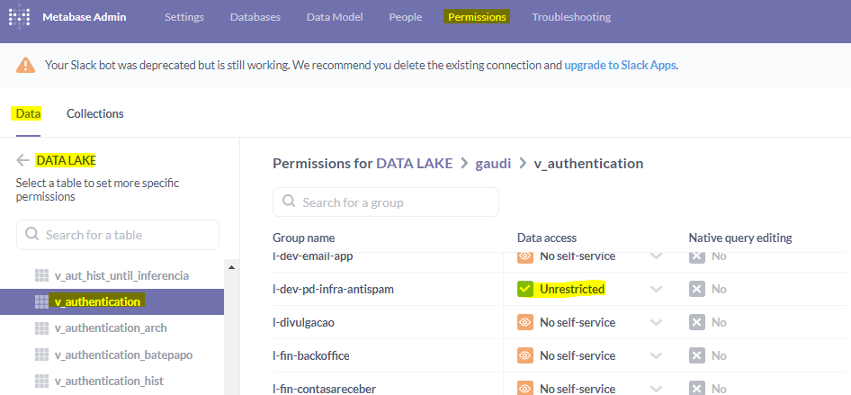
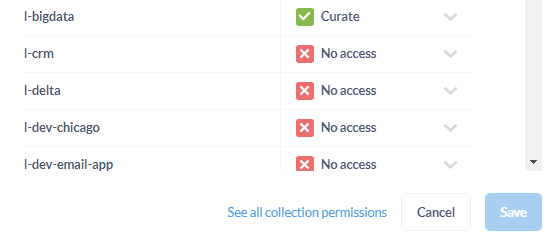

[Documentação](../../../../documentacao.md) > [AWS](../../../aws.md) > [Data Lake](../../data-lake.md) > [Metabase](../metabase.md)

# Permissoes

As permissões de acesso são concedidas a **grupos**, não diretamente a usuários.

O usuário precisa fazer um primeiro login no Metabase para que seja possível atribui-lo a um ou mais grupos.

Os grupos podem ser criados dentro da tela de Administrador.

**Liberação de Acesso**

1 - Liberar acesso de leitura em uma **view ou tabela**:

Na tela de **administrador**, guia permissões, permissões de dados, navegar até a tabela ou view e conceder **acesso ao grupo**:

Desta forma um usuário conseguirá fazer consultas e salva-las em sua coleção pessoal.

2 - Liberar acesso em uma **coleção**:

Para viabilizar o **compartilhamento** de consultas salvas ou paineis, é possivel criar uma **coleção** e conceder acesso para grupos específicos.

Depois de criar uma coleção, clicando no ícone do cadeado é possível fazer a atribuição de grupos na coleção:

No exemplo acima, somente o grupo l-bigdata tem acesso de leitura às consultas da coleção.

A mesma ação também é possivel pela tela de Administrador: Permissões, Permissões de Coleção.
