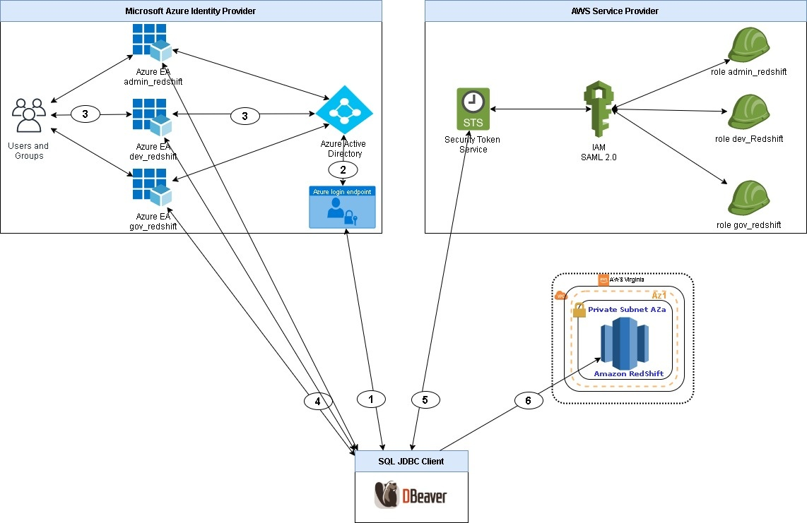

[Documentação](../../../../documentacao.md) > [AWS](../../../aws.md) > [Data Lake](../../data-lake.md) > [Redshift](../redshift.md)

# Acesso Federado utilizando o Azure Active Directory - SAML 2.0

- [DAP](#dap)
- [Acesso Federado](#acesso-federado)

### DAP

### Acesso Federado
