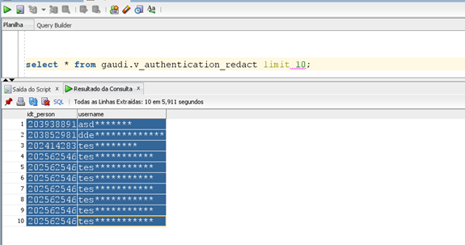

[Documentação](../../../../documentacao.md) > [AWS](../../../aws.md) > [Data Lake](../../data-lake.md) > [Redshift](../redshift.md)

# Data Redact

**Criar função UDF para mascarar o dado - neste exemplo a função adiciona uma mascara ao atributo username**

```sql
CREATE OR REPLACE FUNCTION public.f_mask_email(varchar) RETURNS varchar STABLE as $$ 

   select SUBSTRING(SPLIT_PART($1, '@', 1),1,3) || LPAD('*', LENGTH(SPLIT_PART($1, '@', 1))-3, '*')|| CASE WHEN LENGTH(SPLIT_PART($1, '@', 2))>1 THEN '@'||SPLIT_PART($1, '@', 2) else '' END 

$$ language sql; 
```

**Criar uma view no Redshift com o mascaramento**

```sql
create or replace view gaudi.v_authentication_redact as
select 
idt_person
,public.f_mask_email(username) as username
from gaudi.gaudi_authentication_log
with no schema binding; 
```

**Atribuir permissão à view com mascaramento para o usuário**

```sql
grant select on gaudi.v_authentication_redact to <usuario>;
```

**Exemplo de consulta à view com mascaramento**


