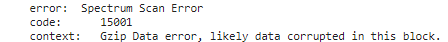
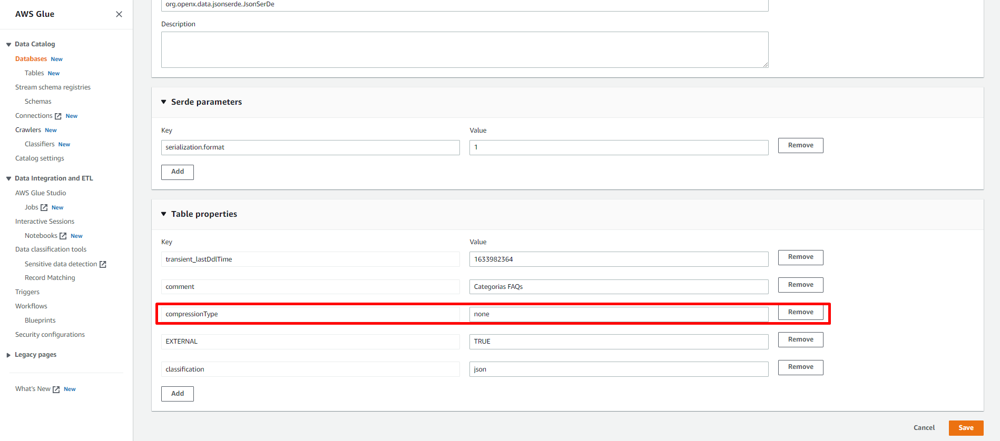

[Documentação](../../../../documentacao.md) > [AWS](../../../aws.md) > [Data Lake](../../data-lake.md) > [Redshift](../redshift.md)

# Erro - Spectrum Scan Error

Caso ocorra o erro abaixo:

Verificar o parametro de "**compressionType**", caso o arquivo esteja com o tipo informado de forma errada, é necessário ajustar na tabela do AWS Glue. O parametro de compressão deve ser um dos 4 tipos (bzip2, gzip, snappy ou none).

Obs: Quando a consulta é feita pelo Spectrum, ele substitui a extensão dos arquivos pelo compressionType informado no AWS Glue, ocasionando o erro. As consultas funcionam normalmente no Athena, os erros acima ocorrem somente no Redshift Spectrum.

ref:

<https://docs.aws.amazon.com/redshift/latest/dg/r_CREATE_EXTERNAL_TABLE.html>
