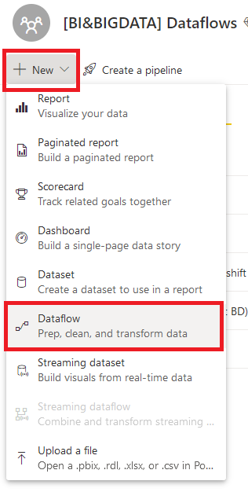
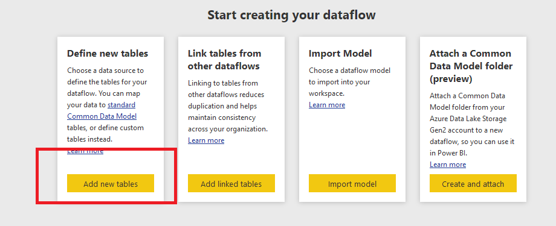
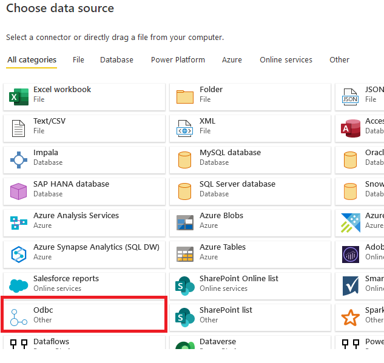
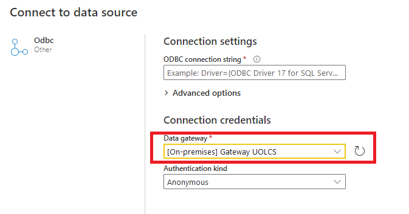
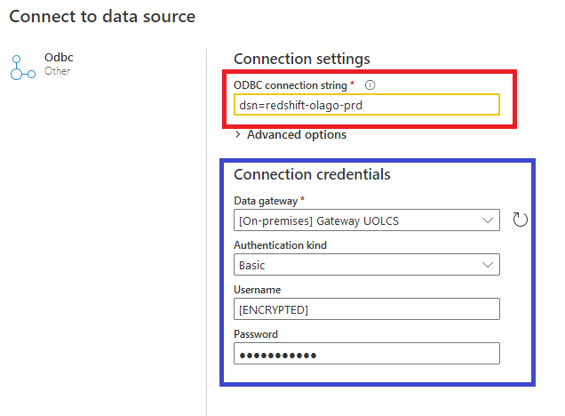
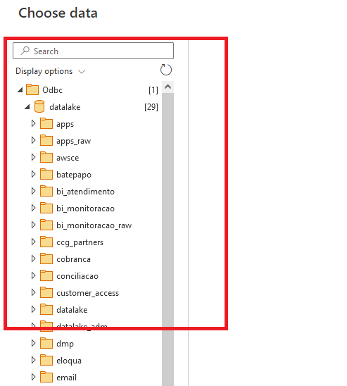

[Documentação](../../../../../documentacao.md) > [AWS](../../../../aws.md) > [Data Lake](../../../data-lake.md) > [Redshift](../../redshift.md) > [Tutoriais](../tutoriais.md)

# Power BI conectando no Redshift

## Introdução

Abaixo o detalhamento de como criar uma dataflow no Power BI para buscar dados de VIEWs no Redshift.

Acessar o Workspace onde se deseja criar o dataflow

Clicar em adicionar novas tabelas

Escolher o datasource **ODBC**

****

Escolher o gateway atual do Power BI antes de informar a String de Conexão

Entrar com a string de conexão do redshift de produção ***dsn=redshift-olago-prd.***Após digitar os dados de conexão as credenciais de conexão serão preenchidas automaticamente (seleção em azul).

Acesso ao redshift realizado e VIEWs disponiveis para construção do fluxo;

