[Documentação](../../../../../documentacao.md) > [AWS](../../../../aws.md) > [Data Lake](../../../data-lake.md) > [Redshift](../../redshift.md) > [Tutoriais](../tutoriais.md)

# Tutorial conectar ao Redshift

**- [Solicitar acesso](#solicitar-acesso)
- [Configuração do ambiente](#configura-o-do-ambiente)
  - [Acesso em QA e Produção (usuário local no Redshift)](#acesso-em-qa-e-produ-o-usu-rio-local-no-redshift)**

# Solicitar acesso

- [Liberação da ACL](https://jira.intranet.uol.com.br/jira/servicedesk/customer/portal/33/create/767?q=acl&q_time=1613771214860).

- Empresa: **UOL CS**
- Tipo de solicitação: **Criação**
- Solicitação envolve a a15(NSX): **Não**
- Justificativa de negócio: **Acesso ao redshift de BigData**
- Risco/Impacto em caso de não liberação: **Impossibilidade de uso do ambiente**
- Tipo de liberação: **Permanente**
- Alguma entrega depende da resolução desse chamado? **Não**
- IP de Origem: **Seu IP interno**
- IP de Destino: **10.80.32.0/20**
- Porta: **5439**
- Protocolo: **TCP**

**Teste a ACL:** *telnet olago.data.intranet 5439*

- Caso a base que você precisa acessar tenha dados sensíveis, é necessário abrir uma solicitação no [portal de GOV](https://jira.intranet.uol.com.br/jira/servicedesk/customer/portal/48/create/849).

- Abrir um **[chamado no portal do time](https://jira.intranet.uol.com.br/jira/servicedesk/customer/portal/231/create/1903)** que criará seu usuário:

- Produto: **Outros**
- Ambiente: **Produção**
- Tipo de liberação: **Permanente**
- Lista de usuários (e-mail de acesso): **Login do usuário que terá acesso**
- Lista de dados: **Schemas que precisa de acesso**
- Justificativa:
  - **Adicionar seu IP interno para liberação do Security Group**
- Anexar email com aprovação do gestor

- [Download do DBeaver](https://dbeaver.io/download/).

# Configuração do ambiente

## **Acesso em QA e Produção** (usuário local no Redshift)

**Step 1:** Acessar o Dbeaver   
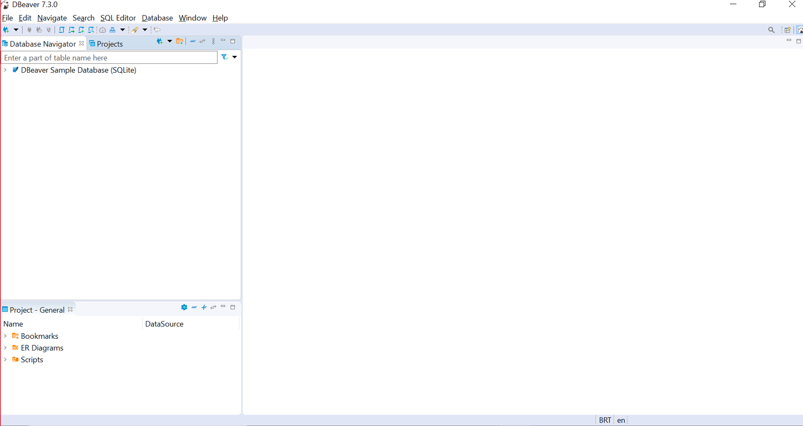

**Step 2:** Clique no botão "*New Database Connection*"  
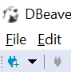

**Step 3:** No campo de pesquisa, informe a base de dados "*Redshift*"  
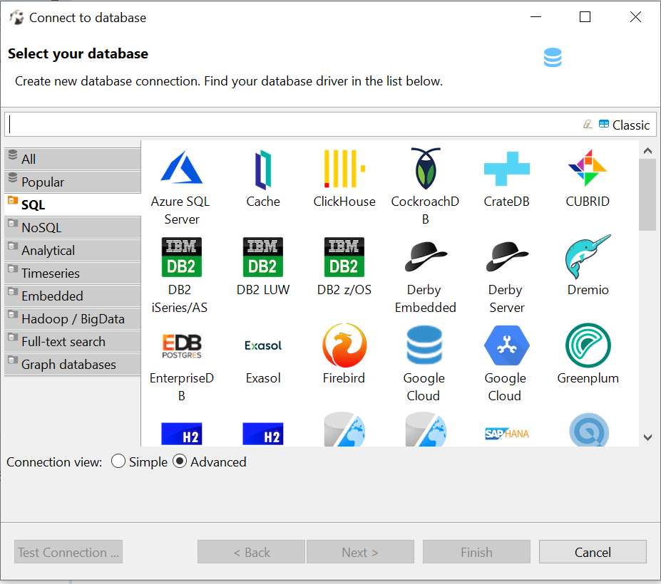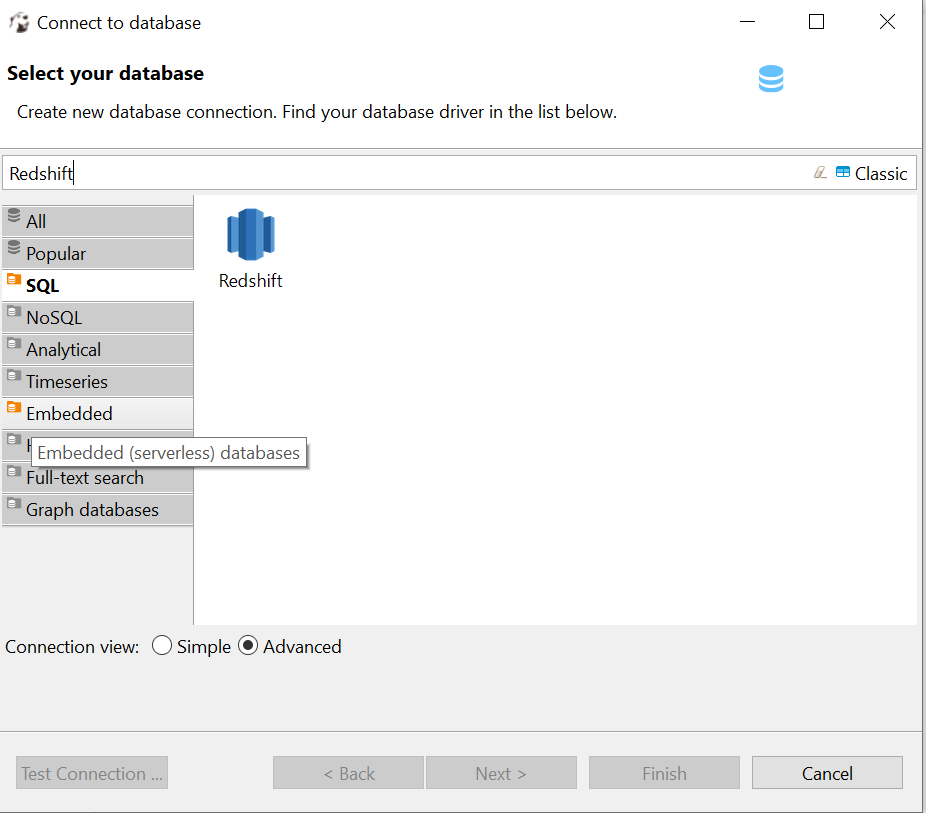

**Step 4:** Selecione a base de dados Redshift e clique no botão "*Next*"  
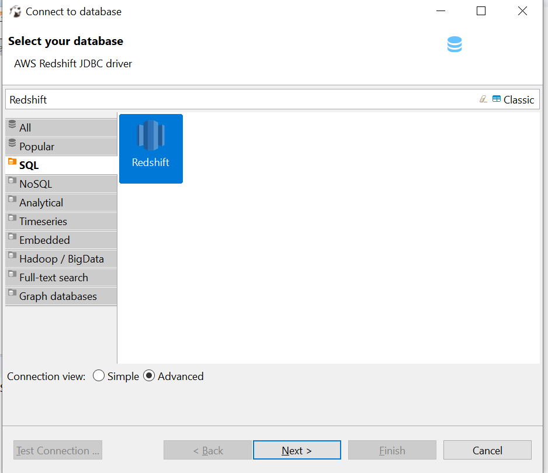

**Step 5:** Faça download do drive indicado   
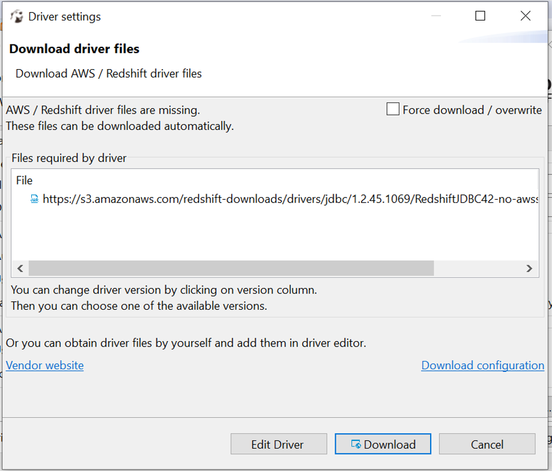

**Step 6:** Informe "*Host, Database, Username e Password*"

Host QA: **olago.qa.data.intranet**  
Host PRD: **olago.data.intranet**  
Database: **datalake**

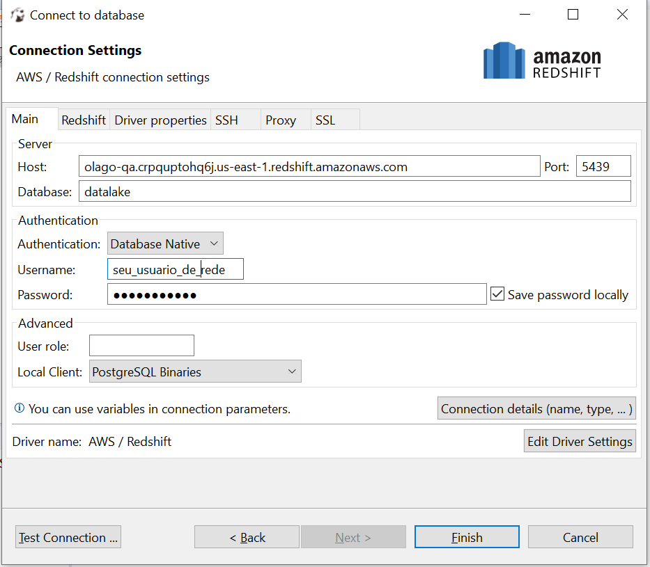

\*Se a conexão pretendida é PRD, na aba SSL é necessário flegar a opção de usar SSL:

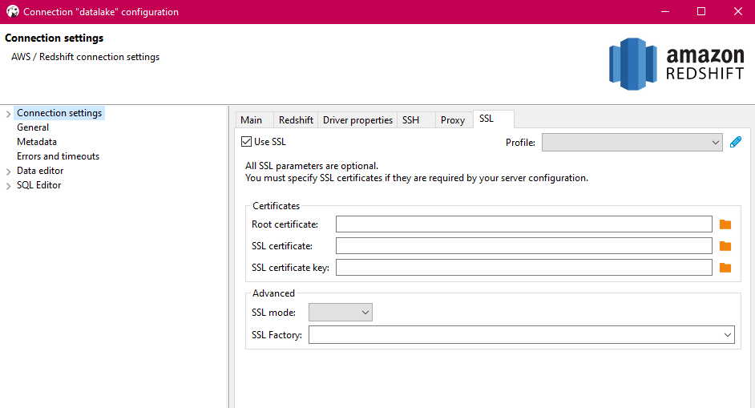

**Step 7:** Clique em "*Test Connection...*", se o resultado for semelhante ao evidenciado, clique em "*OK*"   
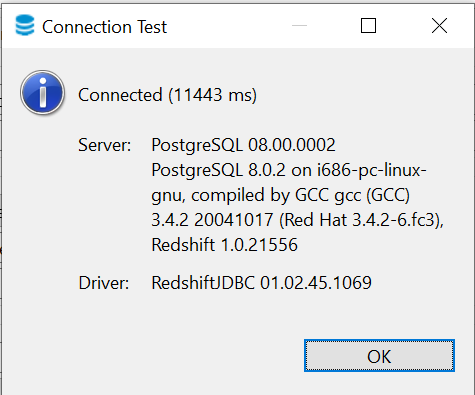

**Step 8:** Clique em "*Connection details (name, type,...)*"  
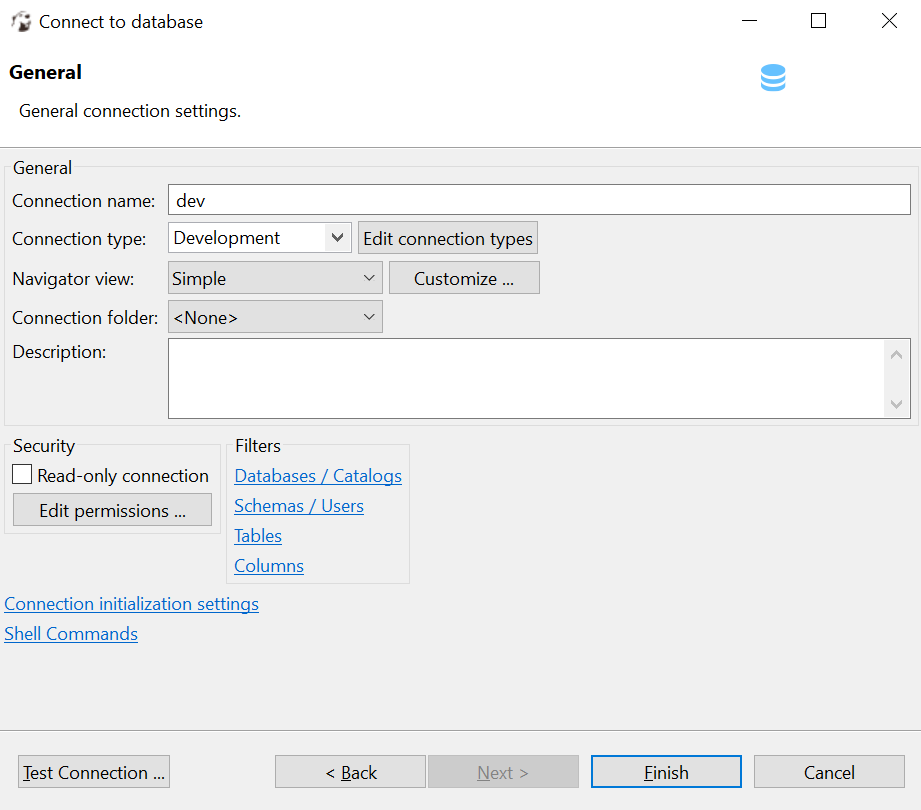

**Step 9**: Informe o "*Connection Name e Connection Type*"  
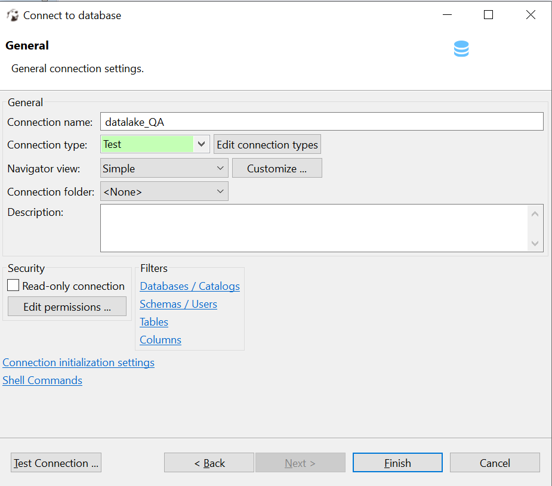

**Step 10:** Clique em "*Finish*" e valide sua conexão no "*Database Navigator*"

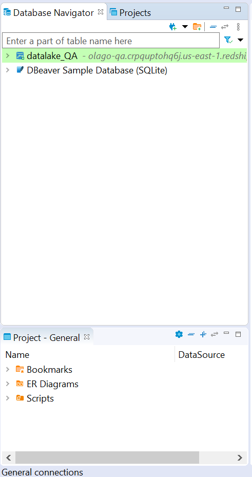
