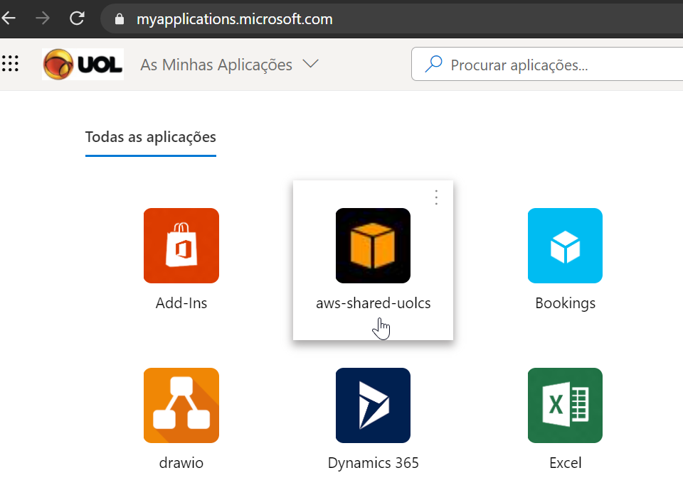
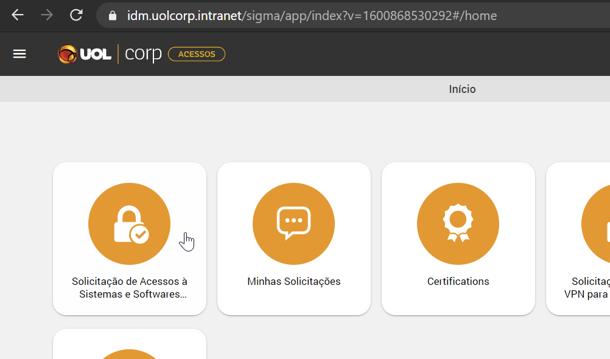
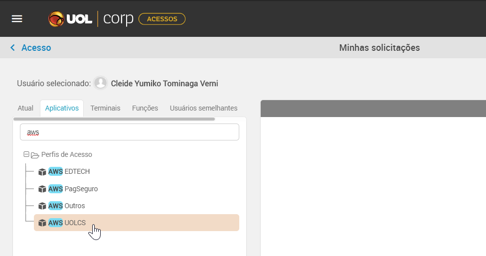
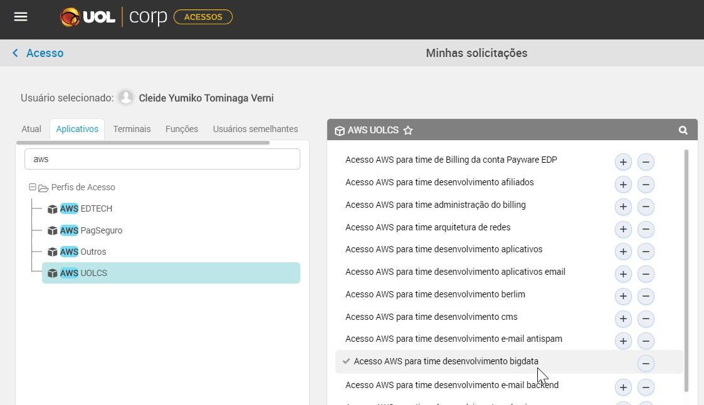

[Documentação](../../documentacao.md) > [AWS](../aws.md)

# Habilitar o app de acesso a AWS

Se você acessou a página de Minhas Aplicações (<https://myapplications.microsoft.com/>) e não encontrou o ícone do app "aws=shared-uolcs", é preciso solicitar a inclusão pelo IDM, conforme abaixo:

1. Acesse o portal do IDM <https://idm.uolcorp.intranet/sigma/app/index?v=1600868530292#/home>
2. Clique em "Solicitação de Acessos à Sistemas e Softwares Licenciados", e depois "Minhas solicitações"  
   
3. Clique em "Aplicativos" e procure por "AWS UOLCS"  
   
4. Ao clicar em "AWS UOLCS" vai carregar a lista de contas, selecione "Acesso AWS para time desenvolvimento bigdata" e escreva a justificativa da solicitação.  
   
5. Depois de aprovada, deverá aparecer o icone de acesso a AWS, descrito no item 1 desta pagina
