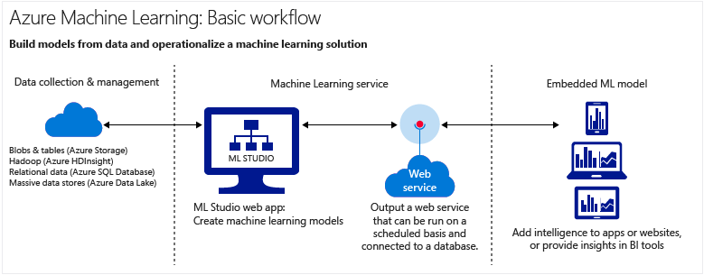
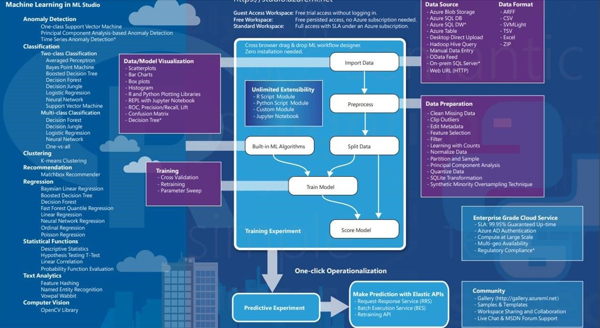

[Documentação](../../../documentacao.md) > [Azure](../../azure.md) > [Machine Learning Studio](../machine-learning-studio.md)

# Arquitetura do Machine Learning Studio

**Fluxo básico**: 

**Data Collection & management** - O ML Studio dá suporte para conexão HTTP, Hadoop(Azure HDinsight), Banco de dados SQL, Banco de dados SQL local, tabela do Azure, Armazenamento do Blobs do Azure e Provedor de feed de dados. Para maiores informações, a Cleide detalhou melhor no confluence: <https://confluence.intranet.uol.com.br/confluence/display/SAPBW/Fontes+de+dados+online+com+suporte>

**Observação: Atualmente, como não há uma VPN configurada entre a rede virtual do azure e a rede do UOL, uma alternativa segura para trafegar os dados com segurança é através do Talend, que possui componentes para o Azure com suporte ao protocolo HTTPS.**

**Machine Learning Service** -

Diagrama de visão geral do Machine Learning Studio 

<https://docs.microsoft.com/pt-br/azure/machine-learning/studio/studio-overview-diagram>  

Para usar o Machine Learning Studio, você precisa ter um espaço de trabalho do Microsoft Azure Machine Learning. Esse espaço de trabalho contém as ferramentas necessárias para criar, gerenciar e publicar testes.

O administrador de sua assinatura do Azure precisa criar o espaço de trabalho e, em seguida, adicioná-lo como um proprietário ou colaborador.Para obter mais detalhes, consulte [Criar e compartilhar um espaço de trabalho do Azure Machine Learning](https://docs.microsoft.com/pt-br/azure/machine-learning/studio/create-workspace).

Dica

Se você tiver sido adicionado como proprietário do espaço de trabalho, será possível compartilhar os testes em que está trabalhando convidando outras pessoas para seu espaço de trabalho. Pode fazer isso no Machine Learning Studio na página CONFIGURAÇÕES . Basta ter a conta da Microsoft ou a conta da empresa de cada usuário.

Na página CONFIGURAÇÕES, clique em USUÁRIOS e, em seguida, clique em CONVIDAR MAIS USUÁRIOS na parte inferior da janela.

Web Service

Após o treinamento do modelo, e possível publicá-lo como web service, para que clientes (ferramentas de BI ou até mesmo aplicações) o utilizem. Para maiores detalhes, há uma documentação no conflunce que fala acerca disso e também uma documentação oficial da Microsoft, conforme os respectivos links abaixo:

[Como criar um modelo preditivo basico no ML Studio](como-criar-um-modelo-preditivo-basico-no-ml-studio.md)

<https://docs.microsoft.com/pt-br/azure/machine-learning/studio/walkthrough-5-publish-web-service>
