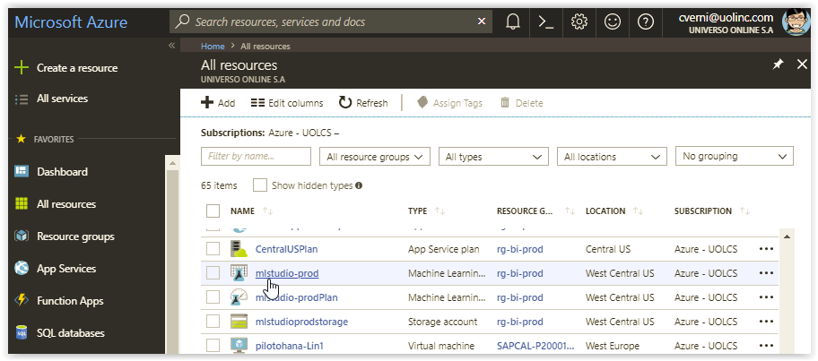
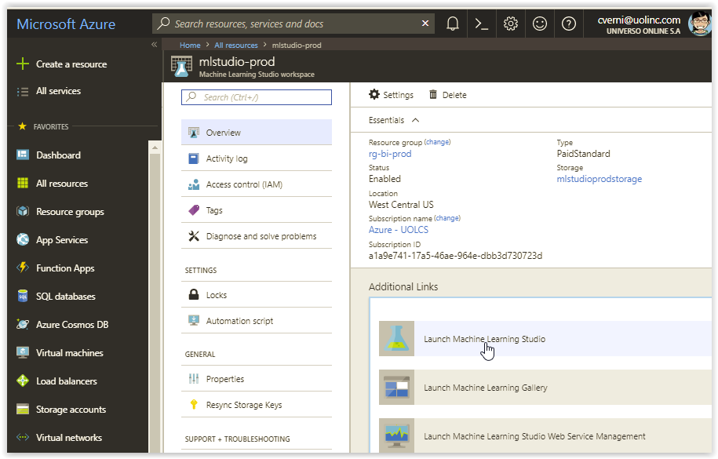
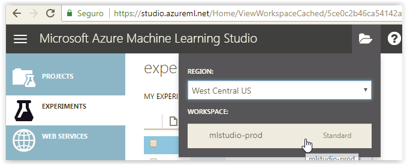
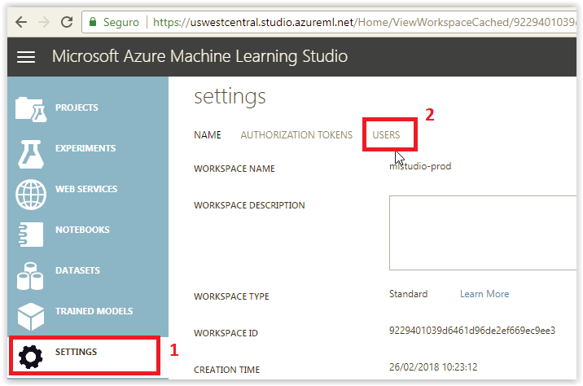
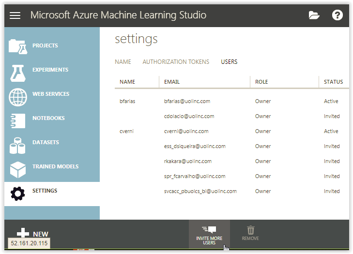

[Documentação](../../../documentacao.md) > [Azure](../../azure.md) > [Machine Learning Studio](../machine-learning-studio.md)

# Como acessar ou adicionar um usuario no workspace do ML Studio

1. Acesse o **[portal da Azure](https://portal.azure.com)** com seu login corporativo (dados do AD);
2. Clique em "All resources" no menu lateral esquerdo, e clique no recurso do tipo "Machine Learning Studio workspace", que neste caso chama-se "mlstudio-prod"  
   
3. Clique em "Launch Machine Learning Studio"   
   
4. Certifique-se de que está no workspace "mlstudio-prod", se estiver no seu workspace pessoal, altere conforme abaixo:  
   
5. Clique em "Settings", e em seguida em "Users"  
   
6. Clique em "Invite more Users" no rodape da página  
   
7. Digite o e-mail do usuário que você deseja adicionar, indique qual será o perfil desse usuário (user ou owner) e clique no icone do canto direito. Será enviado um e-mail para esse usuário, que só precisará executar os passos 1 a 4 acima para iniciar seus experimentos 
