[Documentação](../../../documentacao.md) > [Azure](../../azure.md) > [Machine Learning Studio](../machine-learning-studio.md)

# Como criar um modelo preditivo basico no ML Studio

**Objetivo**

Criar um modelo preditivo de fraude simples, para entender a arquitetura do Machine Learning Studio; maiores detalhes estão na história 
[[BD-7] Criar modelo usando Machine Learning Studio](https://jira.intranet.uol.com.br/jira/browse/BW-1693)

Informações sobre a base que foi utilizada:

- Usuários Bol com apenas uma assinatura;
- Base de 2018;
- Usuário bloqueados pelo account blocker.

**Layout da base**

IDT\_PERSON IDT\_DOMAIN  DAT\_SIGNUP IND\_STATUS  NAM\_LOGIN   DEVICEID       QTD\_DEVICEID            COD\_IP           QTD\_IP           CELULAR        QTD\_CELULAR          RISCO

A coluna **RISCO** indica se o usuário é um fraudador(1) ou não(0). Definiu-se como fraudador aquele que possui um evento de bloqueio pelo account blocker  e status X (bloqueado), ou que possui um número elevado de cadastros associados ao mesmo deviceid/ip/celular.

**Quantidade de não fraudadores**: 9824

**Quantidade de fraudadores**: 3904

**Desenvolvimento do modelo no machine learning Studio**

Para agilizar o desenvolvimento, o seguinte template foi escolhido na galeria do Azure: <https://gallery.azure.ai/Experiment/3fe213e3ae6244c5ac84a73e1b451dc4>

Após adaptá-lo, ele ficou assim:

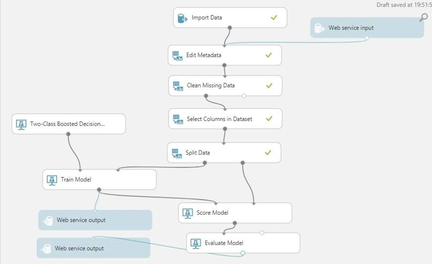

**Descrição dos componentes:**

**Import Data** – Componente utilizado para importar os dados para o ML Studio; o Blob Storage foi escolhido  por já ter um conector nativo.

**Edit Metadata** – Componente para definir o metadado.

**Clean Missing Data** – Utilizado para tratar os campos nulos.

**Select Columns in DataSet** – Utilizado para selecionar quais colunas seguirão para o próximo passo.

**Split Data** – Utilizado para separar a base de dados. Para a primeira porta foi definido que, 70% dos dados, após a aplicação de um algoritmo randômico, seriam destinados para treinamento do modelo e outros 30% para o seu teste.

**Train Model** – Modelo de treinamento que pode ser de regressão ou de classificação (o escolhido para o exemplo).

**Two-Class Boosted Decision tree** – Algoritmo de classificação binária baseado em árvore.

**Score Model** - O módulo Modelo de Pontuação pega os dados de teste (segundo porta do componente Split Data), os executa por meio de modelo e compara as previsões, que este gera, com a coluna de risco.

**Evaluate Model** - componente utilizado para validar o modelo.

**Treinamento do modelo**

Para treinar o modelo, basta clicar em RUN:

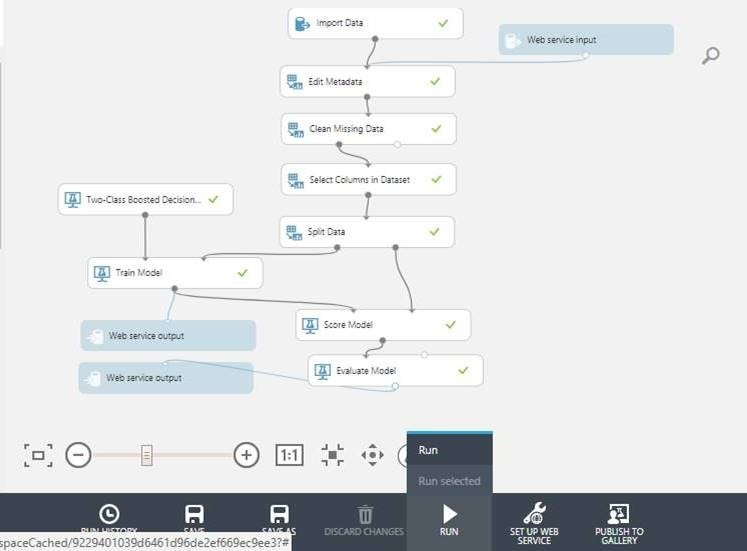

**Validando o modelo**

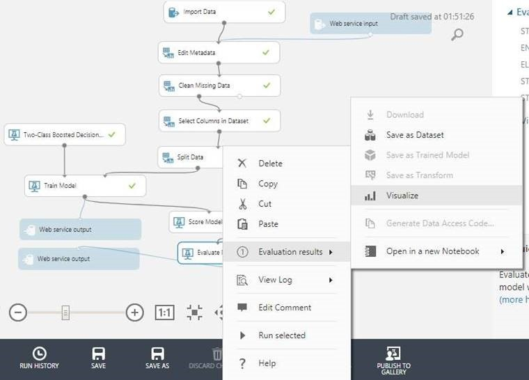

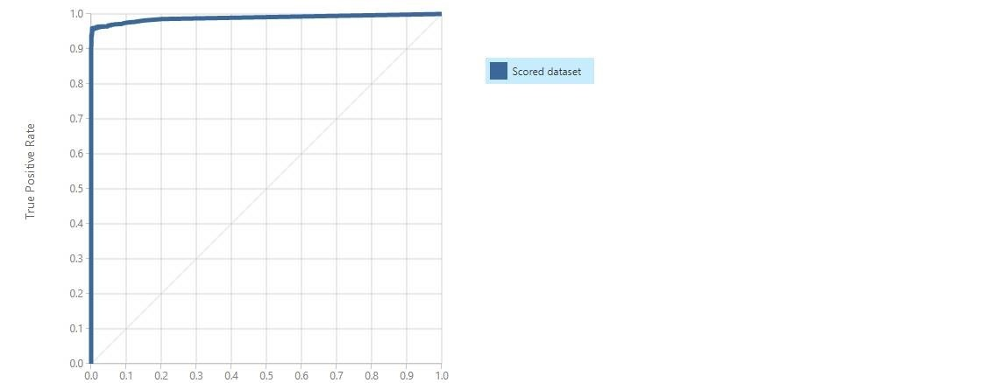

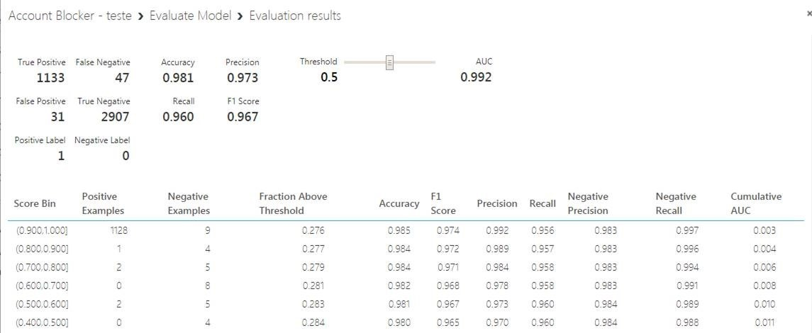

**Web service**

Criar um web service preditivo:

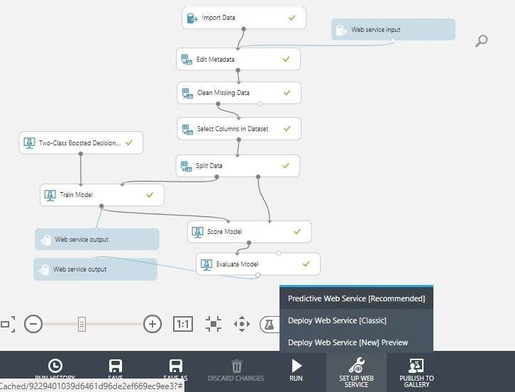

Com o web service criado, é necessário executá-lo antes de publicá-lo:

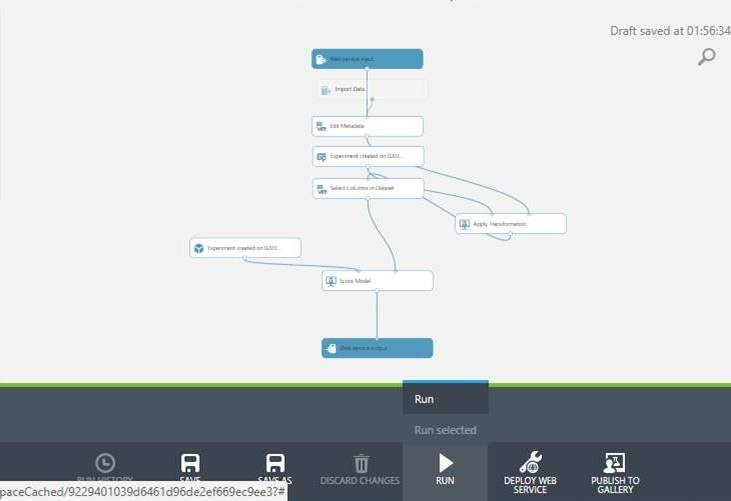

Agora é possível publicar o web service:

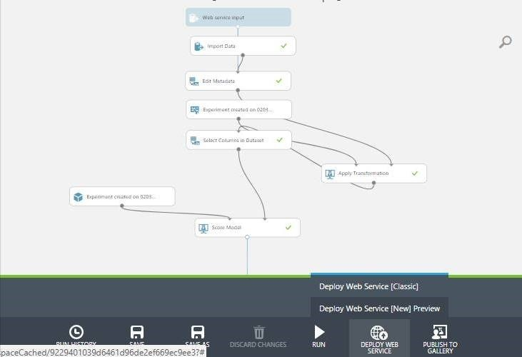

Dê um nome, selecione o storage e um plano e, em seguida, clique em deploy:

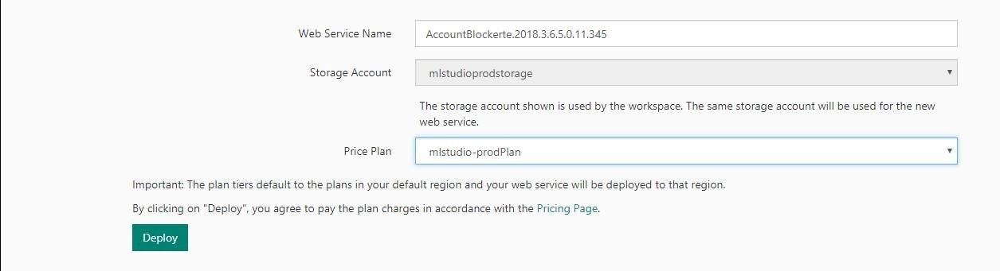

**Teste do Web Service**

Pronto, o web service está criado. Agora é possível testá-lo:

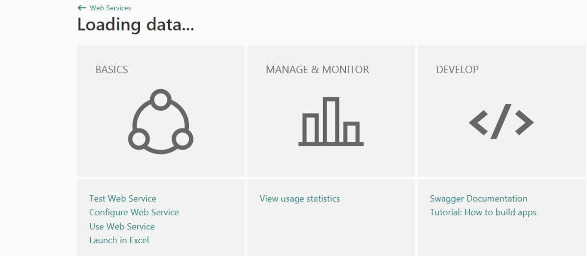

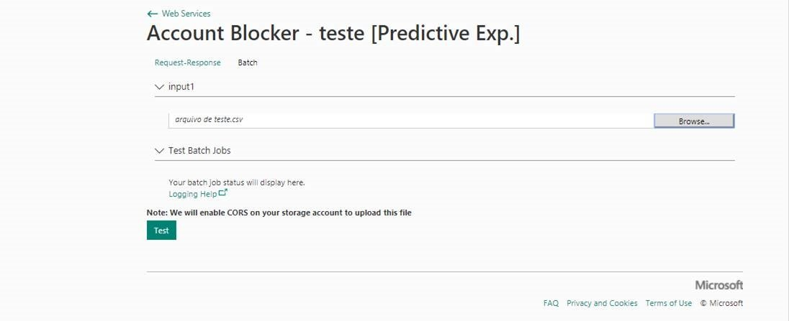

Para o teste, um arquivo foi importado:

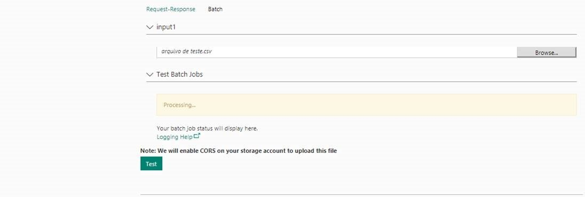

Uma amostra do resultado:

|                                  |               |                 |         |                          |              |               |                      |
|:---------------------------------|:--------------|:----------------|:--------|:-------------------------|:-------------|:--------------|:---------------------|
| DEVICEID                         | QTD\_DEVICEID | COD\_IP         | QTD\_IP | CELULAR                  | QTD\_CELULAR | Scored Labels | Scored Probabilities |
| 385f34d3b9a2421ab413909672f2c34d | 182           | 177.8.49.246    | 406     | 14988\*\*\*\*\*\*        | 1            | 1             | 0.999999284744263    |
| ed47a653b907413d923293d6fc08fc30 | 237           | 168.194.163.131 | 76      | 4399\*\*\*\*\*\*\*\*\*\* | 1            | 1             | 0.999999523162842    |
| 184686fa1ea5404b88059e4b099ef849 | 470           | 201.26.43.65    | 11      | 1199\*\*\*\*\*\*\*\*\*\* | 1            | 1             | 0.999999403953552    |
| 22cd3c24c7bb44b79851d5ef99d1e1f1 | 69            | 186.225.50.170  | 283     | 0                        | 0            | 1             | 0.999998867511749    |
| 469de3de6ef04a57838473352a849f9f | 1             | 186.213.107.103 | 5       | 0                        | 0            | 0             | 0.0017714201239869   |
| d21d2336e41242f69a8a4b1b3c789374 | 1             | 179.34.152.145  | 1       | 0                        | 0            | 0             | 95505481,57          |
| b2dca8dc240c47eea5e73879453fc3b7 | 1             | 201.6.136.47    | 28      | 0                        | 0            | 0             | 0.0975393950939178   |
| 06bb062247d94fce8f4d85e7bd85dd77 | 1             | 187.56.250.249  | 8       | 0                        | 0            | 0             | 394418784,71         |
| 82ebba15c1cc40beb25f02724af4000d | 1             | 177.9.237.5     | 8       | 0                        | 0            | 0             | 394418784,71         |
| 22d097cc3bcb49b9bde849c032561198 | 1             | 177.58.251.119  | 3       | 0                        | 0            | 0             | 5982978109,39        |
| b2b0fc91055c47c2a6f386e5ec6ed37a | 1             | 201.6.112.7     | 8       | 0                        | 0            | 0             | 394418784,71         |
| 99cd85aacdb446e08219498378ce7cce | 1             | 188.227.224.110 | 1       | 0                        | 0            | 0             | 95505481,57          |

Scored Labels iguai a **1**: perfil de fraudador.

Scored Labels igual a **0**: perfil de não fraudador.
