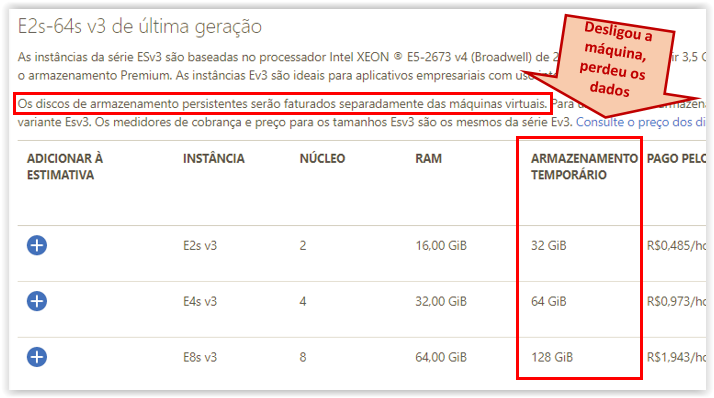

[Documentação](../../../documentacao.md) > [Azure](../../azure.md) > [POC Cloudera](../poc-cloudera.md)

# Instalacao de Cluster Cloudera

Criar as VMs utlizando a imagem "Cloudera CentOS 7.4" no Azure (essa imagem já ira criar a VM com a grande maioria das configurações ok, fixando os IPs internos e públicos (para não mudarem a cada restart);

**Atenção:** antes de escolher o modela da VM, acesse a descrição da maquina através do link <https://azure.microsoft.com/pt-br/pricing/details/virtual-machines/linux/>, e certifique-se de que o disco escolhido é persistente ou temporário.



Nesta POC foram criadas 5 Vms, todas atreladas ao usuario bi\_admin, para facilitar a vida, alterei o hosts da minha maquina conforme abaixo:

**Hosts da minha maquina para não precisar criar DNS**

```java
#IP da maquina  nome da maquina
13.68.97.85     bi-clouderavm1-poc
40.70.58.8      bi-clouderavm2-poc
40.70.46.108    bi-clouderavm3-poc
52.232.240.30   bi-clouderavm4-poc
52.232.160.237  bi-clouderavm5-poc
```

Acesse as máquinas via SSH (use o putty.exe)  utilizando o user informado na criação das VMs (neste caso, bi\_admin)

**Executar em todas as maquinas**

```java
#alterando o user de bi_admin para o root, e setando uma nova senha para o root
sudo su
passwd 
	digite a senha para o root
 
#configurar os hosts internos, editando o arquivo /etc/hots 
sudo vi /etc/hosts
#adicionar este bloco
10.0.1.10 bi-clouderavm1-poc
10.0.1.12 bi-clouderavm2-poc
10.0.1.13 bi-clouderavm3-poc
10.0.1.11 bi-clouderavm4-poc
10.0.1.7  bi-clouderavm5-poc

#configurar p/ não ficar toda hora pedindo senha p/ bi_admin
sudo visudo
#adicionar no final do arquivo:
bi_admin ALL=(ALL) NOPASSWD: ALL
```

Seguir o passo a passo descrito no arquivo **[Installation cloudera manager.pdf](../../../../attachments/169148927.pdf)**

Feita a instalação,acesse a maquina principal com a porta 7180 para configurar o Cloudera Manager: <http://bi-clouderavm1-poc:7180>]

PDFs com as configurações utilizadas na POC:

| Configuration                                                                    | Instances                                                                    |
|:---------------------------------------------------------------------------------|:-----------------------------------------------------------------------------|
| [ClouderaManager - configuration.pdf](../../../../attachments/195725622.pdf)     | [ClouderaManager - instances.pdf](../../../../attachments/195725623.pdf)     |
|                                                                                  | [Roles.pdf](../../../../attachments/195725632.pdf)                           |
| [HDFS - configuration.pdf](../../../../attachments/195725624.pdf)                | [HDFS - instances.pdf](../../../../attachments/195725625.pdf)                |
| [Impala - configuration.pdf](../../../../attachments/195725626.pdf)              | [Impala - instances.pdf](../../../../attachments/195725627.pdf)              |
| [Kafka - configuration.pdf](../../../../attachments/195725628.pdf)               | [Kafka - instances.pdf](../../../../attachments/195725629.pdf)               |
| [Kudu - configuration.pdf](../../../../attachments/195725630.pdf)                | [Kudu - instances.pdf](../../../../attachments/195725631.pdf)                |
| [Spark 2 - configuration.pdf](../../../../attachments/195725633.pdf)             | [Spark 2 - instances.pdf](../../../../attachments/195725634.pdf)             |
| [YARN (MR2 Included) - configuration.pdf](../../../../attachments/195725635.pdf) | [YARN (MR2 Included) - instances.pdf](../../../../attachments/195725636.pdf) |
| [ZooKeeper - configuration.pdf](../../../../attachments/195725637.pdf)           | [ZooKeeper - instances.pdf](../../../../attachments/195725638.pdf)           |
