---
tags:
  - '#bq'
  - '#gcp'
---

[Documentação](../../../documentacao.md) > [GCP - Google Cloud Platform](../../gcp-google-cloud-platform.md) > [BigQuery](../bigquery.md)

# BigQuery - Guia Inicial

**- [Visão geral](#vis-o-geral)
  - [O que é o Google BigQuery?](#o-que-o-google-bigquery)
- [Ambiente de trabalho](#ambiente-de-trabalho)
  - [Visualizar tabelas em outros projetos](#visualizar-tabelas-em-outros-projetos)
    - [ID dos Projetos](#id-dos-projetos)
    - [Como adicionar nos favoritos](#como-adicionar-nos-favoritos)
  - [SQL Editor](#sql-editor)
- [Criação de objetos](#cria-o-de-objetos)
  - [1. Conjunto de Dados (dataset)](#key-1-conjunto-de-dados-dataset)
  - [2. View](#key-2-view)
    - [Via SQL](#via-sql)
    - [Via Interface](#via-interface)
  - [Tabela](#tabela)
    - [Via interface](#via-interface)
    - [Tabela em Branco](#tabela-em-branco)
    - [Tipos de tabela](#tipos-de-tabela)
    - [Tabela Por Arquivo (Fazer Upload)](#tabela-por-arquivo-fazer-upload)
    - [Tabela Drive ou de Origem Externa (Cloud)](#tabela-drive-ou-de-origem-externa-cloud)
    - [Opções avançadas](#op-es-avan-adas)
    - [Tabela em branco](#tabela-em-branco)
    - [Tabela Por Arquivo](#tabela-por-arquivo)
    - [Tabela Drive](#tabela-drive)
- [Boas Práticas](#boas-pr-ticas)**

# **Visão geral**

## **O que é o Google BigQuery?**

O BigQuery é uma estrutura de armazenamento de dados gerenciado do Google, que ajuda a gerenciar e analisar dados com recursos integrados, como aprendizado de máquina, análise geoespacial e business intelligence, utilizando consultas SQL. Essa ferramenta é NoOps, ou seja, ela não requer uma infraestrutura responsável pelo gerenciamento. O mecanismo de análise distribuída e escalonável do BigQuery permite consultar terabytes em segundos e petabytes em minutos. Seu armazenamento de dados é através do método de armazenamento colunar.

# **Ambiente de trabalho**

## **Visualizar tabelas em outros projetos**

Na estrutura do Datalake nós separamos os projetos de onde as pessoas executam as queries e onde os dados estão armazenados. Para facilitar ver os dados de outro projeto, o BigQuery permite adicionar projetos aos favoritos para sempre serem exibidos na listagem:

### ID dos Projetos

Principais projetos:

- **uolcs-datalake-prd** (Datalake)
- **frank-analytics-helper-10** (GA3 e alguns GA4)
- **frank-analytics-helper-11** (GA4)

### Como adicionar nos favoritos

****

****

**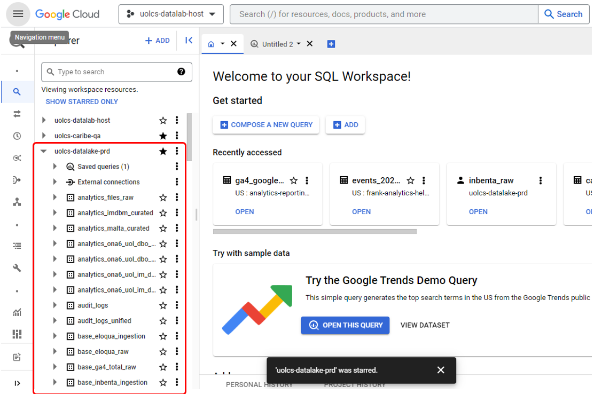**

## **SQL Editor**

Ao realizar uma query existem algumas abas e botões importantes.

Para abrir um Editor basta estrar num projeto que tenha acesso e clicar + ou clicar em “Escrever uma nova consulta”.

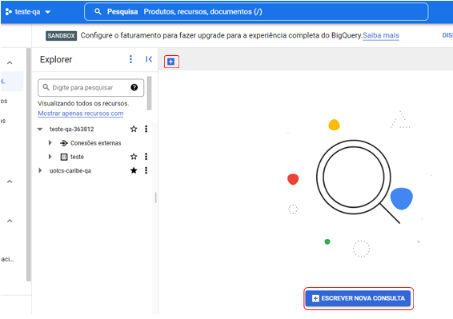

Exemplo de uma consulta:

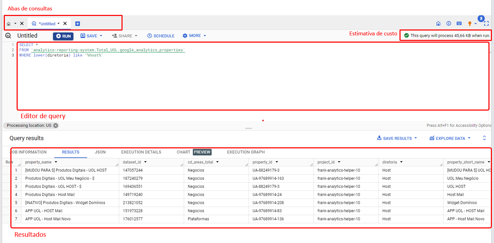

Partes importantes para analisar uma consulta.

Esse é o menu de uma consulta.

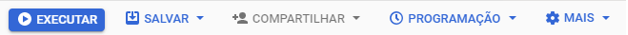

Nele é possível executar a sua consulta, salvar, compartilhar etc. Nessa mesma barra existe a parte mais importante de uma consulta que é a quantidade de processamento da consulta.

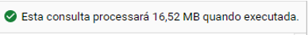

Outra parte importante é um menu que fica embaixo do editor da query. Ele mostra as consultas realizadas por você e pelo projeto.

Ao clicar no Id do JOB é possível ver outras informações, além da query que foi rodada. Entre elas está a informação de Bytes Faturados, são esses bytes faturados que é possível ver se a consulta está gerando um custo elevado ou não.

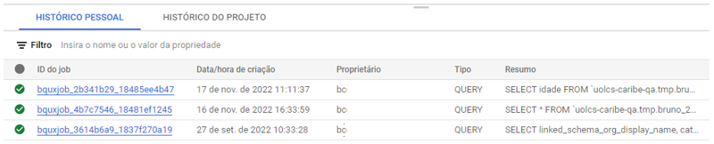

Uma consulta menor que 10MB, será tratada como uma consulta de 10MB, o que é um custo baixo. Porém quanto maior os Bytes Faturados, mais custo ele gera.

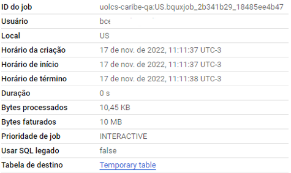

Depois de executar uma query ela exibe um painel de Resultados

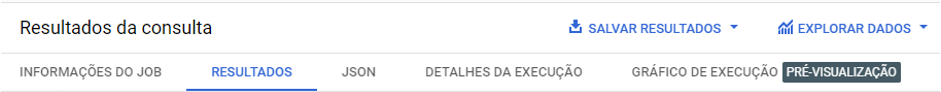

Nele é possível navegar entre esses menus e extrair outras informações como tempo de execução, ver as etapas, entre outras.

---

# **Criação de objetos**

## **1. Conjunto de Dados (dataset)**

Certifique-se que está em um projeto que você tenha permissão e no BigQuery. Clique nos três pontos e depois em “Criar conjunto de dados”.

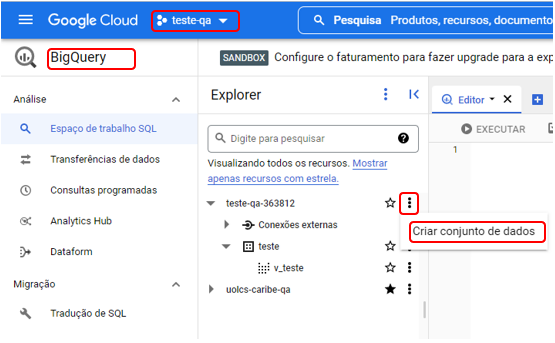

Dê um nome para o conjunto e coloque o local dos dados. Depois clique em Criar conjunto de dados.

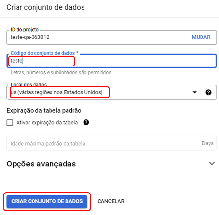

---

## **2. View**

**Documentação: <https://cloud.google.com/bigquery/docs/views>**

### Via SQL

```sql
CREATE VIEW `projeto.dataset.nome_view` AS
[QUERY]
```

### **Via Interface**

Para criar uma view (visualização), basta utilizar o editor, fazer um script sql e ter acesso para criar views. Clique em “Salvar” e depois em “Salvar visualização”.

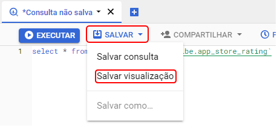

Indique o Projeto que será criado a view, o nome do Conjunto de Dados e o nome da view. Depois clique em “Salvar”,

---

## **Tabela**

Documentação: <https://cloud.google.com/bigquery/docs/tables>

### Via interface

Certifique-se que está em um projeto que você tenha permissão e no BigQuery. Clique nos três pontos do seu conjunto de dados e depois em “Criar tabela”.

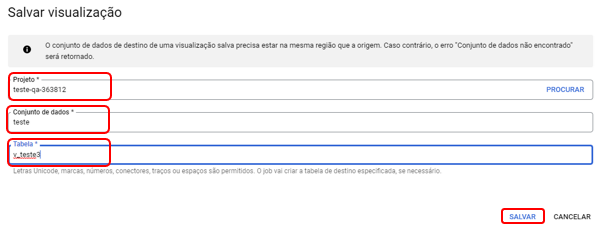

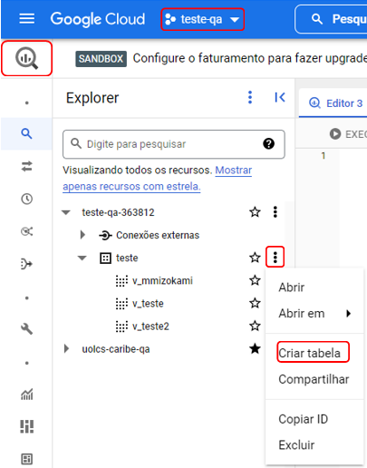

Abrindo um painel, onde será possível criar a tabela.

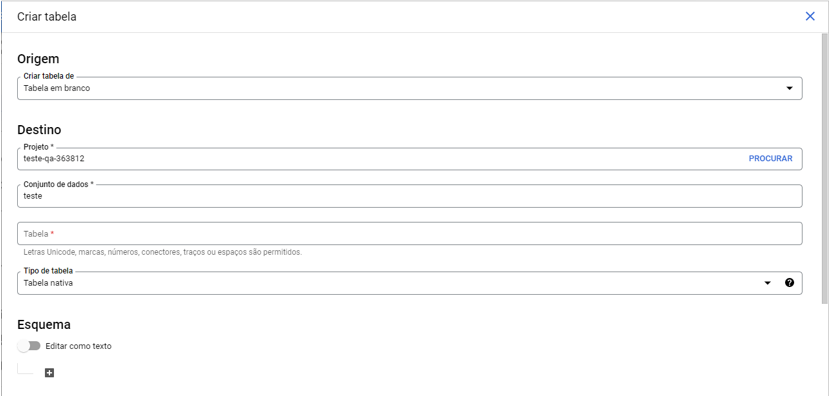

Primeiro selecione a origem da tabela. Por padrão, a opção selecionada é o “criar uma tabela em branco”, mas existem várias opções.

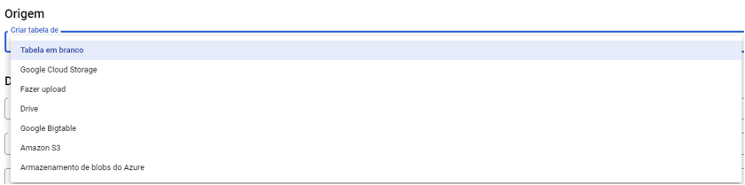

Caso escolha uma opção diferente da “criar uma tabela em branco”, aparecerá um painel para selecionar o arquivo ou caminho de origem e o formato do arquivo.

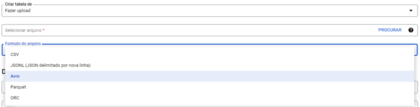 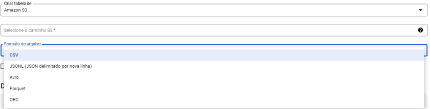

Caso escolha uma opção diferente de “Fazer upload” ou “Drive”, será necessário ativar a API do Google. Assim como aparecerá uma opção “Particionamento dos dados da origem”, essa opção serve para caso os dados estejam particionados na origem e queria replicar no BQ. Abrindo assim um novo painel para a partição, onde é possível exigir um filtro do particionamento e a inferência da partição.

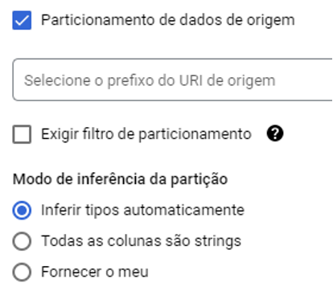

Depois de escolher a origem, é preciso escolher o destino. Escolha o projeto, conjunto de dados, dê um nome a tabela e escolha o tipo de tabela.

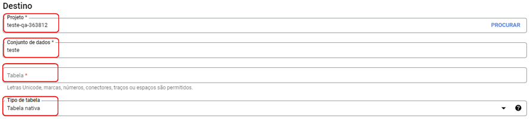

Se for uma tabela em branco, o tipo de tabela será “Tabela nativa”, caso contrário será uma “Tabela externa” e dependendo da origem será necessário colocar o Id de conexão.

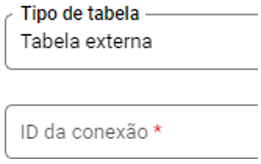

Além disso, para criar uma tabela externa, que não seja através de arquivo ou do drive, é necessário que o conjunto de dados seja do local apropriado para receber os dados.

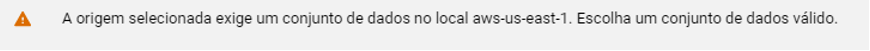

Por último tem o Esquema ele é diferente para cada caso.

### **Tabela em Branco**

Tem esse painel:

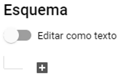

Se escolher editar por texto, os campos serão adicionados via comando SQL, caso escolha fazer através das caixas, clicando no +, ele abre um painel para editar o campo.

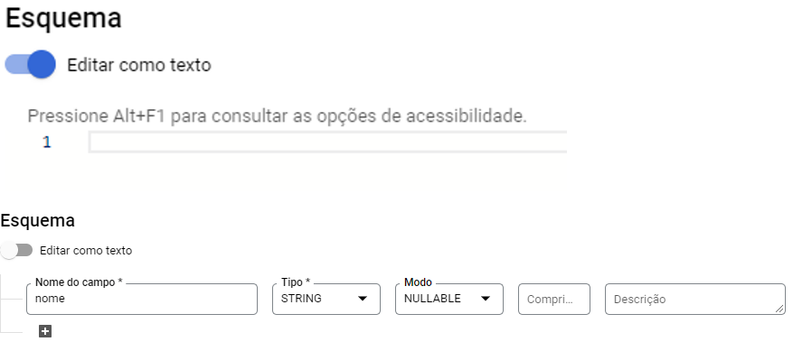

### **Tipos de tabela**

### **Tabela Por Arquivo (Fazer Upload)**

O Esquema é gerado pelo próprio arquivo.


### **Tabela Drive ou de Origem Externa (Cloud)**

Ele possui a opção tanto de gerar campos, como na tabela em branco, mas também uma detecção automática do Esquema.

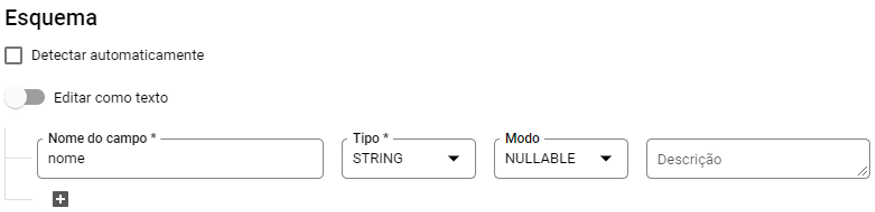

### **Opções avançadas**

Dependendo da origem da tabela, existe mais um painel, que é a de opções avançadas. Para cada origem existe opções diferentes.

### **Tabela em branco**

Para as tabelas em branco, existe esse painel de opções avançadas. Sendo possível alterar a chave de criptografia, assim como ativar a ordenação.

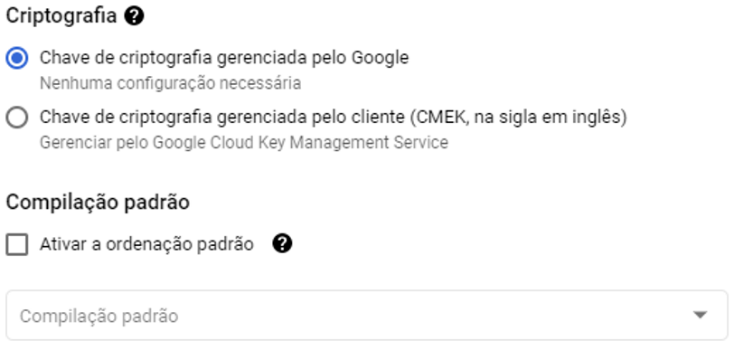

### **Tabela Por Arquivo**

Para as tabelas que forem criadas através de upload de arquivos, existe esse painel de opções avançadas.

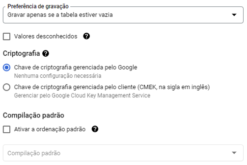

### **Tabela Drive**

Só existe uma opção avançada, que é “Valores desconhecidos”. Caso essa opção estiver marcada, valores de colunas que não correspondem ao Esquema serão ignorados, sendo assim não serão importadas para o BQ.


Depois fazer todas as configurações necessárias da tabela, basta clicar em “Criar Tabela”

---

# **Boas Práticas**

[Boas praticas de consultas no BigQuery](boas-praticas-de-consultas-no-bigquery.md)
