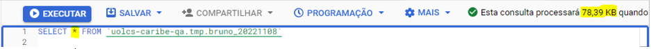
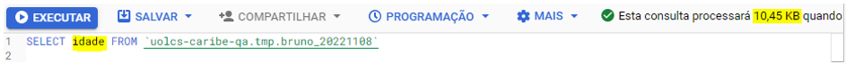
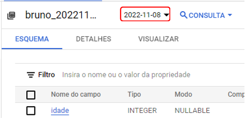
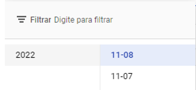
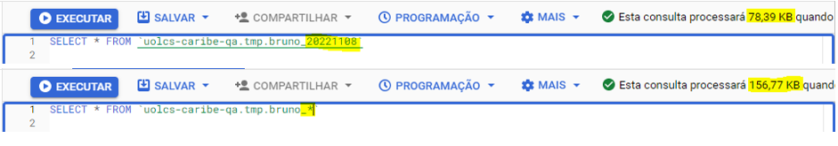
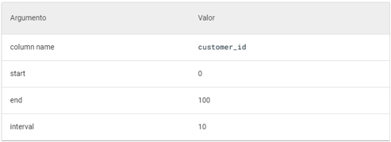
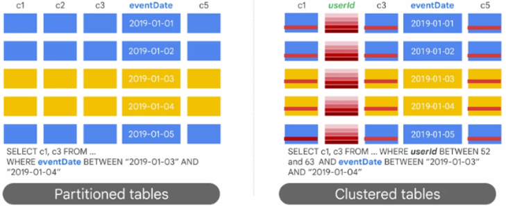

[Documentação](../../../documentacao.md) > [GCP - Google Cloud Platform](../../gcp-google-cloud-platform.md) > [BigQuery](../bigquery.md)

# Boas praticas de consultas no BigQuery

- [Querys](#querys)
- [Particionamento e clusterização de tabelas](#particionamento-e-clusteriza-o-de-tabelas)
  - [Sufixo:](#sufixo)
  - [Tempo de processamento:](#tempo-de-processamento)
  - [Coluna por unidade de tempo:](#coluna-por-unidade-de-tempo)
  - [Inteiros:](#inteiros)
  - [Cluster:](#cluster)
  - [Particionamento diário, por hora, mensal ou anual](#particionamento-di-rio-por-hora-mensal-ou-anual)
  - [Particionamento X Cluster, quando usar?](#particionamento-x-cluster-quando-usar)
- [Gerar uma amostra da tabela para exploração](#gerar-uma-amostra-da-tabela-para-explora-o)

## **Querys**

- **SELECT \* FROM:** Evite, utilize apenas as colunas que precisa.
  - Com (\*):



- - Com as colunas necessárias:



- **WHERE:** Filtre o quanto antes.

- **JOIN:** Coloque a maior tabela a esquerda.

- **GROUP BY:** Baixa cardinalidade é mais rápida do que a alta cardinalidade.

- **ORDER:** Colocar na consulta (query) mais externa

## **Particionamento e clusterização de tabelas**

Documentação

**Particionamento: <https://cloud.google.com/bigquery/docs/partitioned-tables>**

**Cluster: <https://cloud.google.com/bigquery/docs/clustered-tables>**

Ao criar ou utilizar tabelas, é importante utilizar o particionamento de tabelas. Isso torna a consulta mais performática e menos custosa. No BQ existem alguns tipos de particionamento.

### **Sufixo:**

- Ele utiliza o sufixo dos nomes das tabelas. Por exemplo isso significa que duas tabelas possuem o mesmo sufixo.

Ao abrir uma tabela assim, ele trará esse painel:



Isso mostra detalhes da tabela que você quer acessar, mas nesse tipo de tabela, existe um painel extra onde é possível ver o particionamento dessa tabela. Isso mostra que essa tabela tem uma particionamento por data. Gerando um outro painel que mostra outras tabelas com o mesmo sufixo, mas com o final diferente.



Em uma query para pegar todas as tabelas que possuem o mesmo sufixo basta colocar um asterisco (\*) no final

EX:



Além de reunir tabelas com o mesmo sufixo, é possível filtrar, basta utilizar:

SELECT coluna FROM ` dataset.table\*`

WHERE \_table\_suffix = '20221108'

### **Tempo de processamento:**

- o BigQuery atribui automaticamente linhas às partições com base quando o BigQuery processa os dados. O BigQuery cria uma pseudocoluna chama \_PARTITIONTIME. Para fazer um filtro, utilizando esse parâmetro, basta utilizar:

SELECT coluna FROM `dataset.table`

WHERE \_PARTITIONTIME BETWEEN TIMESTAMP('2022-10-04') AND TIMESTAMP('2022-10-07')

Se a granularidade da partição for diária, a tabela também conterá uma pseudocoluna chamada \_PARTITIONDATE.

### **Coluna por unidade de tempo:**

- As tabelas são particionadas com base em uma coluna de TIMESTAMP, DATE ou DATETIME na tabela.

SELECT coluna FROM `dataset.table`

coluna\_partionada > '2022-10-04'

### **Inteiros:**

- As tabelas são particionadas com base em uma coluna de números inteiros. Para criar uma partição com números é necessário definir 4 parametros, a coluna de particionamento, o valor inicial do particionamento de intervalo (inclusive), o valor final do particionamento de intervalo (exclusivo) e o intervalo de cada intervalo dentro da partição.

Ex:



### **Cluster:**

- São tabelas que têm uma ordem de classificação de colunas definida pelo usuário usando colunas em cluster. Uma coluna em cluster é uma propriedade de tabela definida pelo usuário que classifica blocos de armazenamento com base nos valores nas colunas em cluster, que são dimensionáveis ao tamanho da tabela. Ao utilizar cluster em várias colunas, a ordem das colunas determina quais colunas têm precedência quando o BigQuery classifica e agrupa os dados em blocos de armazenamento. Porém ao consultar uma tabela em cluster não será possível receber um custo exato de uma consulta, mas apenas uma estimativa, porque o número de blocos de armazenamento a serem verificados não é conhecido antes da execução da consulta.

### **Particionamento diário, por hora, mensal ou anual**

O BigQuery permite que, ao particionar uma tabela por coluna de unidade de tempo ou de processamento, seja possível fazer partições com granularidade por hora, dia, mês ou ano. Para as granularidades de **Hora** e de **Mês/Ano** existem **casos particulares** para quando utilizar cada uma delas.

Portanto, é recomendado, que caso precise utilizar esse particionamento granular, utilize o particionamento **Diário**.

### **Particionamento X Cluster, quando usar?**

****

- **Particionamento:**
  - Quando é necessário saber os custos de consulta antes de executa-la.
  - Necessidade de gerenciamento no nível do particionamento. Por exemplo, definir um prazo de validade para a partição, carregar dados para uma partição específica ou excluir partições.
  - Especificar como os dados são particionados e quais dados estão em cada partição. Por exemplo, definir a granularidade de tempo ou os intervalos usados para particionar a tabela para particionamento por intervalo de números inteiros.

- **Cluster:** 
  - Quando não é necessário garantias de custo rígidas antes de executar a consulta.
  - Quando precisa de mais granularidade do que o particionamento permite. Para conseguir benefícios de clustering, além das vantagens do particionamento, use a mesma coluna para particionamento e clustering.
  - As consultas geralmente possuem filtros ou agregação em várias colunas específicas.
  - A cardinalidade do número de valores em uma coluna ou grupo de colunas é grande.

Porém, é possível juntar particionamento com clustering, seguindo sempre essa ordem: primeiro particiona os dados, depois, os dados de cada partição são agrupados pelas colunas de clustering.

## **Gerar uma amostra da tabela para exploração**

No BigQuery você sempre será cobrado por bytes escaneados pela query e as tabelas usam um armazenamento colunar. Dessa forma, utilizar um LIMIT não afeta os bytes processados porque ele sempre precisará ler todos os registros das colunas.

Uma alternativa é utilizar a funcionalidade de TABLE SAMPLING: com ela só será cobrado pelo tamanho da amostra.

```sql
SELECT * FROM projeto.dataset.tabela TABLESAMPLE SYSTEM (10 PERCENT)
```

Mais detalhes da documentação: <https://cloud.google.com/bigquery/docs/table-sampling>
