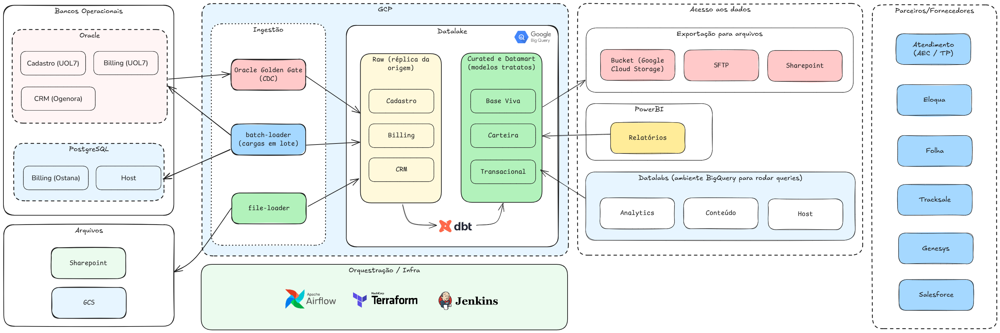

[Documentação](../../documentacao.md) > [GCP - Google Cloud Platform](../gcp-google-cloud-platform.md)

# Data Lake - GCP

- [Visão geral](#vis-o-geral)
  - [Apresentações](#apresenta-es)
  - [Arquitetura](#arquitetura)
- [Componentes](#componentes)
  - [Ingestão em batch](#ingest-o-em-batch)
  - [Ingestão Stream (replicação)](#ingest-o-stream-replica-o)
  - [Transformação](#transforma-o)
    - [Links úteis:](#links-teis)
  - [Metadados de ingestão](#metadados-de-ingest-o)

Monitoração

Dashboard para acompanhamento de uso e custos:

<https://datastudio.google.com/reporting/76ccc45b-2307-48e2-9bdd-2839e5e9ce13>

# **Visão geral**

## **Apresentações**

2022-11: [DataLake - GCP.pptx](https://uolinc.sharepoint.com/:p:/r/sites/SquadCaribe/Documentos%20Compartilhados/General/Apresenta%C3%A7%C3%B5es/DataLake%20-%20GCP.pptx?d=w02b4c56b7f4d43d89b2c48ba5f90674d&csf=1&web=1&e=cLB5xD) - Proposta inicial da primeira entrega em GCP, feita para toda área de D&A

2023-01: [DataLake - GCP\_2.pptx](https://uolinc.sharepoint.com/:p:/r/sites/SquadCaribe/Documentos%20Compartilhados/General/Apresenta%C3%A7%C3%B5es/DataLake%20-%20GCP_2.pptx?d=wbcacdb2ade664792adb69b8cbccef4bc&csf=1&web=1&e=IlAhBC) - Apresentação para Roterdã dos componentes entregues

2023-05: [DataLake GCP - Mai-23 - Data UOL 4.pptx](https://uolinc-my.sharepoint.com/:p:/p/grmachado/EZaavAqLOdpPjToboLOtyqwBRe37NTlGghr1nmAwKF8MGw) ([Vídeo](https://uolinc.sharepoint.com/:v:/r/sites/DataAnalytics/Arquivos/V%C3%ADdeos/4%C2%BA%20DataUOL%20(20230525).mp4?csf=1&web=1&e=S8fMEV&nav=eyJyZWZlcnJhbEluZm8iOnsicmVmZXJyYWxBcHAiOiJTdHJlYW1XZWJBcHAiLCJyZWZlcnJhbFZpZXciOiJTaGFyZURpYWxvZy1MaW5rIiwicmVmZXJyYWxBcHBQbGF0Zm9ybSI6IldlYiIsInJlZmVycmFsTW9kZSI6InZpZXcifX0%3D)) - Apresentação para UOLCS no Data UOL 4

2023-07: [Datalake GCP\_apresentação\_P&D.pdf](https://uolinc.sharepoint.com/sites/SquadCaribe/Documentos%20Compartilhados/General/Apresenta%C3%A7%C3%B5es/Datalake%20GCP_apresenta%C3%A7%C3%A3o_P&D.pdf?CT=1694545982063&OR=ItemsView) ([Vídeo](https://uolinc-my.sharepoint.com/:v:/p/rcastro/EUjpMxVFF9hAv3Nm8Zp0UqgBatHwacO0c5OMVT9xwFkQ6w?nav=eyJyZWZlcnJhbEluZm8iOnsicmVmZXJyYWxBcHAiOiJTdHJlYW1XZWJBcHAiLCJyZWZlcnJhbFZpZXciOiJTaGFyZURpYWxvZyIsInJlZmVycmFsQXBwUGxhdGZvcm0iOiJXZWIiLCJyZWZlcnJhbE1vZGUiOiJ2aWV3In19&e=p1dXap)) - Apresentação para P&D UOLCS

## **Arquitetura**

****

---

# **Componentes**

## **Ingestão em batch**

A ingestão de dados é feita em cargas batch utilizando o Cloud Run + Airflow.

---

## **Ingestão Stream (replicação)**

Para replicação de bases Oracle, por conta do volume de dados optamos pelo uso do Oracle Golden Gate que faz uma replicação via Stream a nível de commit.

Mais detalhes na doc: [Oracle Golden Gate for Big Data](data-lake-gcp/disponibilizacao-de-dados-no-datalake/fontes-externas/oracle-golden-gate-for-big-data.md)

---

## **Transformação**

Transformações serão primariamente feitas através de queries no BigQuery, usando o dbt + Airflow.

- Componentes:
  - dbt-runner: <https://stash.uol.intranet/projects/BIBD/repos/app-caribe-batch/browse/app-caribe-dbt-runner>
  - dag-maker: <https://stash.uol.intranet/projects/BIBD/repos/app-caribe-batch/browse/app-caribe-batch-dag-maker>
- Queries: <https://stash.uol.intranet/projects/BIBD/repos/app-caribe-transformer/browse>

### Links úteis:

- <https://docs.getdbt.com/docs/introduction>
- <https://docs.getdbt.com/guides/best-practices>

---

## **Metadados de ingestão**

Os metadados das tabelas do BigQuery serão documentados em um repositório centralizado no stash.

Uma vez que o arquivo de metadados for atualizado no repositório, automaticamente um processo no Jenkins vai disparar a função que preenche os dados no BigQuery.

- Componentes: <https://stash.uol.intranet/projects/BIBD/repos/app-caribe-batch/browse>
- Metadados: <https://stash.uol.intranet/projects/BIBD/repos/app-caribe-metadata/browse>
