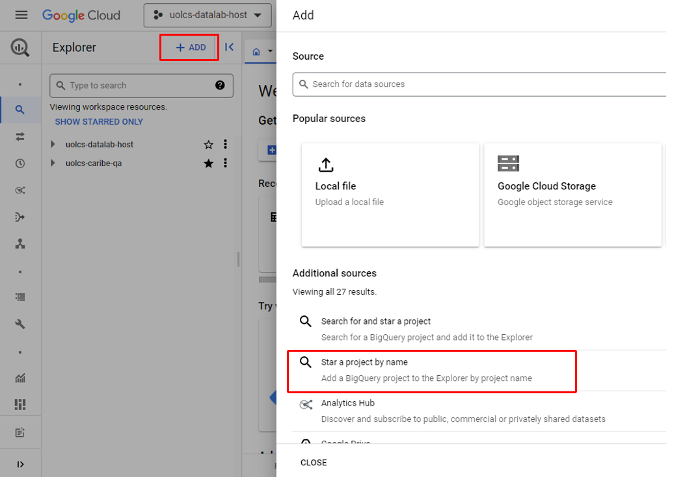
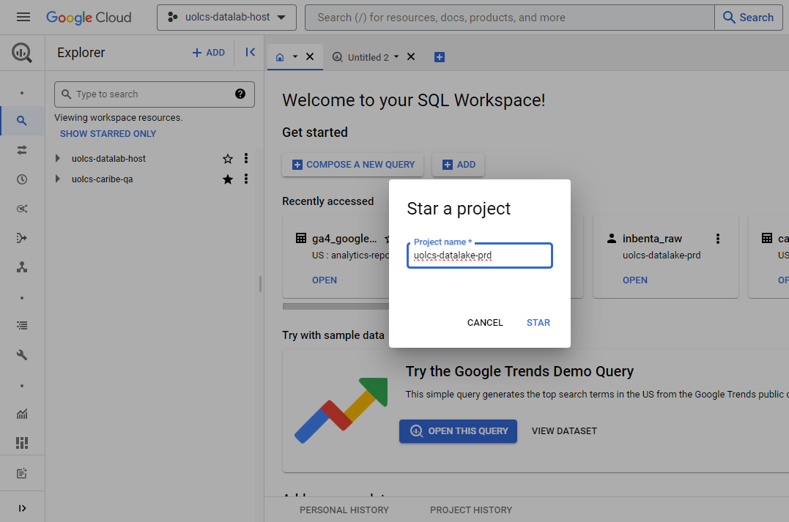

[Documentação](../../../../documentacao.md) > [GCP - Google Cloud Platform](../../../gcp-google-cloud-platform.md) > [Data Lake - GCP](../../data-lake-gcp.md) > [Acessos](../acessos.md)

# Acesso aos dados do Datalake

# **1, Datalab**

Para acessar o Datalake é preciso antes de um ambiente com permissão para execução de queries. Esse ambiente chama Datalab e é um projeto no GCP onde os usuários tem permissão de executar queries e criar tabelas.

Pedidos de criação e acesso a datalabs é feito ao time Caribe via Teams: [D&A Datalake - Notificações | Acessos | Microsoft Teams](https://teams.microsoft.com/l/channel/19%3A5143f371d4974549b8e8da78bb73d0e0%40thread.tacv2/Acessos?groupId=d9beaec3-d0b6-4b51-8e4f-bf0d0eb8bbdf&tenantId=7575b092-fc5f-4f6c-b7a5-9e9ef7aca80d)

- Informar os membros que precisam de acesso e a qual time pertence

| Área                    | Datalab                       |
|:------------------------|:------------------------------|
| Atendimento AEC         | uolcs-datalab-atendimento-aec |
| Atendimento TP          | uolcs-datalab-atendimento-tp  |
| Colab                   | uolcs-datalab-colab           |
| Cosmo                   | uolcs-datalab-cosmo           |
| Customer Marketing      | uolcs-datalab-customer-mkt    |
| DPM                     | uolcs-datalab-dpm             |
| Edtech                  | uolcs-datalab-edtech          |
| FinOps                  | uolcs-datalab-finops          |
| Host                    | uolcs-datalab-host            |
| Ingresso                | uolcs-datalab-ingresso        |
| Planejamento Financeiro | uolcs-datalab-plan-financeiro |
| P&D Atendimento         | uolcs-datalab-pd-atendimento  |
| Platcorp                | uolcs-datalab-platcorp        |
| Publicidade             | uolcs-datalab-publicidade     |

# **2, Acesso aos dados**

## **2.1 Pedido de acesso**

Os dados do datalake estão no projeto do GCP **uolcs-datalake-prd** e organizados em uma estrutura de **Domínio** (Área de negócio dona do dado) e **Camada** (nível de tratamento dos dados: raw, curated e datamart).

Pedidos de acesso são feitos via IDM:

- [Pedido de acessos via IDM](acesso-aos-dados-do-datalake/pedido-de-acessos-via-idm.md)

## **2.2 Visualizar os dados**

Para visualizar os dados, é preciso adicionar o projeto "uolcs-datalake-prd" aos favoritos:

****

****

****

Material de apoio

- [BigQuery - Guia Inicial](../../bigquery/bigquery-guia-inicial.md)
- [Boas praticas de consultas no BigQuery](../../bigquery/boas-praticas-de-consultas-no-bigquery.md)
