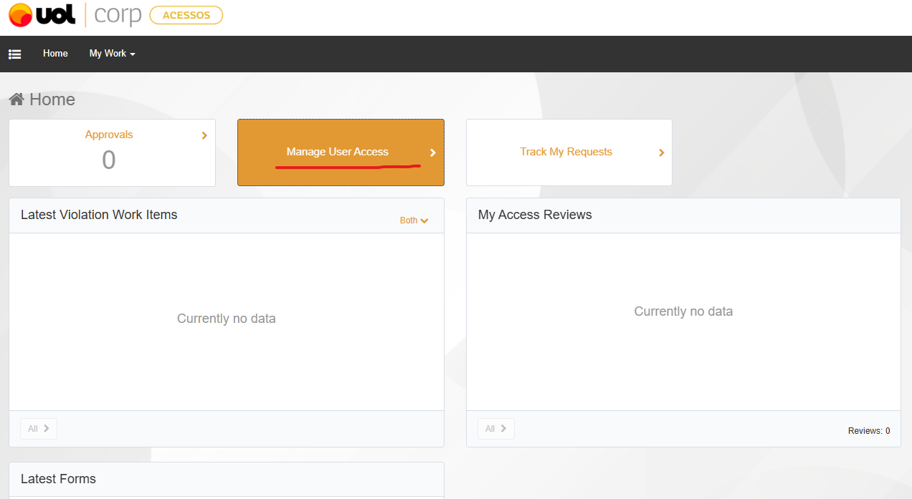
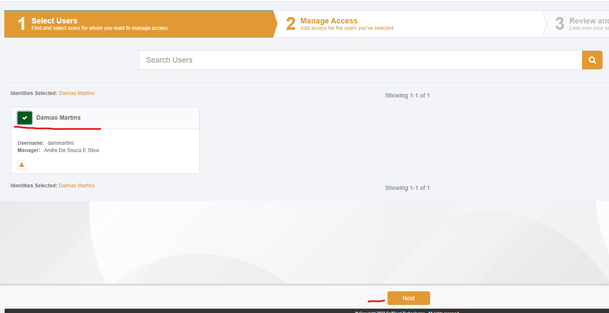
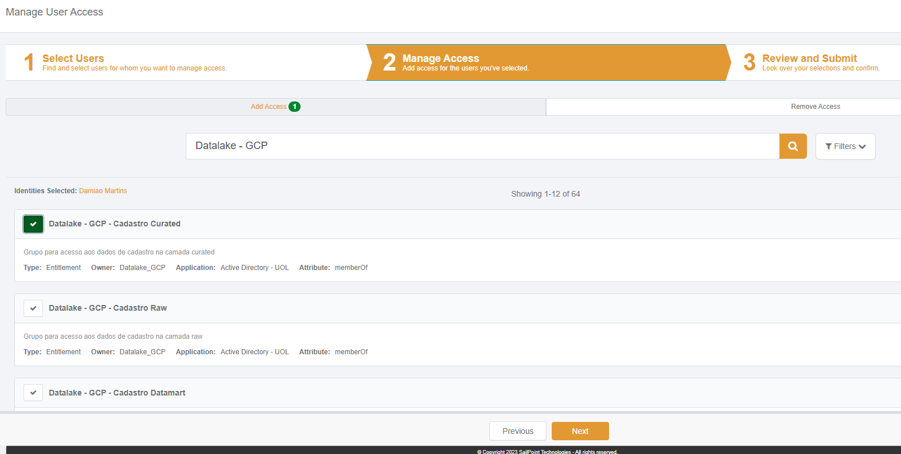
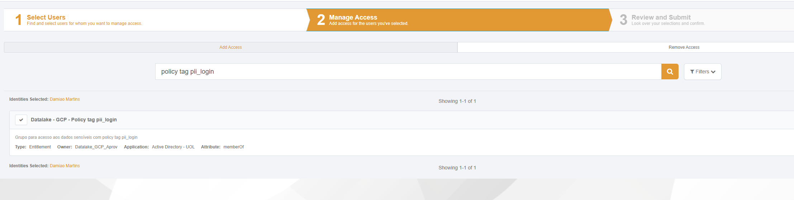
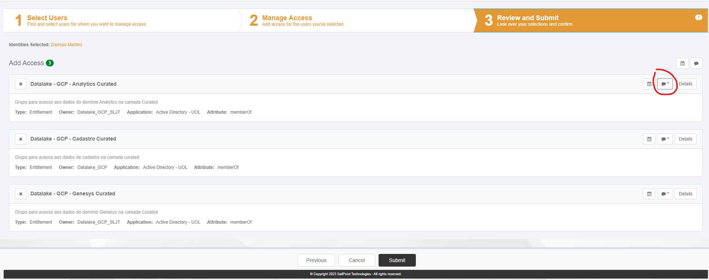

[Documentação](../../../../../documentacao.md) > [GCP - Google Cloud Platform](../../../../gcp-google-cloud-platform.md) > [Data Lake - GCP](../../../data-lake-gcp.md) > [Acessos](../../acessos.md) > [Acesso aos dados do Datalake](../acesso-aos-dados-do-datalake.md)

# Pedido de acessos via IDM

Para pedir acessos aos dados do Datalake, basta abrir uma solicitação via IDM:

Acesso à ferramenta: <https://idm.uolcorp.intranet/>

> [!CAUTION]
> Em caso de problemas, abrir chamado pelo JiraSD: [Central de Serviços UOLCS / Segurança / Reportar Falhas do IDM](https://jirasd.uolinc.com/jira/servicedesk/customer/portal/33/create/2264)

1. Clique em **Manage User Access**

2. Selecione seu usuário:

3. Pesquise por:

- Em caso de acesso a dados: "**Datalake - GCP - <Domínio que deseja acesso>**"
- Em caso de acesso a dados sensíveis:  "**Datalake - GCP - Policy tag <tipo de dado>**"
- Em caso de acesso a bucket: "**Datalake - GCP - Bucket <nome>**"

Exemplo:

- "**Datalake - GCP - Cadastro curated**"
- "**Datalake - GCP - Policy tag pii\_login**"

4. Adicione uma justificativa da necessidade de acesso. A aprovação é do gestor imediado e do Data Steward responsável pelo Domínio em questão. Após aprovação a liberação é automática.

