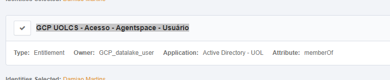

[Documentação](../../../../documentacao.md) > [GCP - Google Cloud Platform](../../../gcp-google-cloud-platform.md) > [Data Lake - GCP](../../data-lake-gcp.md) > [Acessos](../acessos.md)

# Agentspace e NotebookLM

Para usar o Agentspace ou NotebookLM precisa de uma licença.

# 1. Pedir acesso via IDM

Perfil: **GCP UOLCS - Acesso - Agentspace - Usuário**

# 2. Acessar aplicativo Agentspace

<https://vertexaisearch.cloud.google.com/us/home/cid/1f3d84d7-68e1-492c-b59a-da4c08f7f468?hl=en_US>

# 3. Acessar NotebookLM

<https://notebooklm.cloud.google.com/us/?project=953844561165>
