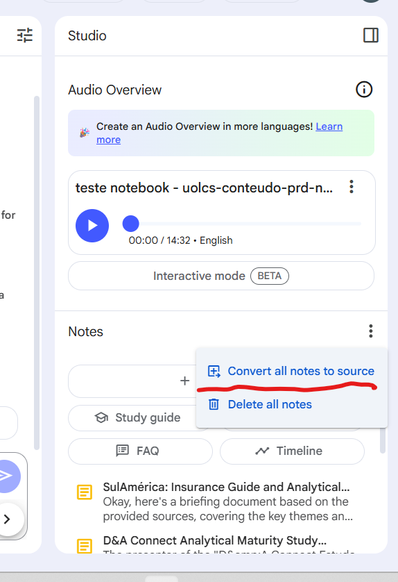
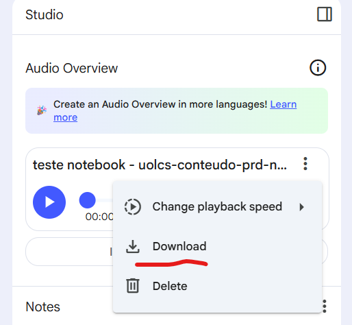

[Documentação](../../../../../documentacao.md) > [GCP - Google Cloud Platform](../../../../gcp-google-cloud-platform.md) > [Data Lake - GCP](../../../data-lake-gcp.md) > [Acessos](../../acessos.md) > [Agentspace e NotebookLM](../agentspace-e-notebooklm.md)

# [Rascunho] Migração NotebookLM entre projetos

**Limitações:**

- Não é possível fazer download dos sources
- é possível fazer somente cópia via texto.

**Opções:**

- Os arquivos enviados para os sources podem ser copiados (ctrl +c) via texto, tanto arquivos pdfs ou videos(transcrição)
- As notas realizadas podem ser copiados por texto
  - Agrupar todas as notas feitas pelo usuário e transformar em source para copia única
    - 
  - Colar todos os textos no novo notebook
- Audio gerado pela ferramenta (podcast) podem ser feito download se necessário.
  - 
