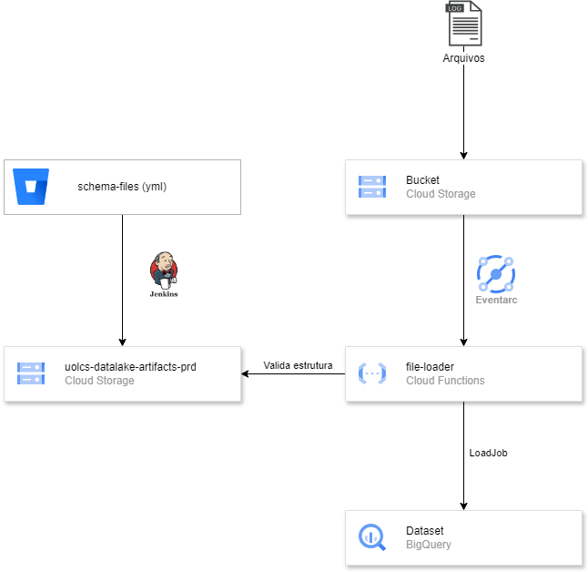

[Documentação](../../../../../../documentacao.md) > [GCP - Google Cloud Platform](../../../../../gcp-google-cloud-platform.md) > [Data Lake - GCP](../../../../data-lake-gcp.md) > [Disponibilizacao de dados no Datalake](../../../disponibilizacao-de-dados-no-datalake.md) > [Fontes externas](../../fontes-externas.md) > [Arquivos](../arquivos.md)

# File Loader

Componente responsável por receber eventos de arquivos escritos em Buckets e enviar para o BigQuery.

O [Sharepoint Loader](sharepoint-loader.md) utiliza este componente para enviar arquivos.

**Links:**

- <https://stash.uol.intranet/projects/BIBD/repos/app-caribe-schema-files/browse>
- [Sharepoint Loader](sharepoint-loader.md)

# **Arquitetura**

# **Arquivos suportados**

- CSV
- XLSX
- JSON
