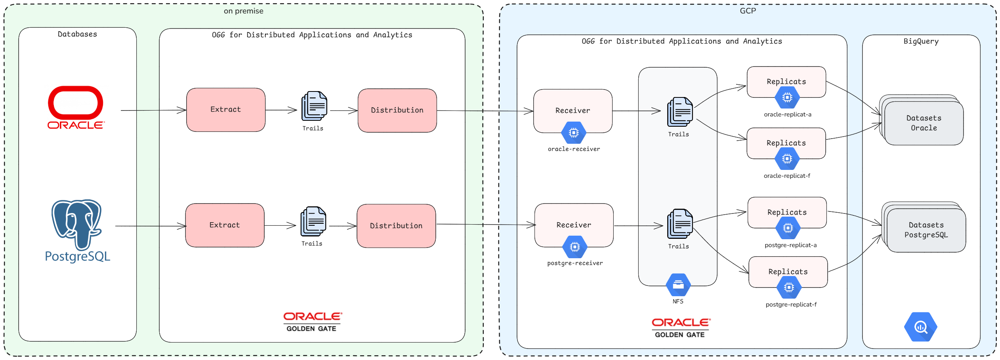

[Documentação](../../../../../documentacao.md) > [GCP - Google Cloud Platform](../../../../gcp-google-cloud-platform.md) > [Data Lake - GCP](../../../data-lake-gcp.md) > [Disponibilizacao de dados no Datalake](../../disponibilizacao-de-dados-no-datalake.md) > [Fontes externas](../fontes-externas.md)

# Oracle Golden Gate for Big Data

- 1 [Status](#status)
- 2 [Visão Geral](#vis-o-geral)
- 3 [Ambientes](#ambientes)
- 4 [Referências](#refer-ncias)
- 5 [Criptografia](#criptografia)
- 6 [Extract](#extract)
- 7 [Distribution Service](#distribution-service)
- 8 [Replicat](#replicat)
  - 8.1 [Criação de tabelas](#cria-o-de-tabelas)
  - 8.2 [Alteração em registros](#altera-o-em-registros)
  - 8.3 [Adição de colunas](#adi-o-de-colunas)
  - 8.4 [Remoção de colunas](#remo-o-de-colunas)
- 9 [Deduplicação](#deduplica-o)

# **Status**

**2023-03-01**: MVP em QA

**2023-04-06:** Inicio do deploy em PRD

# **Visão Geral**

**Referência Oracle**


**Deploy Caribe**

**v1**

**v2 (2025)**



# **Ambientes**

|                 | QA legado                  | QA                                                                                                                                   | PRD                                                                                                                                                                                                                                                                                                                                                                                                                                                                                                                                                                                                                                                                                                                                                                                                                                                                                                                        |
|:----------------|:---------------------------|:-------------------------------------------------------------------------------------------------------------------------------------|:---------------------------------------------------------------------------------------------------------------------------------------------------------------------------------------------------------------------------------------------------------------------------------------------------------------------------------------------------------------------------------------------------------------------------------------------------------------------------------------------------------------------------------------------------------------------------------------------------------------------------------------------------------------------------------------------------------------------------------------------------------------------------------------------------------------------------------------------------------------------------------------------------------------------------|
| Projeto         | **uolcs-caribe-qa**        | **uolcs-dados-dev**                                                                                                                  | **uolcs-dados-prd**                                                                                                                                                                                                                                                                                                                                                                                                                                                                                                                                                                                                                                                                                                                                                                                                                                                                                                        |
| Máquinas        | 10.231.3.28                | 10.224.82.190 - dados-ogg-dev1 <br/> 10.224.82.189 - dados-ogg-dev2                                                                  | 10.224.76.134 - dados-ogg-prd1 <br/> 10.224.76.135- dados-ogg-prd2                                                                                                                                                                                                                                                                                                                                                                                                                                                                                                                                                                                                                                                                                                                                                                                                                                                         |
| UI              | <http://10.231.3.28:7500/> | <http://vogg1.qa.data.intranet:7501/> <br/> <http://vogg2.qa.data.intranet:7501/>                                                    | <http://vogg1.data.intranet:7501/> <br/> <http://vogg2.data.intranet:7501/>                                                                                                                                                                                                                                                                                                                                                                                                                                                                                                                                                                                                                                                                                                                                                                                                                                                |
| Wallet          |                            | /u01/gg\_source/dadosogg/var/lib/wallet/cwallet.sso                                                                                  | /u01/gg\_source/dadosogg/var/lib/wallet/cwallet.sso                                                                                                                                                                                                                                                                                                                                                                                                                                                                                                                                                                                                                                                                                                                                                                                                                                                                        |
| Service account |                            | sa-dados-ogg-dev@uolcs-dados-dev.iam.gserviceaccount.com <br/> /u01/gg\_source/dadosogg/files/sa-dados-ogg-dev-sa-dados-ogg-dev.json | sa-dados-ogg-prd@uolcs-dados-prd.iam.gserviceaccount.com <br/> /u01/gg\_source/dadosogg/files/sa-dados-ogg-prd-sa-dados-ogg-prd.json                                                                                                                                                                                                                                                                                                                                                                                                                                                                                                                                                                                                                                                                                                                                                                                       |
| Dependências    |                            | /u01/app/oracle/product/oggbig/opt/DependencyDownloader/dependencies/bigquery\_2.24.5                                                | /u01/app/oracle/product/oggbig/opt/DependencyDownloader/dependencies/bigquery\_2.24.5                                                                                                                                                                                                                                                                                                                                                                                                                                                                                                                                                                                                                                                                                                                                                                                                                                      |
| NFS             |                            |                                                                                                                                      | dados-ogg-prd1 <br/><ul style="list-style-type: square;"><li>/filestore/data → /u01/gg_source/dadosogg/var/lib/data</li><li>/filestore/vogg1/checkpt → /u01/gg_source/dadosogg/var/lib/checkpt</li><li>/filestore/vogg1/ogg → /u01/gg_source/dadosogg/etc/conf/ogg</li><li>/filestore/vogg1/dirout → /u01/gg_source/dadosogg/dirout</li><li>/filestore/vogg1/dirsta → /u01/gg_source/dadosogg/dirsta</li><li>/filestore/vogg1/files → /u01/gg_source/dadosogg/files</li></ul> dados-ogg-prd2 <br/><ul><li>/filestore/data → /u01/gg_source/dadosogg/var/lib/data</li><li>/filestore/vogg2/checkpt → /u01/gg_source/dadosogg/var/lib/checkpt</li><li>/filestore/vogg2/ogg → /u01/gg_source/dadosogg/etc/conf/ogg</li><li>/filestore/vogg2/dirout → /u01/gg_source/dadosogg/dirout</li><li>/filestore/vogg2/dirsta → /u01/gg_source/dadosogg/dirsta</li><li>/filestore/vogg2/files → /u01/gg_source/dadosogg/files</li></ul> |

# **Referências**

- [Components of Oracle GoldenGate Microservices Architecture](https://docs.oracle.com/en/middleware/goldengate/core/21.3/coredoc/overview-components-oracle-goldengate-microservices-architecture.html)
- [Encrypting Data with the Master Key and Wallet Method](https://docs.oracle.com/en/middleware/goldengate/core/21.3/admin/encrypting-data-master-key-and-wallet-method.html)

# **Criptografia**

Para que os dados sejam transferidos pela rede de forma segura, é necessário utilizar uma chave de criptografia chamada de **MASTERKEY** que fica armazenada em uma **Wallet**.

Todas as instâncias que precisam enviar ou ler os trails, tanto de OGG quanto de OGG for Big Data, precisam compartilhar as mesmas chaves através do arquivo da Wallet: **cwallet.sso**.

Mais detalhes em [Encrypting Data with the Master Key and Wallet Method](https://docs.oracle.com/en/middleware/goldengate/core/21.3/admin/encrypting-data-master-key-and-wallet-method.html)

# **Extract**

Configuração feita pelo time de DBA.

Atualmente o extrator de QA está monitorando todo o schema **DATALAKE\_ELTUBR.**

O extract está gerando o trail **u7.**

Novas tabelas entram automaticamente no trail.

# **Distribution Service**

Uma vez configurado o distribution service pelos DBAs para apontar para nossa instância do OGG for Big Data, é configurado automaticamente o receiver service.

# **Replicat**

- Cada replicat monitora um trail
- Arquivos de configuração:
  - **<REPLICAT>.prm**: mapeamento de nomes de schema/tabela para o destino
  - **<REPLICAT>.properties**: configurações do handler responsável por escrever no destino

### Criação de tabelas

Para que novas tabelas é necessário que extrator esteja mandando para o trail e mapeado no replicat:

- **Extrator**: Se extrator estiver monitorando um schema, novas tabelas chegam automaticamente no trail
- **Replicat**: Mapear a origem/destino nos parâmetros (.prm)
  - Datasets não são criados automaticamente no destino
  - Tabelas são criadas automaticamente no destino

### Alteração em registros

**UPDATE**:

- Se UPDATE não for na PK: gera um evento de UPDATE
- Se UPDATE for em uma PK:
  - O padrão é o replicat abortar o processo
  - Usando **gg.handler.bigquery.pkUpdateHandling=delete-insert**
    - Gera uma linha com DELETE com o último estado do registro e uma linha com INSERT e os valores atualizados
    - **Atenção**: Quando a tabela não tem PK, o OGG considera todas as colunas como PK

**DELETE**:

- Gera um evento de DELETE com o último estado do registro

### **Adição de colunas**

Novas colunas são criadas automaticamente se o handler tiver a propriedade **gg.handler.bigquery.enableAlter=true**

**NOT NULL:**

- Não preenche automaticamente registros existentes com valor DEFAULT no destino
- Quando ocorre um INSERT ou UPDATE, nova coluna vem preenchida normalmente

### Remoção de colunas

Colunas removidas são mantidas no destino e novos eventos deixam ela NULL

# **Deduplicação**

Após o dado ser replicado no BigQuery, é possível realizar a deduplicação utilizando as colunas de *PK*, *position (*que é referente a ordem em que os comandos foram executados na origem) e *deleted*.

**Query**

```sql
SELECT * EXCEPT(Entry_Key)
FROM (  
    SELECT *,ROW_NUMBER() OVER (PARTITION BY $PK ORDER BY position DESC, deleted ASC) AS Entry_Key
    FROM $SCHEMA.TABLE
)
WHERE Entry_Key = 1 AND NOT deleted;
```

**Obs:** A query acima não está contemplando tabelas que não possuam PK, ou update em PK.
