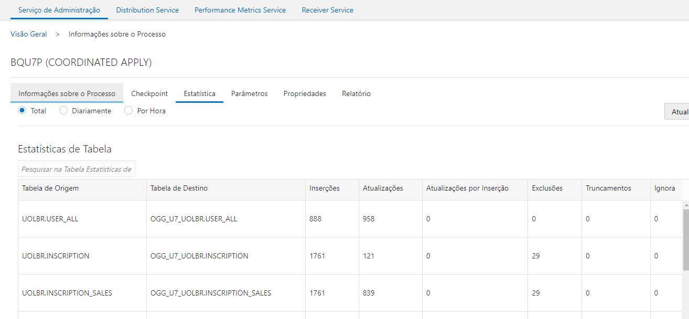
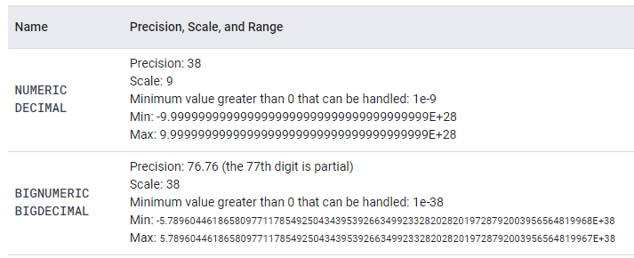
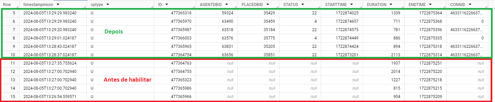

[Documentação](../../../../../../documentacao.md) > [GCP - Google Cloud Platform](../../../../../gcp-google-cloud-platform.md) > [Data Lake - GCP](../../../../data-lake-gcp.md) > [Disponibilizacao de dados no Datalake](../../../disponibilizacao-de-dados-no-datalake.md) > [Fontes externas](../../fontes-externas.md) > [Oracle Golden Gate for Big Data](../oracle-golden-gate-for-big-data.md)

# Fluxo de Adicao de nova tabela no OGG

- [Carga histórica](#carga-hist-rica)
- [Inclusão no OGG](#inclus-o-no-ogg)
  - [1. Solicitar cadastro da nova tabela no extrator](#key-1-solicitar-cadastro-da-nova-tabela-no-extrator)
  - [2. Cadastrar ou atualizar um replicat para incluir a tabela](#key-2-cadastrar-ou-atualizar-um-replicat-para-incluir-a-tabela)
    - [2.1. Criar/atualizar YML](#key-2-1-criar-atualizar-yml)
    - [2.2. Rodar Jenkins](#key-2-2-rodar-jenkins)
  - [3. Monitoria](#key-3-monitoria)
  - [4. Cadastrar query de deduplicação - dbt](#key-4-cadastrar-query-de-deduplica-o-dbt)
- [(Opcional) Recriar tabela no BigQuery adicionando partição](#opcional-recriar-tabela-no-bigquery-adicionando-parti-o)
- [Erros conhecidos](#erros-conhecidos)
  - [OGG-01151/OGG-01296: Error mapping from SOURCE.TABLE to DESTINATION.TABLE](#ogg-01151-ogg-01296-error-mapping-from-source-table-to-destination-table)
  - [OGG-01519: Waiting at EOF on input trail file](#ogg-01519-waiting-at-eof-on-input-trail-file)
  - [OGG-02650: Source wildcard specification <SOURCE>.<TABLE> does not include a catalog name, but the source table name <CATALOG>.<SOURCE>.<TABLE> includes a catalog name.](#ogg-02650-source-wildcard-specification-source-table-does-not-include-a-catalog-name-but-the-source-table-name-catalog-source-table-includes-a-catalog-name)
  - [id: null location: <COLUNA> message: Invalid NUMERIC value <VALOR> reason: invalid](#id-null-location-coluna-message-invalid-numeric-value-valor-reason-invalid)
  - [OGG-01003: id: null location: message: Missing required fields](#ogg-01003-id-null-location-message-missing-required-fields)
  - [Colunas NOT NULL não são replicadas em UPDATES](#colunas-not-null-n-o-s-o-replicadas-em-updates)

---

# **Carga histórica**

ATENÇÃO

A carga histórica deve ser realizada somente após as tabelas serem incluídas no Extrator

**1. Solicitar GRANT de SELECT nas tabelas para o usuário DATALAKE\_ELTUBR**

- Versionar script no repositório [Scripts Portal BD](https://stash.uol.intranet/projects/BIBD/repos/scripts-portal-db/browse/ORACLE/UOL7/SYSTEM/uol7_system_005.sql)
- Abrir chamado para execução:
  - Caso seja para criação de usuário o link para abertura é: <https://jira.intranet.uol.com.br/jira/servicedesk/customer/portal/41/create/2018>
  - Caso o usuário já exista e seja somente para inclusão de novo acesso o link para abertura é: <https://jira.intranet.uol.com.br/jira/servicedesk/customer/portal/41/create/2019>
- Se for uma base nova, cadastrar as credenciais no Secrets Manager (GCP)

**2. Solicitar ACL** (se necessário)

- Enviar e-mail para a lista <l-adm-bd> justificando a necessidade, conforme exemplo:

  > [!NOTE]
  > *Caros,*
  >
  > *Para seguir com a abertura do chamado para SEC liberar ACL do GCP para o banco precisamos do ok de vocês.*
  >
  > *O intuito é fazer carga batch de algumas tabelas desse banco para enriquecer o datalake no GCP e possibilitar cruzamentos com outros dados que já estão lá.*
  >
  > ***Origem:** GCP*
  >
  > ***Rede QA:** 10.224.80.0/22*
  >
  > ***Rede Produção**: 10.224.72.0/21*
  >
  > ***Destino***
  >
  > ***Servidor: xxxx***  
  > ***Banco: xxxx***
- Abrir chamado no [portal de SEC](https://jira.intranet.uol.com.br/jira/servicedesk/customer/portal/33/create/767?q=acl&q_time=1613771214860), anexando o retorno do time de banco. Exemplo de preenchimento do chamado:

  > [!NOTE]
  > ***Empresa**: UOLCS*
  >
  > ***Tipo**: Criação*
  >
  > ***Local**: None*
  >
  > ***Justificativa**: acesso a base do banco **xxxx** para extração de dados para o datalake no GCP.*
  >
  > ***Risco/impacto:** Sem acesso as bases*
  >
  > ***Tipo**: Permanente*
  >
  > ***Dependência**: Colocar a história do nosso quadro*
  >
  > *Preencher IPs de origem e destino.*

**3. Cadastrar tabelas no [Dag Maker](https://stash.uol.intranet/projects/BIBD/repos/app-caribe-batch-pipelines/browse/README.md)**

**4. Executar cargas no Airflow**

Atenção

Atualmente o batch-loader só consegue carregar em torno de 150M de linhas por execução. Se tabela tiver mais que isso, precisa quebrar em partes por data ou por intervalo de IDs.

**(Opcional) 5. Dividir carga em tabelas com muitos registros**

- Caso a tabela não consiga fazer a carga histórica, será necessário dividir a carga. A seguinte query consegue separar a tabela em blocos de X registros:

  ```sql
  SELECT CEIL(rownum/100000000) block_num,
  	MIN(<PK>) min_id,
  	MAX(<PK>) max_id,
  	COUNT(*) num_records
  FROM (SELECT <PK> FROM <TABLE> ORDER BY 1)
  GROUP BY CEIL(rownum/100000000)
  ORDER BY block_num;
  ```

**(Opcional) 6. Fazer carga histórica pelo Dataflow**

Para tabelas muito grandes pode ser trabalhosa a carga histórica via DagMaker. Nesses casos estamos testando utilizar o Dataflow, utilizando o template de JDBC para BQ:

**<https://stash.uol.intranet/projects/BIBD/repos/bigdata-lab/browse/dataflow>**

---

# **Inclusão no OGG**

## **1. Solicitar cadastro da nova tabela no extrator**

- Abrir um chamado no Jira para inclusão da tabela no extrator: <https://jira.intranet.uol.com.br/jira/servicedesk/customer/portal/41/create/5297?q=golden&q_time=1692382833040>
- Em caso de dúvidas ou problemas contactar os DBAs: Leandro ([lbohn@uolinc.com](mailto:lbohn@uolinc.com)) ou Cezar ([cavalenti@uolinc.com](mailto:cavalenti@uolinc.com))

Exemplos de chamados:

- [[SDED-17643] Solicitações Oracle GoldenGate](https://jira.intranet.uol.com.br/jira/browse/SDED-17643)

> [!CAUTION]
> Ao abrir o chamado, é importante reforçar que é necessário habilitar o ***supplemental logging*** no extrator. Isso fará com que operações de UPDATE enviem todas as colunas preenchidas e não somente as afetadas.
>
> Sempre que pedir a inclusão de um extrator, incluir no pedido:
>
> ```
> Favor ativar o supplemental logging a nível de tabelas para todas as novas tabelas inseridas no extract <EXTRATOR>/<trail>
> ```
>
> ou
>
> ```
> ADD SCHEMATRANDATA ”nome do pdb”.”nome do schema” ALLCOLS  
>   
> Exemplo:
> ```
>
> ```
> ADD SCHEMATRANDATA ATTENDANCE_NEGOTIATION.ATEND_ASSINATURAADM ALLCOL
> ```

Estamos utilizando um extrator por banco de origem, atualmente possuímos extratores para os bancos:

| Banco de origem   | Origem (Extrator)   | Destino (Receiver)   | Diretório (Nome do processo)   | Nome trail   | Responsável   | Observações                                                              |
|:------------------|:--------------------|:---------------------|:-------------------------------|:-------------|:--------------|:-------------------------------------------------------------------------|
| UOL3              | EXT\_UOL3           | UOL3\_BQ             | uol3\_bq                       | u3           | Caribe        |                                                                          |
| UOL7              | EXT\_U7BQ           | UOL7\_GCPBQ          | bigdata\_bq                    | u7           | Caribe        |                                                                          |
|                   | ub                  | IUOL7BI              | uol7b\_bq                      | i7           | BI            | Carga histórica billing                                                  |
|                   | EXT\_U7BI           | UOL7\_GCPBI          | uol7b\_bq                      | u7           | BI            | Extrator UOL7 separado a pedido de EngCorp, para isolar dados de Billing |
| Obusta            | EXT\_OBU            | OBU\_BQ              | obusta\_bq                     | ob           | Caribe        |                                                                          |
| Recupera          | EXT\_FIN            | FIN\_RECUPE          | recup\_bq                      | fi           | BI            |                                                                          |
| Ocaso             | EXT\_ATEN           | OCASO\_BQ            | ocaso\_bq                      | at           | BI            |                                                                          |
| Genesys           | EXT\_GEN            | GEN\_BQ              | gen\_bq                        | ge           | Caribe        |                                                                          |
| PIN               | EXT\_PIN            | PIN\_BQ              | pin\_bq                        | pi           | Caribe        | Banco de dados Omega                                                     |
| CRM               | EXT\_CBQ            | CRM\_BQ              | crm\_bq                        | cr           | Caribe        |                                                                          |
| Oizus             | EXT\_OIZU           | OIZUS\_BQ            | oizus\_bq                      | oi           | Caribe        | Dados do schema ORDER\_SERVICE\_ADM                                      |
| QA - Ostana       | EXT\_BS             | INVPER\_BQ           | inv\_per                       | ip           | Caribe        | Dados ostana - invoice\_period - Ambiente QA                             |

Obs: Caso o extrator esteja sendo configurando pela primeira vez no Banco de Origem, é necessário acionar o time de DevOps (Evandro ([ebucci@uolinc.com](mailto:ebucci@uolinc.com) ou Edga ([emariano@uolinc.com](mailto:emariano@uolinc.com))) para criar o diretório no nosso servidor do OGG for BigData para recebermos os dados.

---

## **2. Cadastrar ou atualizar um replicat para incluir a tabela**

- Um replicat é associado a 1 trail
- É possível que ter vários replicats apontando para o mesmo trail, mas cada um processando um conjunto diferente de tabelas
- Atualmente estamos usando um único Coordinated Replicat para processar o trail do UOLBR

A criação ou atualização de replicats é feita utilizando o job do Jenkins: <https://jenkins-dados.data.intranet/job/Caribe/job/ogg-replicat-maker/>

Os artefatos necessários para usar o job são versionados no repositório: <https://stash.uol.intranet/projects/BIBD/repos/datalake-artifacts/browse/oracle-golden-gate/replicats>

> [!WARNING]
> Para gerar os arquivos YML e SQL, é possível usar o script ogg-artifacts-builder: <https://stash.uol.intranet/projects/BIBD/repos/bigdata-lab/browse/ogg-artifacts-builder>

### 2.1. Criar/atualizar YML

A automação precisa de um arquivo yml contendo as configurações do replicat. O YML deve ser versionado no repositório [datalake-artifacts](https://stash.uol.intranet/projects/BIBD/repos/datalake-artifacts/browse/oracle-golden-gate/replicats), respeitando o seguinte padrão:

```bash
datalake-artifacts
└───oracle-golden-gate
   └───replicats
        └───<NOME_REPLICAT>
            └───<AMBIENTE> 
                │   replicat.yml
```

O arquivo YML deve seguir a estrutura:

**replicat.yml**

```yml
version: 1.0
specification:
  configuration:
    trail_name: # nome do trail
    trail_path: # Diretório do trail
    description: # Descrição do replicat
    source_schema: # Nome do schema da origem
    destination_dataset: # Nome do dataset de destino no BigQuery
  properties:
	# (Opcional) Adicionar propriedades customizadas para este replicat
	# Caso não seja informado, utiliza somente as propriedades padrões
    jvm.bootoptions: -Xmx1024m -Xms64m 
    gg.handler.bigquery.ignoreUnknownValues: 'false'
  tables:
  - name: TABELA_1
    keycols:
    - PK_1
	- PK_2
```

Com isso, após execução do Job do jenkins, serão criados:

- **OGG**:
  - **Parâmetros (.prm):** Contém o mapeamento das tabelas da origem para o BQ
  - **Propriedades (.properties):** Contém a configuração de conexão com o BQ
- **BigQuery**
  - Cria automaticamente o **destination\_dataset** caso não exista. Se já existir ele não fará nada.
  - Cria automaticamente as **tabelas** que ainda não existem

### 2.2. Rodar Jenkins

O Jenkins irá gerar os arquivos necessários para o OGG a partir do YML.

Job: <https://jenkins-dados.data.intranet/job/Caribe/job/ogg-replicat-maker/>

**Referências**:

- TABLE for Replicat: <https://docs.oracle.com/en/middleware/goldengate/core/21.3/reference/table-replicat.html#GUID-EFDC0DD2-0619-48D4-AF8A-FEB10D0AB57D>
- MAP for Extract: <https://docs.oracle.com/en/middleware/goldengate/core/21.3/reference/map-extract.html#GUID-8C9D2365-6274-4BC9-98F3-E3E18E859FFD>
- TABLE | MAP: <https://docs.oracle.com/en/middleware/goldengate/core/21.3/reference/table-map.html#GUID-C2356234-3780-48EE-9E7A-F21DC352638C>
- Metacolumns Keywords: <https://docs.oracle.com/en/middleware/goldengate/big-data/21.1/gadbd/metacolumn-keywords.html#GUID-7231D03B-5470-4E46-9852-C61273D7EEEA>

---

## **3. Monitoria**

Validar se o replicat está com status **Running** e estão chegando dados ao BigQuery

- QA:     <http://vogg2.qa.data.intranet:7501/>
- PROD: <http://vogg2.data.intranet:7501/>



---

## **4. Cadastrar query de deduplicação - dbt**

> [!WARNING]
> Para gerar os arquivos YML e SQL, é possível usar o script ogg-artifacts-builder: <https://stash.uol.intranet/projects/BIBD/repos/bigdata-lab/browse/ogg-artifacts-builder>

Utilizamos o dbt (app-caribe-transformer) para deduplicar os dados do OGG e da carga histórica.

- app-caribe-transformer: <https://stash.uol.intranet/projects/BIBD/repos/app-caribe-transformer/browse>

Para simplificar a query, criamos uma macro no dbt que monta a query automaticamente, precisando somente ajustar os parâmetros para a tabela específica.

Exemplo:

```bash
app-caribe-transformer
└───queries
   └───<dominio>
        └───ogg_<servidor>_raw
            │   queries.yml
			│   tabela.sql
```

**tabela.sql**

```yml
version: 1.0
specification:
  domain: cadastro
  owner: caribe
  configuration:
    schedule_interval: 10 2 * * *
    start_date: 2024-08-19
    timezone: America/Sao_Paulo
    parallel_tasks: false
  tables:
    - name: tabela
      dataset: domain_ogg_server_raw
      config:
        materialized: incremental
        incremental_strategy: merge_ogg
        unique_key:
          - pk_1
        cluster_by:
          - pk_1
      query_file: tabela.sql
```

**tabela.sql**

```sql
{{ create_merge_ogg_model(
      dataset_ingestion='domain_ogg_server_ingestion' # dataset que contém a tabela de eventos do OGG.
      dataset_history_raw='domain_server_raw' # dataset raw com dados de histórico.
      dataset_ogg_raw='domain_ogg_server_raw' # dataset que contém os dados finais. A réplica da origem.
      table_name='tabela' # tabela que será criada ou atualizada.
      table_ogg_ingestion_partitioned=True # a tabela de eventos do OGG pode ter sido ou não criada com particionamento por _PARTITIONTIME. (True/False)
      primary_key=['pk_1'] # lista de colunas que compõem a chave primária da tabela.
      list_columns=['pk_1', 'col_1', 'col_2'] # lista de colunas da tabela.
      intraday_load:  False # (opcional) flag para informar se a carga é feita de hora x hora, considerando a ultima hora cheia. (True/False)
      use_source:  True # (opcional) flag para informar se a query nos dados da tabela ingestion do ogg deve ser feita via source. (True/False)
)
}}
```

---

# **(Opcional) Recriar tabela no BigQuery adicionando partição**

> [!CAUTION]
> **IMPORTANTE:** Parar o replicat antes de iniciar esse processo

Caso a tabela tenha sido criada manualmente e sem partição, mas para otimizar custo faça sentido adicionar, será preciso recriar a tabela.

Tabelas criadas pela automação do Jenkins já são particionadas por padrão.

Exemplo:

ATENÇÃO

Atualmente o BigQuery não permite renomear uma tabela que tenha streaming buffer, que são os casos das tabelas escritas pelo OGG. Então é necessário criar uma cópia, apagar a tabela atual e recriar ela a partir da cópia.

```sql
-- 1. Copiar tabela
-- ATENÇÃO: Não é possível usar COPY ou fazer um job de cópia pois ele não inclui o Streaming buffer
CREATE TABLE IF NOT EXISTS `uolcs-datalake-prd.cadastro_ogg_uol7_uolbr_ingestion.TABELA_bkp` AS
SELECT * FROM `uolcs-datalake-prd.cadastro_ogg_uol7_uolbr_ingestion.TABELA`;

-- 2. Validar se a cópia tem a mesma quantidade de linhas da original
SELECT COUNT(1) FROM `uolcs-datalake-prd.cadastro_ogg_uol7_uolbr_ingestion.TABELA_bkp`
SELECT COUNT(1) FROM `uolcs-datalake-prd.cadastro_ogg_uol7_uolbr_ingestion.TABELA`;  

-- 3. Apagar tabela atual
-- DROP TABLE `uolcs-datalake-prd.cadastro_ogg_uol7_uolbr_ingestion.TABELA`  

-- 4. Recriar tabela adicionando partição
CREATE TABLE
   `uolcs-datalake-prd.cadastro_ogg_uol7_uolbr_ingestion.TABELA` 
LIKE `uolcs-datalake-prd.cadastro_ogg_uol7_uolbr_ingestion.TABELA_bkp`
PARTITION BY
   _PARTITIONDATE;

-- 5. Inserir dados na tabela nova
INSERT INTO `uolcs-datalake-prd.cadastro_ogg_uol7_uolbr_ingestion.TABELA` (
	_PARTITIONTIME,
	deleted,	
	-- demais colunas
)
SELECT 
	TIMESTAMP_TRUNC(TIMESTAMP_MICROS(timestampmicro), DAY),
	deleted,	
	-- demais colunas
FROM `uolcs-datalake-prd.cadastro_ogg_uol7_uolbr_ingestion.TABELA_bkp`
```

---

# **Erros conhecidos**

## **OGG-01151/OGG-01296: Error mapping from SOURCE.TABLE to DESTINATION.TABLE**

**Level: ERROR**

**Mensagem:**

```java
2023-05-18T16:57:06.165-0300 INFO | INFO OGG-06511 Oracle GoldenGate Delivery, BQU7OSA.prm: Using following columns in default map by name: IDT_ORDER_ALL, DAT_CREATION, COD_ORDER_ALL_STATUS, DNA_UID, IP, PORT, IDT_INSCRIPTION_CHANNEL, COD_SALES_AGENT, COD_SALES_STORE, COLLECT_STRATEGY, UUID, COD_PROMOTION, DAT_UPDATE, TOTAL_VALUE, FLG_CONTINUITY_SENT_EMAIL, FLG_CHANGE_PAYMENT_METHOD, COD_ATTENDANT. (main) 
2023-05-18T16:57:06.165-0300 INFO | INFO OGG-06510 Oracle GoldenGate Delivery, BQU7OSA.prm: Using the following key columns for target table cadastro_ogg_uol7_order_service_adm_ingestion.ORDER_ALL: IDT_ORDER_ALL. (main) 
2023-05-18T16:57:06.166-0300 INFO | INFO OGG-03010 Oracle GoldenGate Delivery, BQU7OSA.prm: Performing implicit conversion of column data from character set we8iso8859p1 to UTF-8. (main) 
2023-05-18T16:57:06.166-0300 WARN | WARNING OGG-01431 Oracle GoldenGate Delivery, BQU7OSA.prm: Canceled grouped transaction on cadastro_ogg_uol7_order_service_adm_ingestion.ORDER_ALL, Mapping error. (main) 
2023-05-18T16:57:06.166-0300 WARN | WARNING OGG-01003 Oracle GoldenGate Delivery, BQU7OSA.prm: Repositioning to rba 23287647 in seqno 190. (main) 
2023-05-18T16:57:06.166-0300 WARN | WARNING OGG-01151 Oracle GoldenGate Delivery, BQU7OSA.prm: Error mapping from ORDER_SERVICE_ADM.ORDER_ALL to cadastro_ogg_uol7_order_service_adm_ingestion.ORDER_ALL. (main) 
2023-05-18T16:57:06.167-0300 ERROR| ERROR OGG-01296 Oracle GoldenGate Delivery, BQU7OSA.prm: Error mapping from ORDER_SERVICE_ADM.ORDER_ALL to cadastro_ogg_uol7_order_service_adm_ingestion.ORDER_ALL. (main) 
```

**Solução:**

- Habilitar o supplemental logging no schema na origem, feito pelos DBAs.
- Caso o problema persistir: Se a PK da tabela for auto incremental na origem, é necessário utilizar outra coluna não nula como KEYCOL no replicat. Como o OGG não faz nada com a PK, não tem problema utilizar outra coluna como KEYCOL, ele só vai criar esse coluna como REQUIRED no BigQuery.

---

## **OGG-01519: Waiting at EOF on input trail file**

**Level: WARNING (replicat), ERROR (Distribution Service)**

**Mensagem no replicat:**

```java
Oracle GoldenGate Delivery, BQU7.prm: Waiting at EOF on input trail file /u01/gg_source/dadosogg/var/lib/data/bigdata_bq/u7000000475, which is not marked as complete; but succeeding trail file /u01/gg_source/dadosogg/var/lib/data/bigdata_bq/u7000000476 exists. If ALTER ETROLLOVER has been performed on source extract, ALTER EXTSEQNO must be performed on each corresponding downstream reader.
```

**Mensagem no Distribution Service:**

```java
ERROR   OGG-01224  Oracle GoldenGate Distribution Service for Oracle:  Generic error 110 noticed. Error description - Connection timed out., endpoint: vogg1.data.intranet:7503.
```

**Característica:**

Geralmente ocorre este erro no Replicat quando o Distribution Service recebe um timeout ao enviar os trails para o OGG for BigData.

**Solução:**

Um dos túneis da VPN estava caindo com frequência. Precisou acionar time de redes e realizar um ajuste nas configurações (PFS?)

---

## **OGG-02650:  Source wildcard specification <SOURCE>.<TABLE> does not include a catalog name, but the source table name <CATALOG>.<SOURCE>.<TABLE> includes a catalog name.**

**Exemplo de mensagem no ggserr:**

```java
Oracle GoldenGate Delivery, BQOBBBMA.prm: Source wildcard specification BILLING_BENEFIT_MANAGER_ADM.BENEFIT_TYPE does not include a catalog name, but the source table name BILLING_BENEFIT_MANAGEMENT.BILLING_BENEFIT_MANAGER_ADM.BENEFIT_TYPE includes a catalog name.
```

**Solução:**

Incluir o catalogo no mapeamento do replicat. Exemplo:

```java
REPLICAT BQOBBBMA
MAP <CATALOG>.<SCHEMA>.<TABLE>, TARGET <DATASET>.<TABLE>, KEYCOLS (<PRIMARY_KEY>);
```

---

## **id: null location: <COLUNA> message: Invalid NUMERIC value <VALOR> reason: invalid**

**Problema**

BigQueryHandler não tem suporte para o tipo BIGNUMERIC do BigQuery, então colunas decimais no Oracle com escala > 9 não conseguem ser persistidas, como o tipo FLOAT(126).



**Mensagem no log do replicat (BQ\*.log):**

```java
ERROR 2023-06-23 13:31:55.000667 [main] - id: null location: <COLUNA> message: Invalid NUMERIC value: 172.62999068857954 reason: invalid
```

**Solução:**

Persistir o valor como STRING ou truncar número para escala 9 (possível perda de precisão)

```java
# Ajustar escala para 9
gg.handler.bigquery.adjustScale=true

# OU

# Persistir como STRING
gg.handler.bigquery.mapLargeNumbersAsStrings=true
```

**Mais informações:**

- <https://docs.oracle.com/en/middleware/goldengate/big-data/21.1/gadbd/using-bigquery-handler.html>
- <https://cloud.google.com/bigquery/docs/reference/standard-sql/data-types#decimal_types>

---

## **OGG-01003: id: null location: message: Missing required fields**

**Problema:**

Ao cadastrar um replicat sem declarar as KEYCOLS e a tabela não tiver uma PK configurada no banco, o OGG irá considerar todas as colunas como obrigatórias. Quando algum registro tiver alguma coluna com valor nulo, ocorre o erro.

**Solução:**

Configurar ao menos uma coluna como KEYCOL, mesmo que não seja PK, a coluna só precisa não ter registros nulos.

**Mensagem no log do replicat (BQ\*.log):**

```java
ERROR 2023-09-29 11:13:13.000437 [main] - id: null location:  message: Missing required fields: Msg_0_CLOUD_QUERY_TABLE.cod_comis, Msg_0_CLOUD_QUERY_TABLE.cod_parce, Msg_0_CLOUD_QUERY_TABLE.dat_pagam, Msg_0_CLOUD_QUERY_TABLE.num_agrupa_efic, Msg_0_CLOUD_QUERY_TABLE.num_faixa_comis, Msg_0_CLOUD_QUERY_TABLE.val_pago. reason: invalid
```

---

## **Colunas NOT NULL não são replicadas em UPDATES**

**Problema:**

Em UPDATES (optype = 'U'), colunas NOT NULL na origem não são enviadas, somente colunas alteradas pelo UPDATE.

Isso aconteceu com a tabela STATUS do Genesys em 1/8/2024.

Após habilitar o supplemental transactional logging para todas as colunas da tabela, o problema foi resolvido.

**Solução:**

Habilitar o supplemental logging em todas as colunas da tabela de origem, feito pelos DBAs.

**Exemplo:**

****

```sql
SELECT 
  DATETIME(TIMESTAMP_MICROS(timestampmicro), 'America/Sao_Paulo') as timestampmicro, * EXCEPT(deleted, position, csn, timestampmicro) 
FROM `uolcs-datalake-prd.genesys_ogg_ogenora_ccadm_ingestion.STATUS` 
WHERE 
(DATETIME(_PARTITIONTIME) >= DATE('2024-08-05') OR _PARTITIONTIME IS NULL)
AND optype = 'U' 
order by timestampmicro DESC
```
