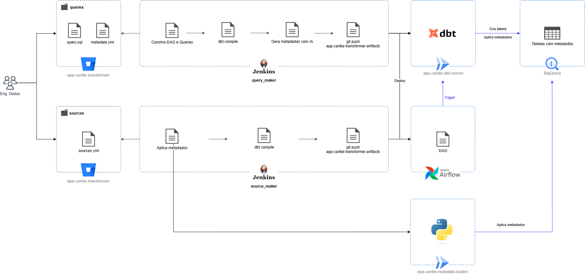

[Documentação](../../../../documentacao.md) > [GCP - Google Cloud Platform](../../../gcp-google-cloud-platform.md) > [Data Lake - GCP](../../data-lake-gcp.md) > [Disponibilizacao de dados no Datalake](../disponibilizacao-de-dados-no-datalake.md)

# Preenchimento de metadados

- [Responsabilidade](#responsabilidade)
- [Como preencher ou corrigir metadados](#como-preencher-ou-corrigir-metadados)
  - [1. Tabelas geradas pelo dbt (app-caribe-transformer)](#key-1-tabelas-geradas-pelo-dbt-app-caribe-transformer)
  - [2. Datasets de tabelas geradas pelo dbt (app-caribe-transformer)](#key-2-datasets-de-tabelas-geradas-pelo-dbt-app-caribe-transformer)
  - [3. Datasets e tabelas geradas por processos externos](#key-3-datasets-e-tabelas-geradas-por-processos-externos)
- [Arquitetura](#arquitetura)

# **Responsabilidade**

É de responsabilidade da pessoa que gerou a tabela preencher e manter os metadados atualizados.

# **Como preencher ou corrigir metadados**

## 1. Tabelas geradas pelo dbt (app-caribe-transformer)

⚠️ Atenção

O pipeline para entrega de queries tenta gerar automaticamente metadados faltantes usando IA

Documentação do transformer: <https://stash.uol.intranet/projects/BIBD/repos/app-caribe-transformer/browse#cadastro-metadata>

Adicionar um arquivo `metadata.yml`  na mesma pasta do `queries.yml`

Exemplo:

**metadata.yml**

```yml
version: 2

models:
  - name: tabela_1
    description: Descrição da tabela
    config:
      labels:
        type_ingestion: delta
        frequency_ingestion: daily
    columns:
      - name: email
        description: Descrição da coluna
        policy_tags:
          - '{{ var("policy_tag__pii_email") }}'
      - name: coluna_2
        description: Projeto de faturamento
```

## 2. Datasets de tabelas geradas pelo dbt (app-caribe-transformer)

No arquivo `metadata.yml` não é possível adicionar metadados para o dataset, pois o dbt não suporta e mais de uma pasta do transformer pode escrever no mesmo dataset.

Nesses casos é necessário adicionar os metadados em um arquivo `sources.yml` contendo somente os metadados do dataset, não precisa incluir as tabelas. Adicionar na pasta **dbt-datasets-metadata-only**

Caminho:

```java
app-caribe-transformer
└── sources
    └── dbt-datasets-metadata-only
        └── <nome_do_dataset>
            └── sources.yml
```

Exemplo:

**sources.yml**

```yml
version: 2  

sources:
- name: nome_do_dataset
  description: Descrição do dataset
  config:
    labels:
      data_steward: skfouri
      data_steward_bkp: thrsantos
      has_pseudonymized: true
      has_pii: true
  tables:
  - name: tabela_1
    description: Tabela de histórico de blacklist unificada
    config:
      labels:
        type_ingestion: full
    columns:
    - name: coluna_1
      description: Exemplo
    - name: coluna_2
      description: Identificador da pessoa
      policy_tags:
      - '{{ var(''policy_tag__pseudonymization_unique_person'') }}'
```

**Aplicar os metadados usando o job do Jenkins: <https://jenkinsbibd.intranet:8443/job/DAGs/job/source_maker/>**

## 3. Datasets e tabelas geradas por processos externos

⚠️ Atenção

A aplicação do metadado é realizada somente no momento do build. Então caso o processo que alimenta a tabela utilize **write\_disposition=WRITE\_TRUNCATE** ele irá apagar os metadados.

Nesse caso, recomendamos que o processo adicione um tratamento para manter os metadados na tabela.

Exemplo:

- o cleaner utiliza um código para pegar os metadados da tabela antes de truncar e reaplica após o job terminar: <https://stash.uol.intranet/projects/BIBD/repos/app-caribe-batch/browse/app-caribe-batch-cleaner/app/src/core/cleaner.py#191>

⚠️ Atenção

**Analytics Hub:**

Para datasets linkados no uolcs-datalake-prd via analytics hub, os metadados precisam ser aplicados no projeto original.

Nesses casos, adicione uma label "**source\_project\_id**" indicando o projeto que contém os dados.

Para todas as outras tabelas que não foram geradas pelo dbt, é possível adiciona-las como um source no dbt.

Com isso, além do preenchimento de metadados, também é possível aproveitar as outras funcionalidades como **source freshness** e **data quality tests.**

Caminho:

```java
app-caribe-transformer
└── sources
    └── <domínio>
        └── <nome_do_dataset>
            └── sources.yml
```

Exemplo:

**sources.yml**

```yml
version: 2  

sources:
- name: nome_do_dataset
  schema: nome_do_dataset
  loader: Nome da aplicação que gerou a tabela
  description: Descrição do dataset
  config:
    labels:
	  source_project_id: uolcs-datalake-publicidade-prd # (opcional) analytics hub: indica o projeto original que contém os dados
      data_steward: skfouri
      data_steward_bkp: thrsantos
      has_pseudonymized: true
      has_pii: true
    freshness:
      error_after:
        count: 1
        period: day
  tables:
  - name: tabela_1
    description: Tabela de histórico de blacklist unificada
    config:
      labels:
        type_ingestion: full
    columns:
    - name: coluna_1
      description: Exemplo
    - name: coluna_2
      description: Identificador da pessoa
      policy_tags:
      - '{{ var(''policy_tag__pseudonymization_unique_person'') }}'
	  data_tests:
		- not_null
```

**Aplicar os metadados usando o job do Jenkins: <https://jenkinsbibd.intranet:8443/job/DAGs/job/source_maker/>**

# **Arquitetura**


