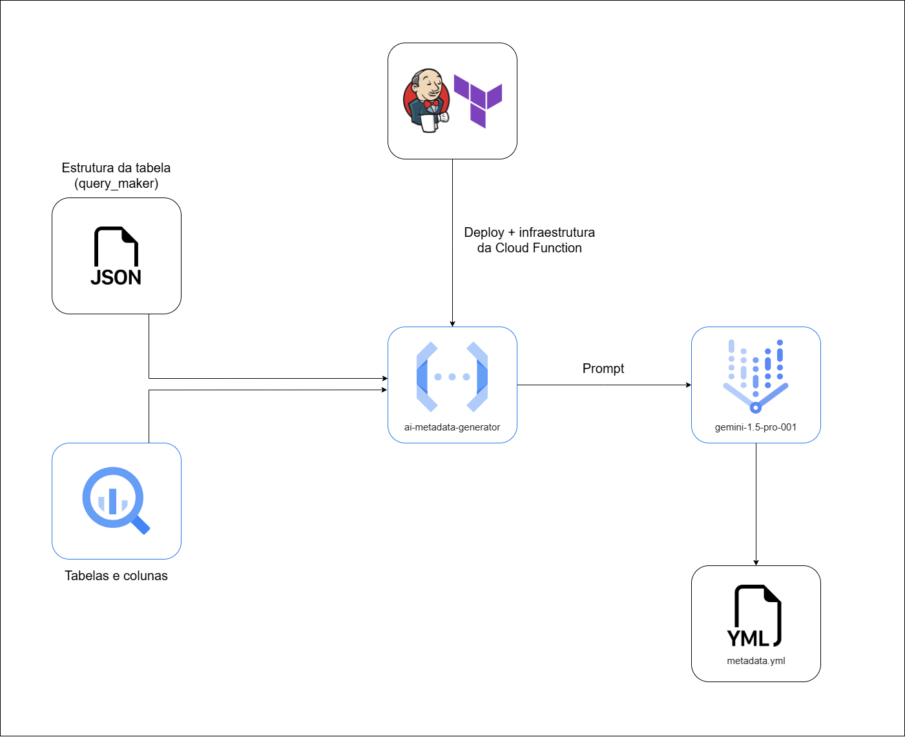

---
tags:
  - '#metadados'
  - '#gcp'
---

[Documentação](../../../../../documentacao.md) > [GCP - Google Cloud Platform](../../../../gcp-google-cloud-platform.md) > [Data Lake - GCP](../../../data-lake-gcp.md) > [Disponibilizacao de dados no Datalake](../../disponibilizacao-de-dados-no-datalake.md) > [Preenchimento de metadados](../preenchimento-de-metadados.md)

# Fluxo IA - Metadados

**Introdução**

Esse fluxo é utilizado para automatizar a geração e aplicação de metadados (descrições e policy tags) para tabelas do Data Lake, utilizando inteligência artificial. O objetivo principal é facilitar a governança de dados e a aplicação de classificações de informações sensíveis em larga escala.

**Objetivos**

- Reduzir o esforço manual relacionado a documentação

- Aumentar a cobertura de metadados

- Aplicar as policy tags de forma fácil e padronizada

**Arquitetura**

****

**Funcionamento**

1- Identificação de tabelas e colunas sem metadados

O projeto começa com arquivos contendo uma lista de tabelas e colunas que ainda não possuem policy tags ou descrições.

2- Montagem do prompt para IA

O script main.py carrega esses arquivos e utiliza templates de prompt para gerar perguntas para a IA.

3- Envio do prompt para a IA

O script envia os prompts para a API da IA na GCP e o modelo responde com sugestões de descrições de colunas e sugestões de policy tags.

4- Processamento das respostas e geração dos arquivos

A resposta da IA é processada e gravada em arquivos metadata.yml (para integração com DBT).

5- Aplicação dos metadados

Através de scripts os metadados gerados são aplicados diretamente nas tabelas do BigQuery via API.

**Exemplos**

| Coluna        | Antes          | Depois                                                                             |
|:--------------|:---------------|:-----------------------------------------------------------------------------------|
| email         | sem descrição  | Endereço de e-mail do cliente                                                      |
| cpf           | sem policy tag | '{{ var("policy\_tag\_\_pii\_email") }}'                                           |
| phone\_number | sem metadados  | Telefone principal do usuário   '{{ var(''policy\_tag\_\_pii\_telephone'') }}' |

.

**Arquivos de apoio**

Esta aplicação utiliza arquivos .csv que servem como referências para a geração dos metadados. Cada arquivo tem uma função específica no processo:

***colunas\_sem\_policy\_tag.csv***

Lista as colunas que ainda não possuem policy tags atribuídas.

- name: nome da coluna.
- description: descrição atual (se houver).

Utilizado para que a IA possa sugerir classificações sensíveis (como PII, confidential etc).

***policy\_tags\_mapping.csv***

Mapeia os identificadores das policy tags para seus nomes padronizados.

- policy\_tags: caminho completo da policy tag.
- policy\_tag\_name: nome padronizado (ex: pii\_name, pii\_login).

***policy\_tags\_padronizadas.csv***

Serve como uma base histórica de referências que associa colunas a policy tags e descrições padronizadas, o que ajuda a IA a manter consistência nas recomendações.

- name: nome da coluna.
- policy\_tag\_name: tag sugerida pela IA.
- count: número de ocorrências associadas à coluna.
- description: descrição original.
- padronized\_description: descrição revisada e padronizada.

***colunas\_importantes.csv***

Este arquivo funciona como um repositório de descrições padronizadas para colunas comuns. Ele é utilizado para garantir consistência na documentação e auxiliar a IA com exemplos de descrições que já têm qualidade.

- name: nome da coluna.
- description: descrição padronizada recomendada para aquela coluna.

Serve como uma base de referência para que a IA aprenda ou reutilize descrições que já passaram por validação humana ou processos anteriores. Isso ajuda a manter consistência nos metadados ao longo de diferentes tabelas.

.

**Prompts**

Esses arquivos contêm instruções específicas que definem como o modelo deve se comportar, o tipo de resposta esperada e o formato de saída desejado.

***prompt\_final.txt***

Este arquivo contém o template base para geração de descrições de colunas utilizando IA. Ele orienta a IA a gerar um metadata.yaml válido contendo descrições de colunas com base no nome da tabela e de suas colunas, mesmo quando não há nenhuma descrição anterior.

Como funciona:

- A IA recebe como entrada o nome da tabela e uma lista de colunas.

- É instruída a gerar descrições claras e diretas, ou seja sem exemplos ou termos vagos como "informação relevante".

- O retorno deve estar no formato .yaml.

***prompt\_policy\_tag.txt***

Template utilizado para a classificação automática de colunas com policy tags, indicando o nível de sensibilidade dos dados. Ele serve como base para ensinar à IA como associar colunas a policy tags apropriadas, com base no nome da coluna e sua descrição.

Como funciona:

- A IA recebe pares de nome e descrição de colunas como entrada.

- Com base nesses dados, deve atribuir uma das policy tags válidas (como pii\_email, pii\_name, pseudonymization\_unique\_person, etc).

.

**Link - Stash: <https://stash.uol.intranet/projects/BIBD/repos/app-caribe-ai-metadata-generator/browse>**

**Link - Looker Studio: <https://lookerstudio.google.com/reporting/64ddd115-03dc-416f-9af1-0ba47a7aa96e>**
