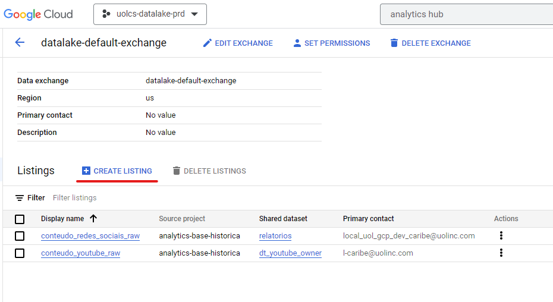
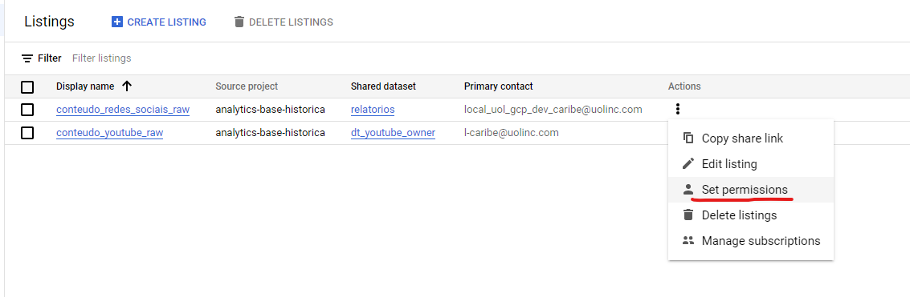
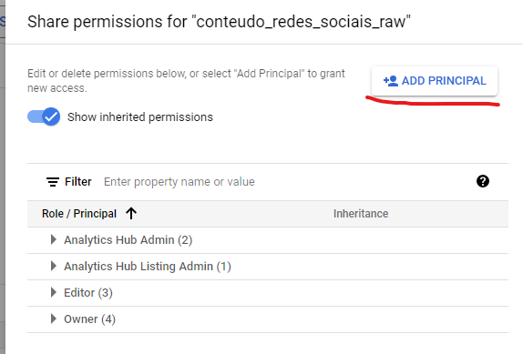
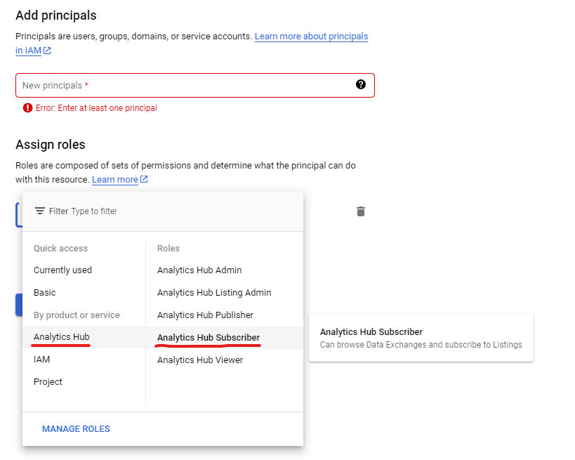
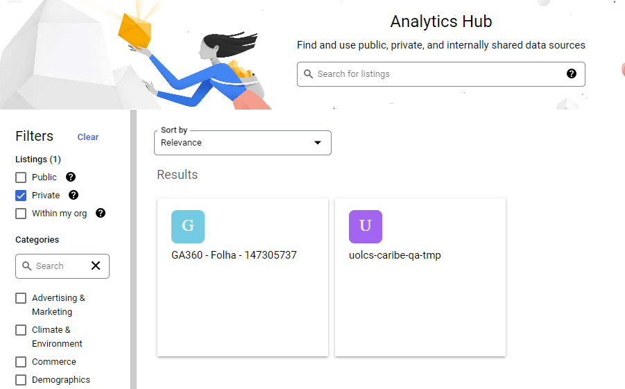
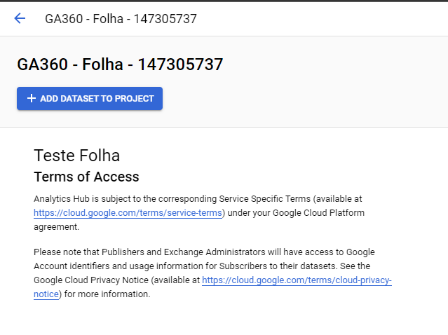
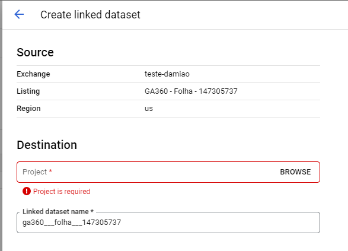

[Documentação](../../../../../documentacao.md) > [GCP - Google Cloud Platform](../../../../gcp-google-cloud-platform.md) > [Data Lake - GCP](../../../data-lake-gcp.md) > [Interno - Devs](../../interno-devs.md) > [[Interno-Devs] Acesso aos dados do Datalake](../-interno-devs-acesso-aos-dados-do-datalake.md)

# Analytics Hub

- [Glossário](#gloss-rio)
- [Exchanges](#exchanges)
- [Criar um Listing](#criar-um-listing)
- [Usar um Listing](#usar-um-listing)

O acesso aos dados do Datalake por pessoas de fora da organização UOLCS podem ser feitos através do Analytics Hub. Por ele é possível criar um link simbólico de datasets entre projetos.

Documentação resumida para enviar aos usuários: [analytics_hub.pdf](../../../../../../attachments/457885719.pdf)

# **Glossário**

- **Exchange**: Conceito central do Analytics Hub, onde serão criados os ***listings*** de datasets. É possível ter várias exchanges por projeto.
- **Listing**: Anúncio de um dataset. É necessário um listing por dataset, um listing está sempre atrelado a uma exchange. O listing pode ser **público** (qualquer usuário GCP pode usar) ou **privado** (somente usuários com permissão de ***subscriber*** podem usar).
- **Subscriber**: Pessoa que fará o link de um ***listing*** para um dataset no projeto de destino.
- **Publisher**: Pessoa que cria ***listings***

# **Exchanges**

**PRD:**

- [datalake-default-exchange](https://console.cloud.google.com/bigquery/analytics-hub/exchanges/projects/490873182749/locations/us/dataExchanges/datalake_default_exchange_1870fccca19?project=uolcs-datalake-prd)

# **Criar um Listing**

**1. Dentro da Exchange, clique em "Create Listing"**

****

**2. Preencha pelo menos os campos:**

- Display name: Nome da listagem que os usuários usarão para achar dentro do Analytics Hub
- Primary contact
- Request access contact
- Shared dataset

**3. Dar permissão para usuários usarem**

- Adicione o email usuário que precisa acessar no Listing com permissão "**Analytics Hub Subscriber**"

# **Usar um Listing**

- Abrir o Analytics Hub
- Ir em "Search listings"
- Filtrar por "Private"
- Clicar na listagem desejada e em seguida "Add dataset to project"
- Configurar o projeto e dataset de destino

