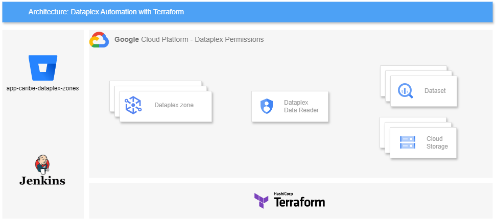
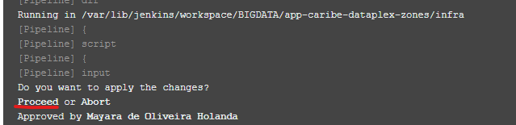

[Documentação](../../../../../documentacao.md) > [GCP - Google Cloud Platform](../../../../gcp-google-cloud-platform.md) > [Data Lake - GCP](../../../data-lake-gcp.md) > [Interno - Devs](../../interno-devs.md) > [[Interno-Devs] Acesso aos dados do Datalake](../-interno-devs-acesso-aos-dados-do-datalake.md)

# Dataplex - Liberação de Acesso

- [O que é o Dataplex?](#o-que-o-dataplex)
- [O que é o Terraform?](#o-que-o-terraform)
- [Visão Geral do Projeto](#vis-o-geral-do-projeto)
  - [Estrutura do Projeto](#estrutura-do-projeto)
- [Como Utilizar](#como-utilizar)
  - [Preenchimento dos Arquivos YML](#preenchimento-dos-arquivos-yml)
  - [Como inserir datasets que estão em outro projeto](#como-inserir-datasets-que-est-o-em-outro-projeto)
  - [Como inserir buckets](#como-inserir-buckets)
  - [Estrutura dos Arquivos YML](#estrutura-dos-arquivos-yml)
  - [Pipeline do Jenkins](#pipeline-do-jenkins)
  - [Estrutura do Diretório infra](#estrutura-do-diret-rio-infra)

## O que é o Dataplex?

O **Dataplex** é uma ferramenta de gerenciamento de dados da **Google Cloud** que permite organizar, gerenciar e governar dados em grande escala.

Ele facilita a criação de zonas de dados, onde cada zona pode ter diferentes políticas de acesso e governança.

## O que é o Terraform?

O **Terraform** é uma ferramenta de infraestrutura como código (IaC) que permite definir e provisionar infraestrutura através de arquivos de configuração.

Ele é amplamente utilizado para gerenciar recursos em várias plataformas de nuvem, incluindo o **Google Cloud Platform.**



## Visão Geral do Projeto

Este projeto foi criado para que por meio de arquivos YML versionados no Bitbucket seja possível gerenciar as zonas do **Dataplex no Datalake GCP** (uolcs-datalake-prd).

As atualizações nos recursos são aplicadas através de um pipeline do **Jenkins**, que utiliza o **Terraform** para provisionar e gerenciar a infraestrutura.

### Estrutura do Projeto

- **config/**: Diretório contendo arquivos YML para cada zona do Dataplex.
- **infra/**: Artefatos do Terraform.
- **Jenkinsfile**: Pipeline do Jenkins

## Como Utilizar

### Preenchimento dos Arquivos YML

- Clonar o repositório [app-caribe-dataplex-zones](https://stash.uol.intranet/projects/BIBD/repos/app-caribe-dataplex-zones/browse)
- Preencher os arquivos yml para cada zona do Dataplex com as informações necessárias
- Abrir uma PR para aprovação do time Caribe
- Executar o pipeline do [Jenkins](https://jenkinsbibd.intranet:8443/job/BIGDATA/job/app-caribe-dataplex-zones/), que encontra-se na view BIGDATA

### Como inserir datasets que estão em outro projeto

O projeto padrão onde os datasets são criados é o uolcs-datalake-prd. Porém há casos onde é necessário inserir no dataplex um dataset que está em outro projeto (casos onde não é usado o analytics hub). Os casos mais comuns são com dados do GA.

Para mapear no dataplex um dataset que está em outro projeto basta coloca-lo na lista de assets no formato "projeto.dataset", exemplo:

```yml
assets:
- frank-analytics-helper-11.analytics_318143566
- frank-analytics-helper-10.142277048
- analytics-base-historica.searchconsole_nossa
```

Nos cenários onde foi feito um link via Analytics Hub, **não** é necessário concatenar o nome do projeto.

### Como inserir buckets

Se for necessário incluir um bucket em uma zona, deve-se seguir o formato "STORAGE\_BUCKET:nome\_do\_bucket", conforme exemplo:

```yml
assets:
- conteudo_publicador_raw
- STORAGE_BUCKET:bucket-uolcs-datalake-conteudo-prd
```

### Estrutura dos Arquivos YML

O nome do arquivo YML será usado para nomear a zona e sua estrutura deve ser conforme exemplo:

```yml
description: ""  # Descrição da zona
display_name: "ZONE-UOLCS-DOMAIN-LAYER"  # Nome exibido da zona
labels:
  provisioner: "terraform"  # Ferramenta de provisionamento
  squad: "squad"  # Equipe responsável
  domain: "domain"  # Domínio da zona
type: ""  # Tipo da zona: RAW ou CURATED
location_type: "SINGLE_REGION"  # Localização da zona

members: # Lista de grupos com acesso a zona. Colocar uma lista vazia [] se não tiver acessos para inserir
  - "group:group@uolinc.com"  # exemplo de grupo, concatenar "group:"
  - "user:my-user@uolinc.com" # exemplo de usuário, concatenar "user:"
  - "serviceAccount:my-service-accounts@project.iam.gserviceaccount.com" # exemplo de service account, concatenar "serviceAccount:"

assets: # Lista de assets que podem ser datasets ou buckets. Colocar uma lista vazia [] se não tiver assets para inserir
  - dataset_name  # Dataset
  - STORAGE_BUCKET:bucket-name # Bucket, sempre concatenar com a string "STORAGE_BUCKET:"
```

### Pipeline do Jenkins

O pipeline no Jenkins é responsável por aplicar as atualizações nos recursos produtivos.

Após início, acompanhar no log se a ação do "Plan" condiz com a alteração que você versionou. No exemplo abaixo, 1 item será adicionado, 1 modificado e nenhum será destruído.

```bash
Plan: 1 to add, 1 to change, 0 to destroy.
```

Se tudo estiver correto, aprove para que o "Apply" seja feito. Essa aprovação pode ser feita pela tela de log, ou pela visão geral do pipeline.



### Estrutura do Diretório `infra`

O diretório `infra` contém os artefatos do Terraform necessários para provisionar as zonas no Dataplex.

Backend: O backend do Terraform está configurado para usar o Google Cloud Storage (GCS).

Tfstate: O estado do Terraform (tfstate) é armazenado em dois buckets separados: uolcs-datalake-artifacts-prd e uolcs-datalake-artifacts-qa.

**Referências:**

<https://registry.terraform.io/providers/hashicorp/google/5.42.0/docs/resources/dataplex_zone>

<https://cloud.google.com/dataplex/docs>
