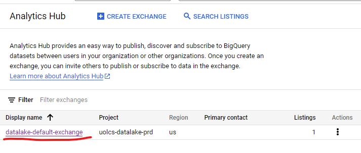
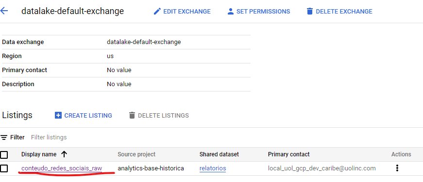
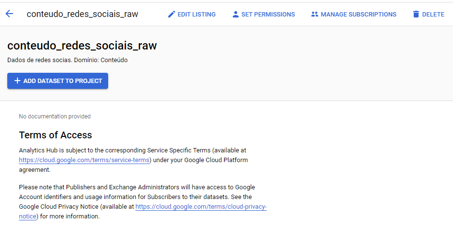

[Documentação](../../../../../documentacao.md) > [GCP - Google Cloud Platform](../../../../gcp-google-cloud-platform.md) > [Data Lake - GCP](../../../data-lake-gcp.md) > [Interno - Devs](../../interno-devs.md) > [[Interno-Devs] Acesso aos dados do Datalake](../-interno-devs-acesso-aos-dados-do-datalake.md)

# Datasets dentro de um projeto GCP

- [Dados Não Sensíveis - Analytics hub](#dados-n-o-sens-veis-analytics-hub)
  - [Listar o dataset no Analytics Hub do projeto datalake - uolcs-datalake-prd](#listar-o-dataset-no-analytics-hub-do-projeto-datalake-uolcs-datalake-prd)
  - [Criar o Link do Listing](#criar-o-link-do-listing)
  - [Limitações](#limita-es)
- [Dados Sensíveis](#dados-sens-veis)

# **Dados Não Sensíveis -** **Analytics hub**

Caso o conjunto de dados (dataset) desejado esteja já no GCP e não tenha dados sensíveis, seguir os passos abaixo:

## **Listar o dataset no Analytics Hub do projeto datalake - [uolcs-datalake-prd](https://console.cloud.google.com/bigquery/analytics-hub/exchanges?project=uolcs-datalake-prd)**

A Exchange padrão é o [datalake-default-exchange](https://console.cloud.google.com/bigquery/analytics-hub/exchanges/projects/490873182749/locations/us/dataExchanges/datalake_default_exchange_1870fccca19?project=uolcs-datalake-prd)

1. Clicar em **[create listing](https://console.cloud.google.com/bigquery/analytics-hub/exchanges/projects/490873182749/locations/us/dataExchanges/datalake_default_exchange_1870fccca19/create?project=uolcs-datalake-prd)**
2. Preencher os dados conforme descrito:
   1. **Display name**: nome do dataset de destino, ex: conteudo\_redes\_sociais\_raw
   2. **Primary contact (Opcional):** ex: **[local\_uol\_gcp\_dev\_caribe@uolinc.com](mailto:local_uol_gcp_dev_caribe@uolinc.com)**
   3. ****Request access contact(Opcional):**** ex: ****[l-caribe@uolinc.com](mailto:l-caribe@uolinc.com)****
   4. **Shared dataset:** selecionar o dataset no projeto correto

## **Criar o Link do Listing**

**Clicar na listing criado**

**Adicionar o dataset no projeto**

Após esses passos, adicionar o dataset na **zona** de domínio correta no **Dataplex**

## **Limitações**

Não é possível editar qualquer tabela do dataset **(read-only)** adicionado ao projeto, ou seja, adicionar como **policy tags(mascaramento), descriptions de tabelas e colunas.**

A Linhagem do dados **não** está disponível nessa visualização, somente em transformações a partir desses dados.

# **Dados Sensíveis**

**#todo**
