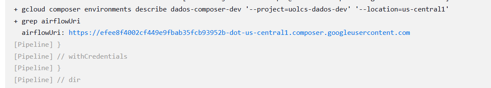
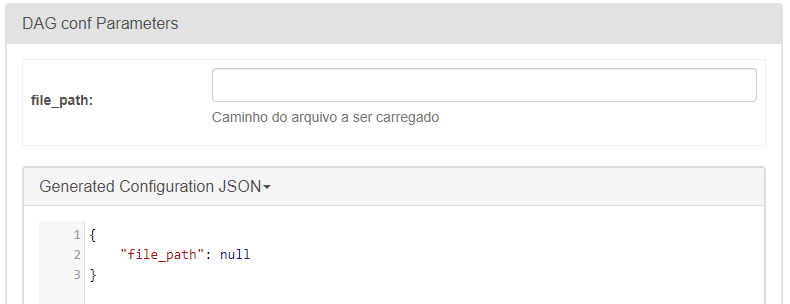
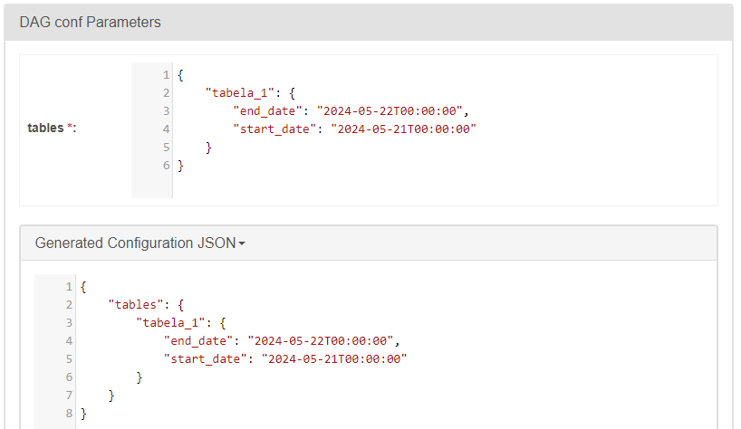

[Documentação](../../../../../documentacao.md) > [GCP - Google Cloud Platform](../../../../gcp-google-cloud-platform.md) > [Data Lake - GCP](../../../data-lake-gcp.md) > [Interno - Devs](../../interno-devs.md) > [Airflow Composer](../airflow-composer.md)

# Airflow Composer - Entrega de artefatos

- 1 [Acesso ao ambiente](#acesso-ao-ambiente)
  - 1.1 [QA](#qa)
  - 1.2 [PROD](#prod)
- 2 [DAGs](#dags)
  - 2.1 [Deploy de DAGS](#deploy-de-dags)
  - 2.2 [Remover DAGs](#remover-dags)
- 3 [Cadastro de variáveis e conexões](#cadastro-de-vari-veis-e-conex-es)
  - 3.1 [Variáveis](#vari-veis)
  - 3.2 [Conexões](#conex-es)
- 4 [Plugins](#plugins)
- 5 [Guia para migração](#guia-para-migra-o)
  - 5.1 [DummyOperator](#dummyoperator)
  - 5.2 [Schedule](#schedule)
  - 5.3 [Params](#params)
  - 5.4 [Cloud Run Job](#cloud-run-job)
  - 5.5 [BigQueryHook](#bigqueryhook)
- 6 [Deploy do Composer](#deploy-do-composer)
  - 6.1 [Upgrade de versão](#upgrade-de-vers-o)
  - 6.2 [Contas de serviço](#contas-de-servi-o)

# **Acesso ao ambiente**

## **QA**

O ambiente de QA é destruído todo dia as 21h.

Para subir o ambiente ou desativar a destruição utilize o job no Jenkins: <https://jenkins-dados.data.intranet/job/BIGDATA/job/Composer/job/gcp-composer-qa/>

A URL será exibida no log do job no Jenkins:



Também é possível conseguir a URL pelo Console do GCP: <https://console.cloud.google.com/composer/environments?project=uolcs-dados-dev>

## **PROD**

**URL: <http://composer.data.intranet/>**

- O composer não permite customizar o domínio, então criamos um redirect para facilitar.

**Monitoração: [https://console.cloud.google.com/composer/environments/detail/us-central1/dados-composer-prd/monitoring?project=uolcs-dados-prd](https://console.cloud.google.com/composer/environments/detail/us-central1/dados-composer-prd/monitoring?project=uolcs-dados-prd&pageState=(%22environmentDetails%22:(%22relativeTimeRange%22:%22PT6H%22),%22composerMonitoringSection%22:(%22section%22:%22Overview%22)))**

# **DAGs**

## **Deploy de DAGS**

### **Manualmente em QA**

Utilizar job no Jenkins: **[composer\_dag\_uploader\_qa](https://jenkins-dados.data.intranet/job/DAGS/job/composer_dag_uploader_qa/)**

### **Incluir em pipeline do Jenkins**

Utilizar a função **uploadDagToGCS(<dag\_filepath>, <environment>)**

Exemplo de deploy via Jenkins

**Jenkinsfile**

```groovy
     environment{
        HTTP_PROXY="${env.PROXY_URL}"
        HTTPS_PROXY="${env.PROXY_URL}"
    }
...
    stage('Deploy DAG') {
      agent {
        docker {
          image 'google/cloud-sdk:alpine'
          reuseNode true
        }
      }
      steps {
        dir('dags') {
          echo "Deploying DAG=${env.DAG_FILENAME}"
          uploadDagToGCS(env.DAG_FILENAME, params.ENV)
        }
      }
    }
```

Atenção

A função **uploadDagToGCS** irá autenticar automaticamente o gcloud usando o parâmetro **ENV**

## **Remover DAGs**

Utilizar job no Jenkins: **[composer\_remove\_dag](https://jenkins-dados.data.intranet/job/DAGS/job/composer_remove_dag/)**

---

# **Cadastro de variáveis e conexões**

Tanto variáveis como conexões serão armazenadas no Secret Manager. <https://cloud.google.com/composer/docs/composer-2/configure-secret-manager>

## Variáveis

Para criar novas variáveis, é necessário adicionar no yaml e fazer um PR:

- QA: <https://stash.uol.intranet/projects/DEVOPSDADOS/repos/gcp-automation/browse/analytics/composer-variables/vars/dados-composer-dev-variables.yaml>
- PRD: <https://stash.uol.intranet/projects/DEVOPSDADOS/repos/gcp-automation/browse/analytics/composer-variables/vars/dados-composer-prd-variables.yaml>

A aplicação é feita via Terraform pelo job do Jenkins: <https://jenkinsbibd.intranet:8443/job/BIGDATA/job/gcp-composer-variables/>

## Conexões

Por enquanto a criação é feita manualmente pelo Caribe e DevOps.

Precisam ser criadas manualmente, seguindo o formato:

- nome: **airflow-connections-<nome-da-conexão>**
- value: Utilizar preferencialmente o formato JSON

Exemplo:

**airflow-connections-gcp\_sa\_airflow\_datalake**

```js
{
    "conn_type": "google-cloud-platform",
    "extra": {
        "extra__google_cloud_platform__key_path": "",
        "extra__google_cloud_platform__keyfile_dict": "<JSON DA SA>",
        "extra__google_cloud_platform__num_retries": 5,
        "extra__google_cloud_platform__project": "uolcs-caribe-qa",
        "extra__google_cloud_platform__scope": "https://www.googleapis.com/auth/cloud-platform"
    }
}
```

---

# **Plugins**

Hooks e Operators customizados estão versionados no repositório: [datalake-artifacts/airflow/plugins-composer](https://stash.uol.intranet/projects/BIBD/repos/datalake-artifacts/browse/airflow/plugins-composer)

A entrega é feita pelo job do Jenkins: <https://jenkinsbibd.intranet:8443/job/BIGDATA/job/gcp-composer-plugins/>

---

# **Guia para migração**

## DummyOperator

DummyOperator está depreciado desde a versão 2.3 e não existe na versão 2.7. Alterar para EmptyOperator:

```py
# De:
from airflow.operators.dummy import DummyOperator

# Para:
from airflow.operators.empty import EmptyOperator
```

## Schedule

O nome do parâmetro "schedule\_interval" está previsto para ser depreciado e precisa ser substituído por "schedule":

```py
# De: 
with DAG(
    dag_name,
    schedule_interval='* * 1 0 0',
) as dag:  

# Para: 
with DAG(
    dag_name,
    schedule='* * 1 0 0',
) as dag:  
```

## Params

Agora, para utilizar o Trigger w/ config é obrigatório definir os parâmetros na definição da DAG.

Mais detalhes na documentação oficial: <https://airflow.apache.org/docs/apache-airflow/2.7.3/core-concepts/params.html>

Dags de exemplo no repositório: <https://stash.uol.intranet/projects/BIBD/repos/app-templates/browse/airflow>

### Exemplos:

#### Parâmetro simples

```py
with DAG(
    dag_name,
    schedule='* * 1 0 0',
 	params={
        'file_path': Param(default=None, type=["null", "string"], description="Caminho do arquivo a ser carregado")
    }
) as dag:  
```



#### Parâmetros complexos

```py
with DAG(
    dag_name,
    schedule='* * 1 0 0',
  	params={
            'tables': Param(
                {
                    'tabela_1': {
                        'start_date': ((datetime.now() - timedelta(days=1)).strftime('%Y-%m-%d')) + "T00:00:00",
                        'end_date': datetime.now().strftime('%Y-%m-%d') + "T00:00:00",
                    }
                },
                schema={
                    "type": "object",
                    "properties": {
                        "tabela_1": {"type": "object", "properties": {"start_date": {"type": "string"}, "end_date": {"type": "string"}}}
                    },
                    "additionalProperties": False
                }
            )
        } 
) as dag:  
```

Resultado:



## Cloud Run Job

No airflow AWS utilizavamos o operador customizado CloudRunJobOperator, mas na versão mais nova do airflow-providers-google existe um operador nativo CloudRunExecuteJobOperator:

Docs: <https://airflow.apache.org/docs/apache-airflow-providers-google/10.16.0/operators/cloud/cloud_run.html>

```py
# De:
from operators.CloudRunJobOperator import CloudRunJobOperator

ingestion_BASE_OPTOUT = CloudRunJobOperator(
   task_id='ingestion_BASE_OPTOUT',
   gcp_conn_id='gcp_sa_airflow_datalake',
   job_name='app-caribe-batch-loader-job',
   project_id='{{ var.json.datalake_gcp_config.project_id }}',
   polling_interval=10,
   envs={
      'CLOUD_RUN_JOBS_PAYLOAD' : {'key': 'value'}
   }
)


# Para:
from airflow.providers.google.cloud.operators.cloud_run import CloudRunExecuteJobOperator

ingestion_BANK_DEBIT_TRANSACTION = CloudRunExecuteJobOperator(
  task_id='ingestion_BANK_DEBIT_TRANSACTION',
  gcp_conn_id='gcp_sa_airflow_datalake',
  job_name='app-caribe-batch-loader-job',
  region='us-central1',
  project_id='{{ var.json.datalake_gcp_config.project_id }}',
  timeout_seconds=10 * 60 * 60,
  overrides = {
    "container_overrides": [{
       "name": "app-caribe-batch-loader-job",
       "args": [],
       "env": [{"name": 'key', "value": json.dumps(value)}]
    }],
    "task_count": 1,
    "timeout": "36000s"
  },
  on_failure_callback=teams_alert_callback,
  deferrable=True
)
```

## BigQueryHook

No airflow AWS utilizavamos o parametro **bigquery\_conn\_id** ou **gcp\_conn\_id** mas na versão mais nova só é possível usar o **gcp\_conn\_id**:

Docs:

- Atual 10.16.0: <https://airflow.apache.org/docs/apache-airflow-providers-google/10.16.0/_api/airflow/providers/google/cloud/hooks/bigquery/index.html#airflow.providers.google.cloud.hooks.bigquery.BigQueryHook>
- Antiga 6.1.0: <https://airflow.apache.org/docs/apache-airflow-providers-google/6.1.0/_api/airflow/providers/google/cloud/hooks/bigquery/index.html#airflow.providers.google.cloud.hooks.bigquery.BigQueryHook>

```py
# De:
 bq = BigQueryHook(
            bigquery_conn_id="gcp_sa_airflow_datalake",
            use_legacy_sql=False
        )
# Para:
 bq = BigQueryHook(
            gcp_conn_id="gcp_sa_airflow_datalake",
            use_legacy_sql=False
        )
```

---

# **Deploy do Composer**

O ambiente é provisionado via Terraform:

- Stash: <https://stash.uol.intranet/projects/DEVOPSDADOS/repos/gcp-automation/browse/analytics/composer>

- Jenkins: <https://jenkinsbibd.intranet:8443/job/BIGDATA/job/gcp-composer-qa>

## Upgrade de versão

1. ### Via terraform:

   1. o ambiente anterior é destruído e provisionado um ambiente novo, apontando para o mesmo bucket de artefatos
   2. todo histórico de execuções é perdido
2. ### Via interface (em preview)

   1. Consegue manter o ambiente, desde que não haja conflitos

## Contas de serviço

|          | Ambiente   | Email                                                                                                                                           | Credencial Jenkins   |
|:---------|:-----------|:------------------------------------------------------------------------------------------------------------------------------------------------|:---------------------|
| Jenkins  | DEV        | [sa-dados-jenkins-infra-dev@uolcs-dados-dev.iam.gserviceaccount.com](mailto:sa-dados-jenkins-infra-dev@uolcs-dados-dev.iam.gserviceaccount.com) | gcp-uolcs-dados-dev  |
| Jenkins  | PRD        | [sa-dados-jenkins-infra-prd@uolcs-dados-dev.iam.gserviceaccount.com](mailto:sa-dados-jenkins-infra-prd@uolcs-dados-dev.iam.gserviceaccount.com) | gcp-uolcs-dados-prd  |
| Composer | DEV        | [sa-dados-composer-dev@uolcs-dados-dev.iam.gserviceaccount.com](mailto:sa-dados-composer-dev@uolcs-dados-dev.iam.gserviceaccount.com)           |                      |
| Composer | PRD        | [sa-dados-composer-prd@uolcs-dados-prd.iam.gserviceaccount.com](mailto:sa-dados-composer-prd@uolcs-dados-prd.iam.gserviceaccount.com)           |                      |
