[Documentação](../../../../../documentacao.md) > [GCP - Google Cloud Platform](../../../../gcp-google-cloud-platform.md) > [Data Lake - GCP](../../../data-lake-gcp.md) > [Interno - Devs](../../interno-devs.md) > [Airflow Composer](../airflow-composer.md)

# Airflow Composer - Interface

- [Tela inicial](#tela-inicial)
- [Trigger Manual](#trigger-manual)
- [Visão "Tree"](#vis-o-tree)
- [Visão "Graph"](#vis-o-graph)
- [Verficar log de execuções](#verficar-log-de-execu-es)
- [Repetir uma task que falhou](#repetir-uma-task-que-falhou)
- [Forçar status da task](#for-ar-status-da-task)

## **Tela inicial**

**Versão atual**

Filtros na tela inicial antes:

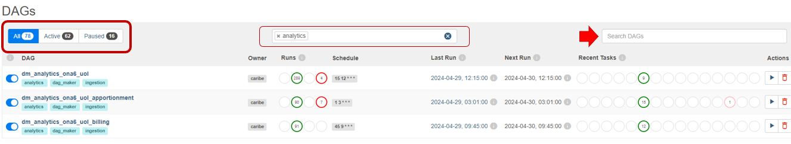

**Versão nova:**

Filtrar dags que estejam executando no momento

**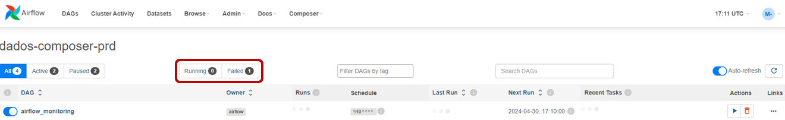**

## **Trigger Manual**

Versão atual:

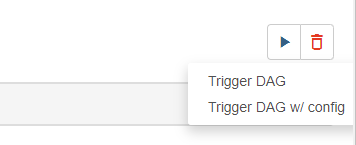

Para executar "com parâmetros" era necessário inserir manualmente a estrutura do json, passando os nomes das tabelas.

Versão nova:

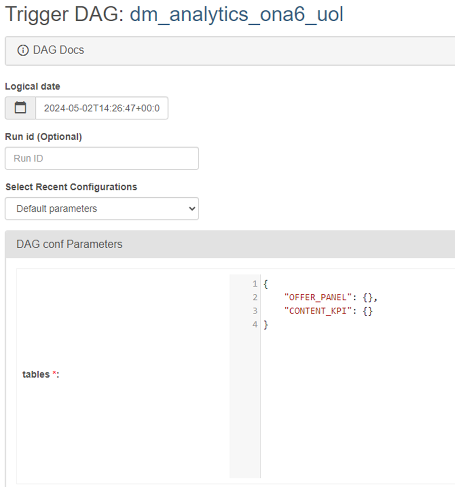

Todas as tabelas já aparecerão na interface. O json já estará montado.

Exemplo com múltiplas queries na mesma DAG:

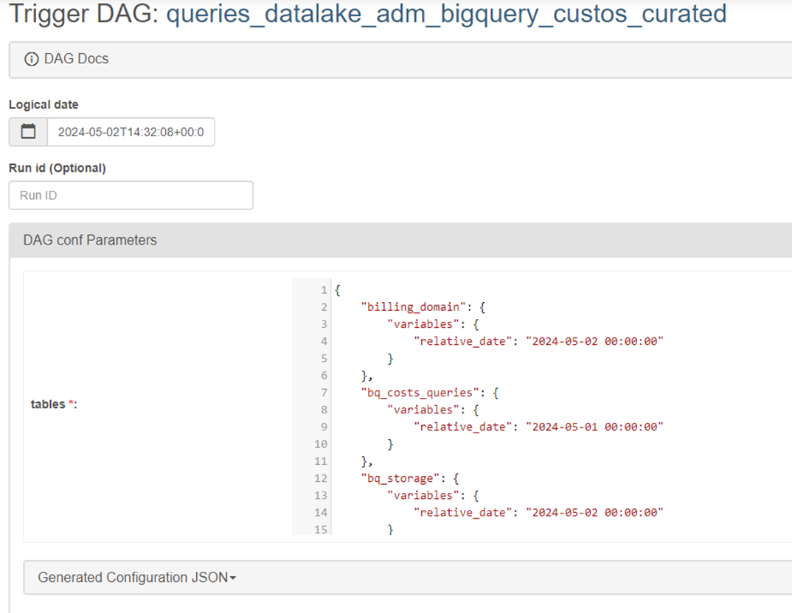

## **Visão "Tree"**

A visão em árvore foi **substituída** por uma visão chamada "Grid".

Versão atual

**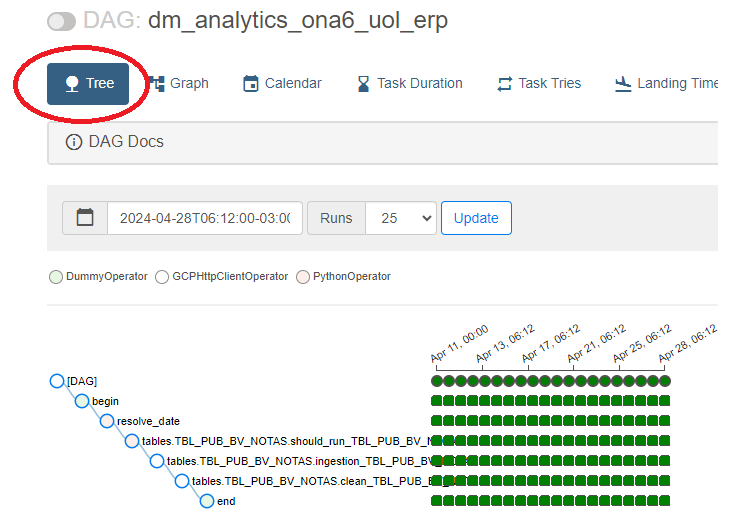**

Versão nova

**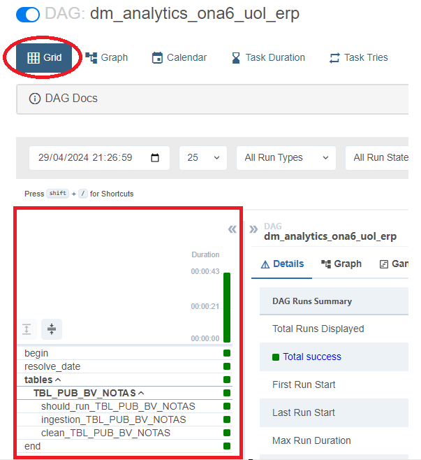**

## **Visão "Graph"**

Versão atual:

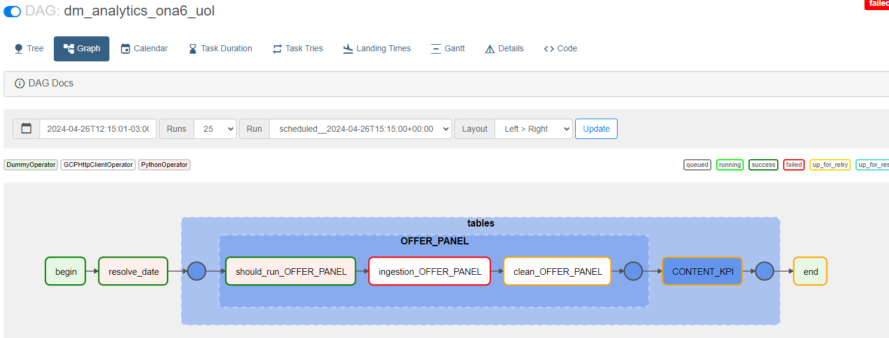

Versão nova:

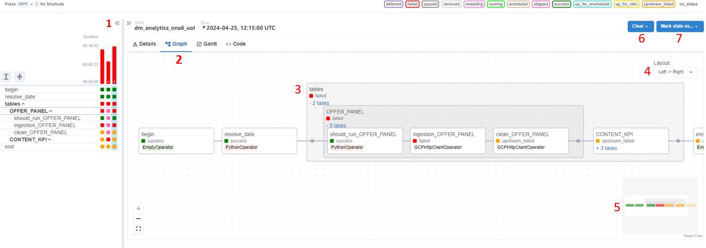

**Visão da DAG na vertical:**

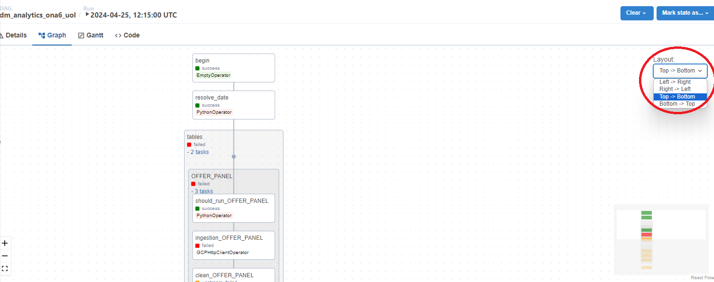

## **Verficar log de execuções**

Versão atual:

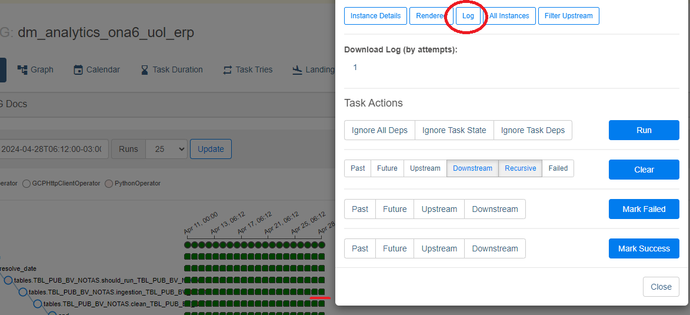

Versão nova:

**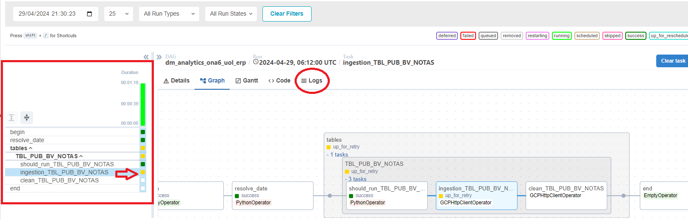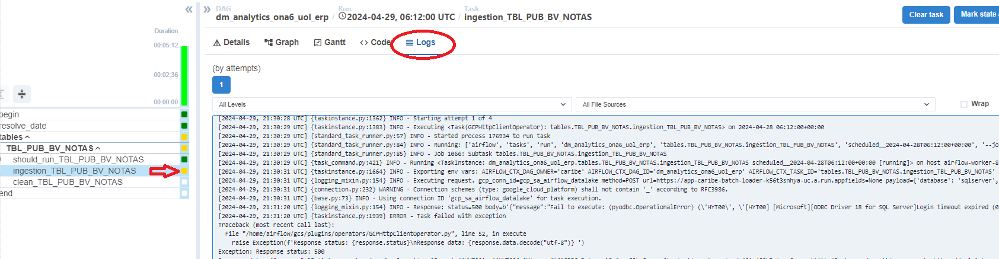**

## **Repetir uma task que falhou**

Versão atual:

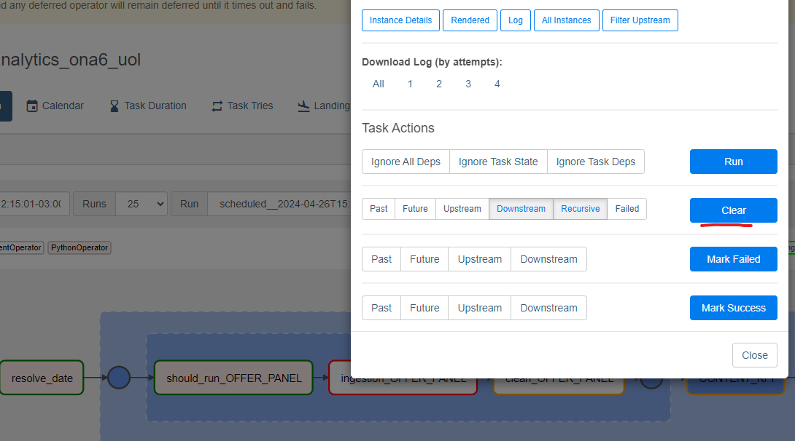

Versão nova:

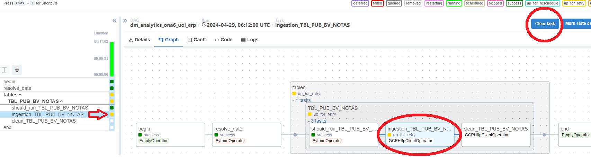

## **Forçar status da task**

Versão atual

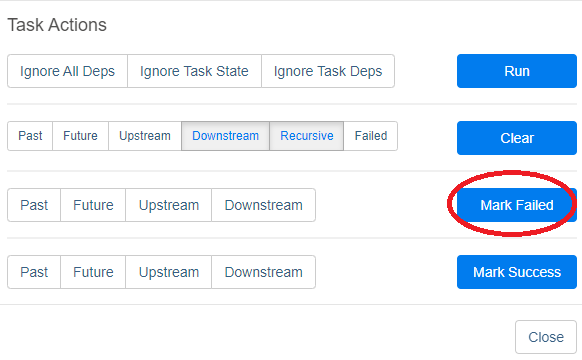

Versão nova:

**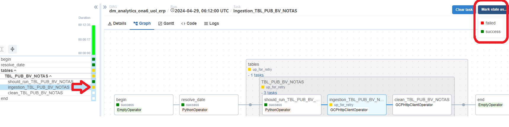**
