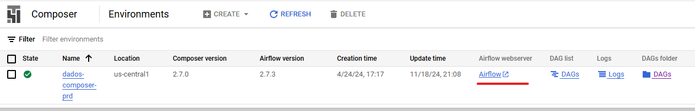

[Documentação](../../../../documentacao.md) > [GCP - Google Cloud Platform](../../../gcp-google-cloud-platform.md) > [Data Lake - GCP](../../data-lake-gcp.md) > [Interno - Devs](../interno-devs.md)

# Novos integrantes D&A

# Pedidos de acesso

Pedir inclusão do usuário nos grupos pelo Jira: **<https://jira.intranet.uol.com.br/jira/servicedesk/customer/portal/45/create/4938>**

### **Analytics**

- GCP: **g\_uol\_gcp\_datalake\_ans (Analytics)** ou g\_uol\_gcp\_datalake\_ans\_ga (Lisboa)
- Jenkins: **G\_analytics\_jenkinsdados**

### **Engenheiros de dados**

- GCP/BQ: **g\_uol\_gcp\_datalake\_eda**
- Jenkins novo: **G\_user\_jenkinsdados**

Além do grupo principal para engenheiros, também pedir para o grupo específico:

**Engenheiros de dados - Conteúdo (Roma)**

- - GCP: **g\_uol\_gcp\_datalake\_eda\_conteudo**
  - Jenkins: **G\_roma\_jenkinsdados**

**Engenheiros de dados - Publicidade (Chicago)**

- - GCP: **g\_uol\_gcp\_datalake\_eda\_publicidade**
  - Jenkins: **G\_chicago\_jenkinsdados**

# Ferramentas

**BitBucket/Stash:**

- Criação de usuário: <https://jirasd.uolinc.com/jira/servicedesk/customer/portal/21/create/1131>
- Repositórios BigData/Caribe: <https://stash.uol.intranet/projects/BIBD>

**Airflow:**

- Composer PRD: <http://composer.data.intranet/>
- Composer QA:
  - O ambiente fica desligado por padrão, então para usar precisa primeiro criar um novo cluster do Composer e depois obter a URL da interface.
  - Para criar o cluster do Composer utilize o job do Jenkins: <https://jenkinsbibd.intranet:8443/job/BIGDATA/job/gcp-composer-qa/>
  - Para pepgar a URL do Airflow/Composer, utilize o painel do GCP: <https://console.cloud.google.com/composer/environments?project=uolcs-dados-dev>
  - 

**Jenkins:**

- <https://jenkins-dados.data.intranet/>
