[Documentação](../../../../../documentacao.md) > [GCP - Google Cloud Platform](../../../../gcp-google-cloud-platform.md) > [Data Lake - GCP](../../../data-lake-gcp.md) > [Interno - Devs](../../interno-devs.md) > [Novos Projetos](../novos-projetos.md)

# [Rascunho] Concessão de acesso temporario - PAM (Privileged Access Manager)

**- [Criar novo Entitlement](#criar-novo-entitlement)
  - [Entitlement details](#entitlement-details)
    - [Opcional](#opcional)
  - [Add requesters](#add-requesters)
  - [Add approvers](#add-approvers)
  - [Add additional notifications](#add-additional-notifications)
- [Solicitando o acesso temporário](#solicitando-o-acesso-tempor-rio)
- [Aprovando acesso](#aprovando-acesso)**

# **Criar novo Entitlement**

Para concessão de acessos temporários, é necessário criar um novo Entitlement no PAM.

PAM: <https://console.cloud.google.com/iam-admin/pam/entitlements/all>?

Documentação de referencia: <https://cloud.google.com/iam/docs/temporary-elevated-access>

Grant necessário

- Privileged Access Manager Admin

**Passos**:

1-Acessar o PAM, e na aba **Entitlements**, clicar em **Create**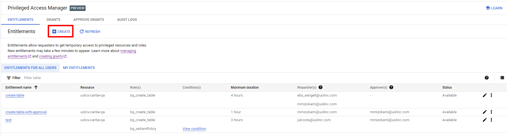

2. Preencher os campos abaixo:

### Entitlement details

**Entitlement name** - Definir um nome para o Entitlement  
**Role** - Informar a role com os respectivos acessos a serem concedidos de forma temporaria.  
**IAM condition (opcional)** - É possível vincular condições para a role. Ex: O acesso ser liberado apenas para um Prefixo/Sufixo no nome de um dataset.  
**Maximum duration for the grant** - Tempo máximo que pode ser solicitado o grant, entre 1 hora e 24horas.

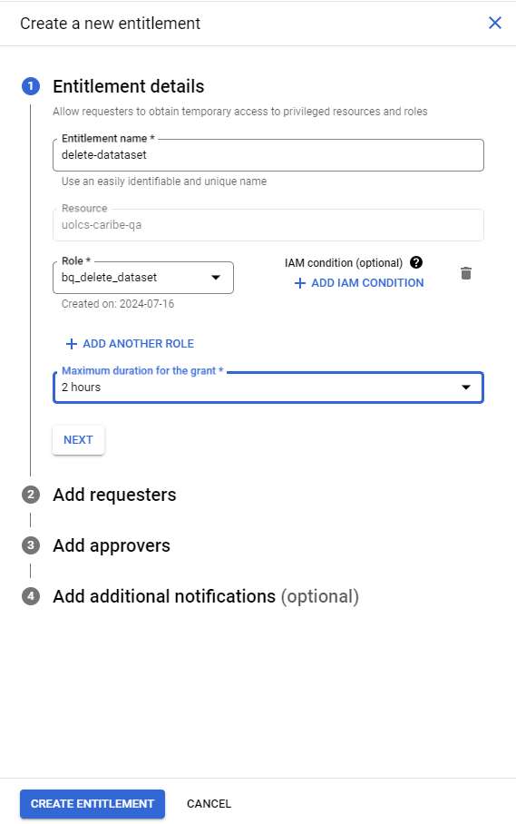

#### Opcional

Para atribuir um IAM condition, pode ser feito por tempo ou por serviço. No exemplo abaixo foi definido por tipo de serviço "bigquery.googleapis.com/Dataset" e pelo sufixo "\_ingestion" no nome dos objetos.

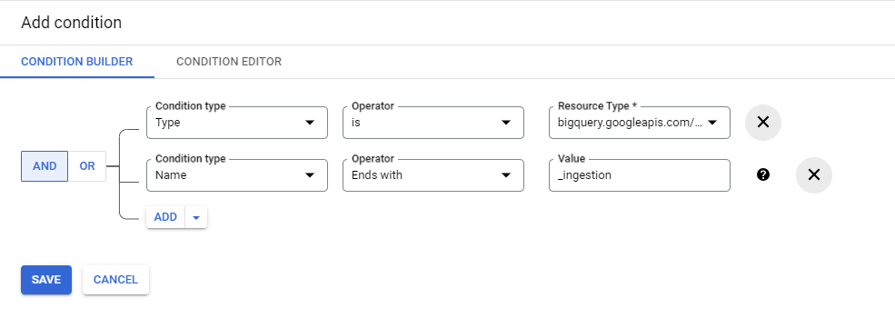

É possível também editar via CEL expression utilizando o Condition Editor.

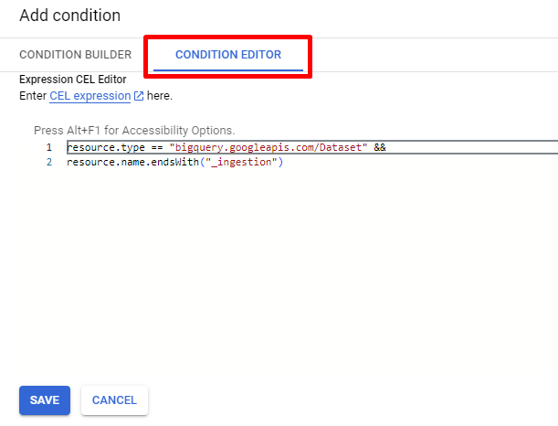

### **Add requesters**

**Requester principal(s)** - Lista ou usuário que podem solicitar o acesso temporario. Obs: Mesmo se for informado uma lista, o acesso é liberado de forma nominal ao solicitar.  
**Justification required from requesters** - Caso seja marcado, exige que seja preenchido uma justificativa ao solicitar o acesso temporario, em forma de texto livre.

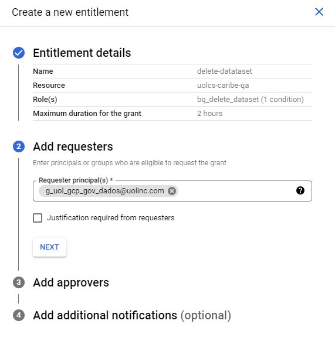

### Add approvers

**Active access without approvals** - Marcar apenas caso não precise aprovação,   
**Approver principal(s)** - Lista ou usuário que pode aprovar a solicitação. Obs: Mesmo se for informado uma lista, é necessário apenas 1 aprovador.  
**Justification required from approvers** - Caso seja marcado, exige que seja preenchido uma justificativa ao aprovar o acesso temporario, em forma de texto livre.

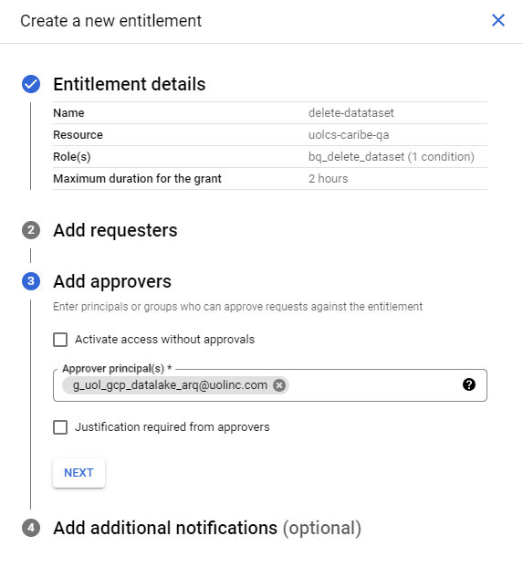

### Add additional notifications

É possível adicionar notificações por e-mail para as etapas abaixo:

-Quando a solicitação de acesso é aberta.

-Quando a solicitaçao está pendente de aprovação.

-Quando o acesso é concedido.

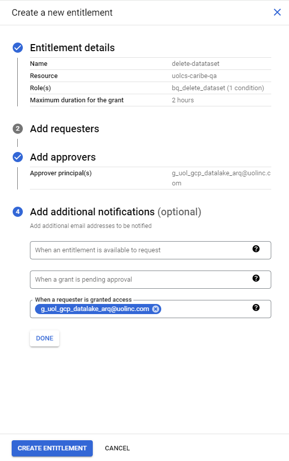

# **Solicitando o acesso temporário**

Para solicitar o acesso, dentro da aba Entitlements, clicar em **Request Grant**.

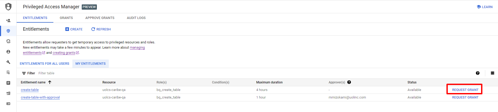

Será aberto a tela para informar os campos:

**Grant duration** - A duração minima do acesso é de 30 minutos, e a máxima é a informada no momento que o Entitlement foi criado.

**Justification** - Pode ou não ser obrigatorio a justificativa, caso tenha sido marcada no momento da criação do Entitlement.

**Notification recipient(s) (opcional)** - Pode adicionar usuario ou lista para ser notificada.

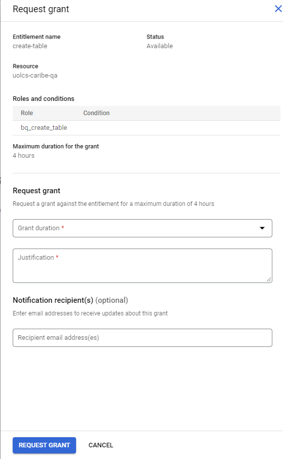

No caso abaixo, a duração máxima do acesso que pode ser solicitada é 4 horas.

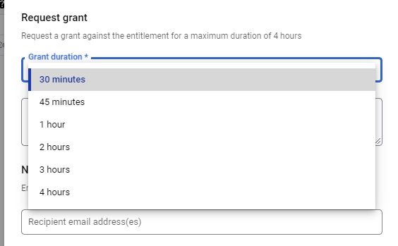

Após a aprovação, a solicitação aparece na aba Grants com o status Active, e é possível acompanhar o tempo restante do acesso.

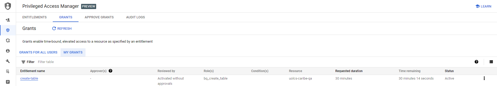

# Aprovando acesso

Quando um usuario solicita o acesso, ela fica pendente na aba Approve Grants, clique em "Approve / Deny" para abrir os detalhes da solicitação.

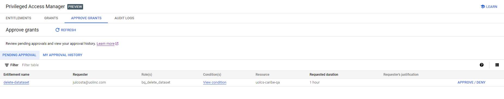

Após clicar no botão, será aberto uma janela do lado direito com os detalhes da solicitação, e é possível Aprovar ou Negar as solicitações pelos respectivos botões no final da página. Além de permitir adicionar comentários ou justificativas (caso seja obrigatorio).

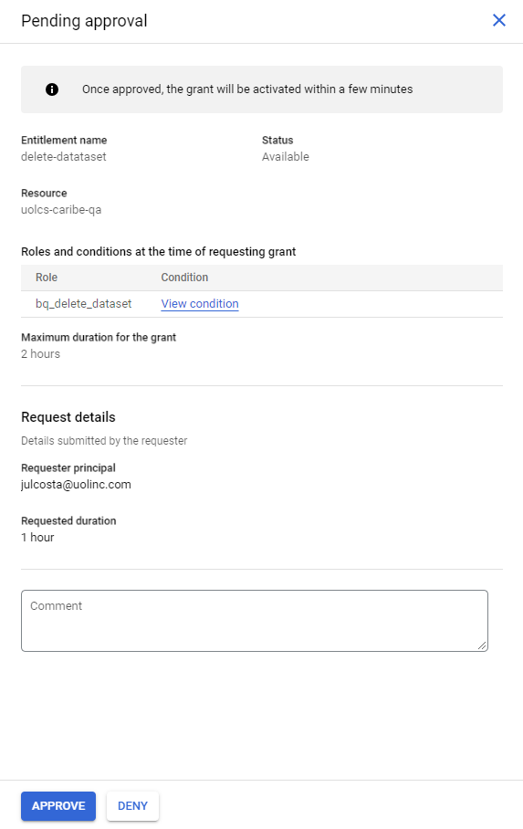
