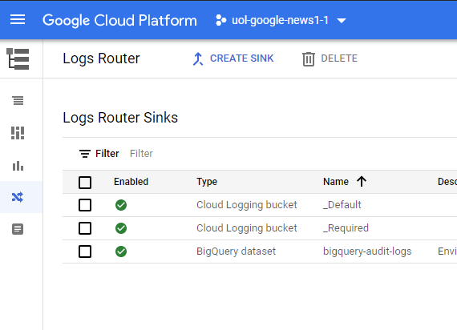
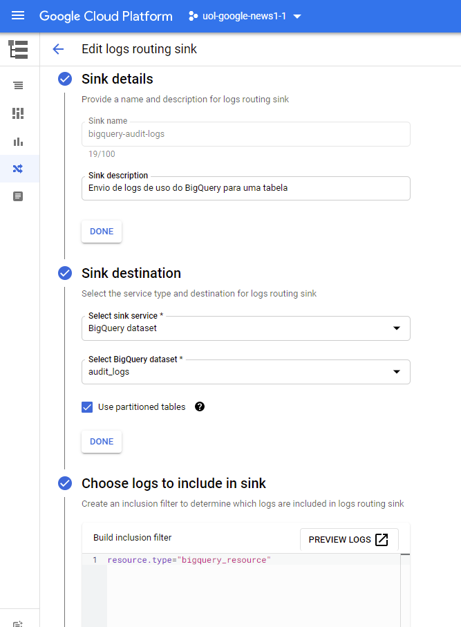
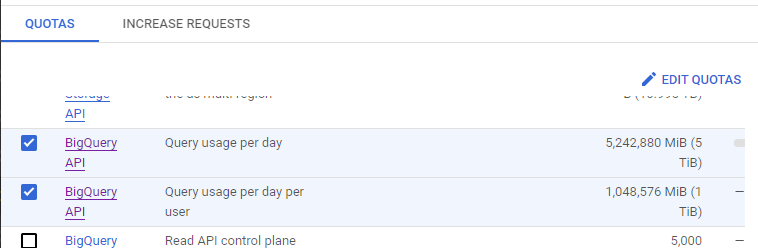
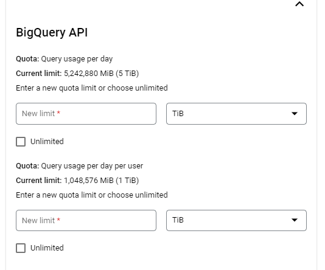

[Documentação](../../../../../documentacao.md) > [GCP - Google Cloud Platform](../../../../gcp-google-cloud-platform.md) > [Data Lake - GCP](../../../data-lake-gcp.md) > [Interno - Devs](../../interno-devs.md) > [Novos Projetos](../novos-projetos.md)

# Configuração inicial de projetos

- [Habilitar gravação do Audit Logs no BigQuery](#habilitar-grava-o-do-audit-logs-no-bigquery)
- [Habilitar trava de quota de uso do BigQuery](#habilitar-trava-de-quota-de-uso-do-bigquery)

# Habilitar gravação do Audit Logs no BigQuery

Habilitar o envio do Audit Logs para uma tabela no BigQuery permite consultar o uso dos recursos via query e ter uma visão granular dos custos.

Documentação de referência: <https://cloud.google.com/bigquery/docs/reference/auditlogs#defining_a_bigquery_log_sink_using_gcloud>

**Passos:**

1. Acesse a página de **Logs Router**: <https://console.cloud.google.com/logs/router>
2. Clique em **Create Sink**:  
   
3. Preencha conforme o exemplo:
   1. Em **Sink details**: Defina um nome
   2. Em **Sink destination**:
      1. Selecione o serviço **BigQuery Dataset**
      2. Selecione o dataset de destino (É necessário criar o dataset antes desse passo)
      3. Habilite o **Use Partitioned Tables**
   3. Incluir o filtro:
      1. ```
         resource.type="bigquery_resource"  
           
           

         ```
   4. 

OBS: As tabelas terão dados somente a partir do momento que o Sink for habilitado

# Habilitar trava de quota de uso do BigQuery

Quotas permitem limitar o uso de um recurso dentro do GCP.

**Passos**:

1. Acessar **IAM & Admin** > **Quotas**: <https://console.cloud.google.com/iam-admin/quotas>
2. Selecionar e depois clicar em **Edit Quotas**:
   1. Query usage per day
   2. Query usage per day per user  
        
      
3. Ajustar os limites:  
     
   
