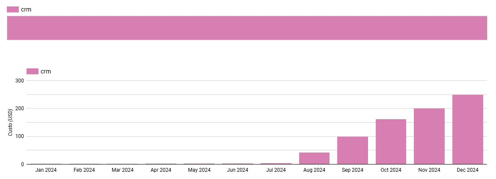
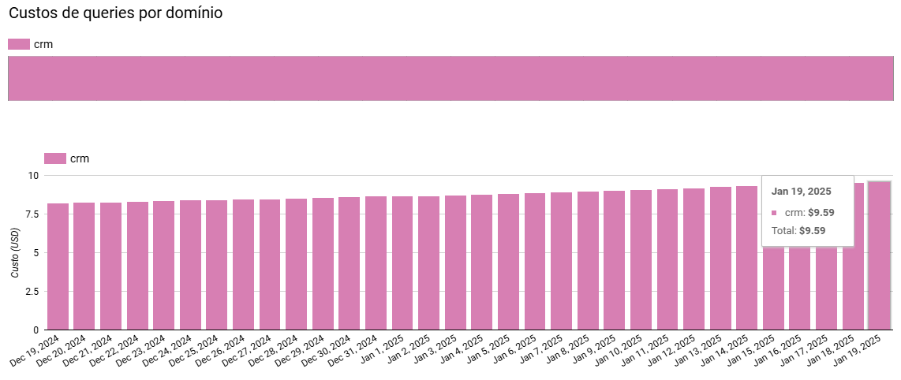
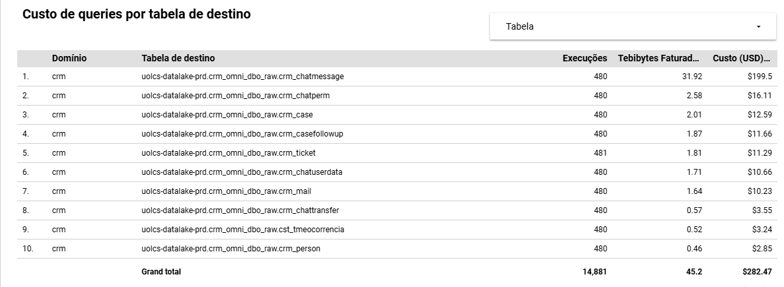
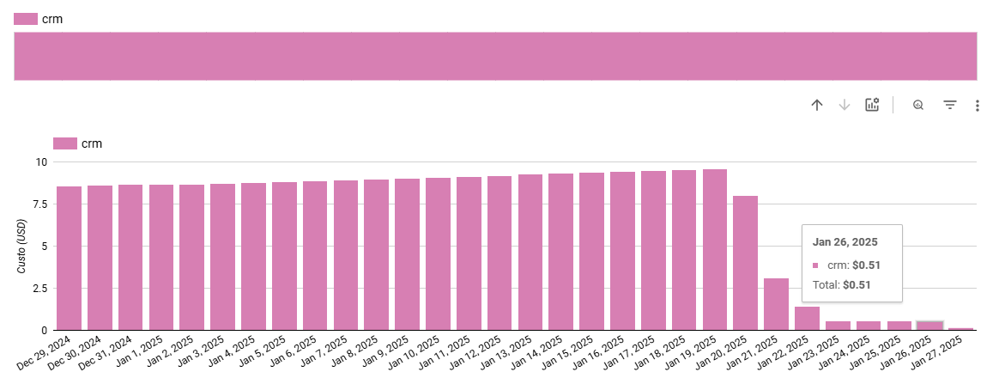

[Documentação](../../../../../documentacao.md) > [GCP - Google Cloud Platform](../../../../gcp-google-cloud-platform.md) > [Data Lake - GCP](../../../data-lake-gcp.md) > [Otimizacao de recursos](../../otimizacao-de-recursos.md) > [Acoes pontuais](../acoes-pontuais.md)

# 2025-01-22 Ingestao CRM Omni

## Alterado cleaner para usar MERGE ao invés de ler toda a ingestion a cada execução

**O que:**

Ingestão ainda estava usando primeira versão do Dag Maker, que para deduplicar os dados lia todos os dados da camada ingestion e recriava a raw a cada execução, Isso gerava um aumento gradual no custo da execução das queries, pois o tamanho da ingestion só aumenta e não poderia ter purga, pois precisava sempre ter todo o histórico.

**Alteração:**

Adicionado cluster pela PK nas tabelas raw e alterado o cleaner para usar MERGE. Dessa forma a cada execução só é lida as últimas partições da ingestion e somente os clusters afetados da raw. Com isso, é reduzido consideravelmente o volume de dados escaneados por execução.

**Custo:**

|                                                                                  |  Antes                     |  Depois                 |  Redução    |
|:---------------------------------------------------------------------------------|:---------------------------|:------------------------|:------------|
| **Mensal**                                                                       | **~USD 280 (R$ 1.900)**    | **~USD 17 (R$ 116)**    | **93%**     |
| **Anual \*** (previsto baseado nos últimos 30 dias, desconsiderando crescimento) | **~USD 3.360 (R$ 22.800)** | **~USD 212 (R$ 1.390)** | **93%**     |

O custo vinha em um crescimento exponencial desde agosto/23

Últimos 30 dias:

 

Dia 26/01, após a alteração:

**Objetos afetados:**

- uolcs-datalake-prd.crm\_omni\_dbo\_raw.crm\_chatmessage
- uolcs-datalake-prd.crm\_omni\_dbo\_raw.crm\_case
- uolcs-datalake-prd.crm\_omni\_dbo\_raw.crm\_casefollowup
- uolcs-datalake-prd.crm\_omni\_dbo\_raw.crm\_chatperm
- uolcs-datalake-prd.crm\_omni\_dbo\_raw.crm\_chatuserdata
- uolcs-datalake-prd.crm\_omni\_dbo\_raw.crm\_mail
- uolcs-datalake-prd.crm\_omni\_dbo\_raw.crm\_person
- uolcs-datalake-prd.crm\_omni\_dbo\_raw.crm\_ticket
- uolcs-datalake-prd.crm\_omni\_dbo\_raw.cst\_tmeocorrencia
- uolcs-datalake-prd.crm\_omni\_dbo\_raw.crm\_chattransfer
