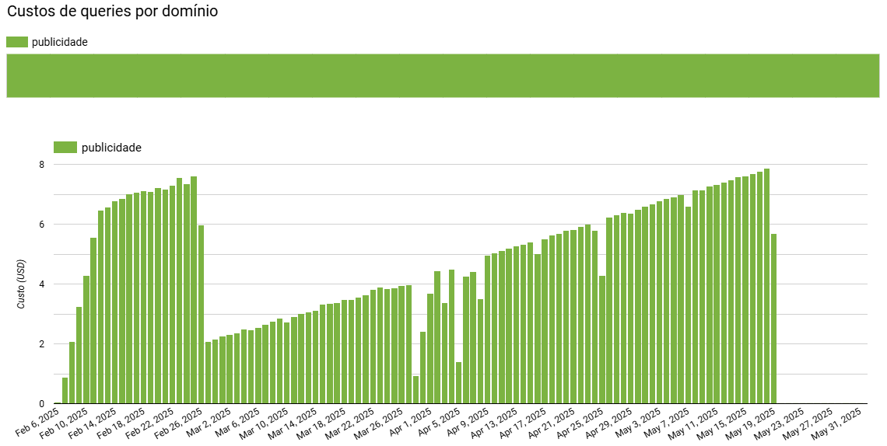
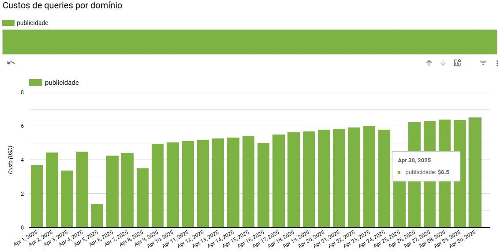
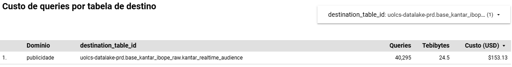
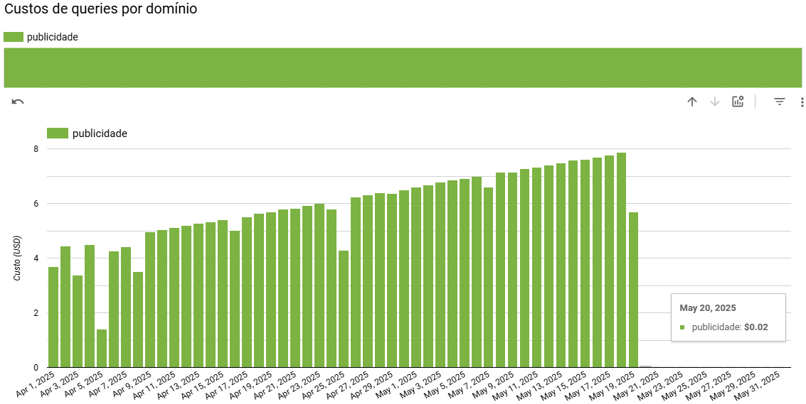

[Documentação](../../../../../documentacao.md) > [GCP - Google Cloud Platform](../../../../gcp-google-cloud-platform.md) > [Data Lake - GCP](../../../data-lake-gcp.md) > [Otimizacao de recursos](../../otimizacao-de-recursos.md) > [Acoes pontuais](../acoes-pontuais.md)

# 2025-05-26 Ingestao de Kantar Ibope Realtime

## Ajuste no fluxo de deduplicação com correção da coluna de particionamento na camada *ingestion*

**O que:**

A camada de *ingestion* estava particionada pela coluna `_PARTITIONTIME`, mas o processo de deduplicação utilizava a coluna `DateRating`. Isso fazia com que o *cleaner* precisasse percorrer diversas partições até localizar os dados corretos, o que aumentava significativamente o volume de dados escaneados por execução. À medida que novos dados eram inseridos diariamente, o volume total da camada crescia e a deduplicação se tornava cada vez mais pesada.

**Alteração:**

A coluna de particionamento foi alterada para `DateRating`, que é a mesma usada no processo de deduplicação. Com isso, o *cleaner* pode acessar diretamente a partição necessária, reduzindo de forma considerável o volume de dados escaneados a cada execução.

**Custo:**

|                                                                                  | Antes                     | Depois              | Redução   |
|:---------------------------------------------------------------------------------|:--------------------------|:--------------------|:----------|
| **Mensal**                                                                       | **~USD 150 (R$ 800)**     | **~USD 0.6 (R$ 3)** | **99%**   |
| **Anual \*** (previsto baseado nos últimos 30 dias, desconsiderando crescimento) | **~USD 1800 (R$ 10.000)** | **~USD 7 (R$ 40)**  | **99%**   |

O custo vinha em crescimento exponencial desde o início da ingestão em Jan/2025:

Mês de Abril, antes da alteração:

Dia 20/05, após a alteração:

**Objetos afetados:**

- uolcs-datalake-prd.base\_kantar\_ibope\_raw.kantar\_realtime\_audience

*Obs.: Análises feitas a partir do [Dashboard Custos GCP](https://lookerstudio.google.com/u/0/reporting/76ccc45b-2307-48e2-9bdd-2839e5e9ce13/page/p_76jl9l1buc).*
