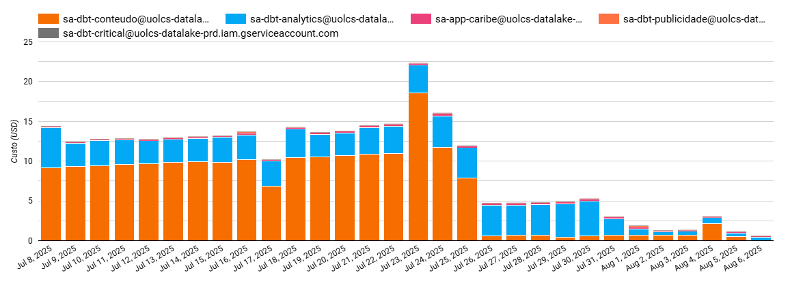

---
tags:
  - '#unrestored-unknown-attachment'
---

[Documentação](../../../../../documentacao.md) > [GCP - Google Cloud Platform](../../../../gcp-google-cloud-platform.md) > [Data Lake - GCP](../../../data-lake-gcp.md) > [Otimizacao de recursos](../../otimizacao-de-recursos.md) > [Acoes pontuais](../acoes-pontuais.md)

# 2025-08-06 Aplicacao do dbt copy-partitions por padrao

## Alterado o query\_maker para utilizar copy\_partitions sempre que possível

**O que:**

Quando é usado o **incremental\_strategy: insert\_overwrite**, o dbt por padrão utiliza uma query de **MERGE** para sobrescrever partições, gerando custo de processamento.

Porém ele suporta o parâmetro **copy\_partitions: true**, dessa forma utilizando a API do BigQuery para sobrescrever as partições e não gerando custo de query.

**Alteração:**

Adicionada uma condição ao query\_maker, sempre que uma query for **incremental\_strategy: insert\_overwrite** será adicionado o parâmetro **copy\_partitions: true**, caso ainda não tenha.

**Custo:**

|                                                                                  | Antes                      | Depois    | Redução   |
|:---------------------------------------------------------------------------------|:---------------------------|:----------|:----------|
| **Mensal**                                                                       | **~USD 400 (R$ 2.400)**    | **USD 0** | **100%**  |
| **Anual \*** (previsto baseado nos últimos 30 dias, desconsiderando crescimento) | **~USD 4.800 (R$ 28.800)** | **USD 0** | **100%**  |

*Obs.: Análises feitas a partir do [Dashboard Custos GCP](https://lookerstudio.google.com/u/0/reporting/76ccc45b-2307-48e2-9bdd-2839e5e9ce13/page/p_76jl9l1buc).*
