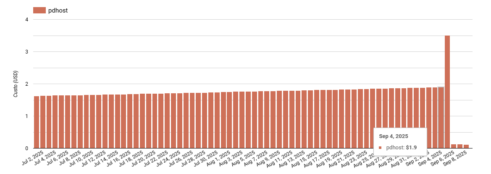
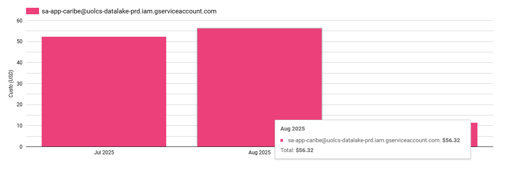
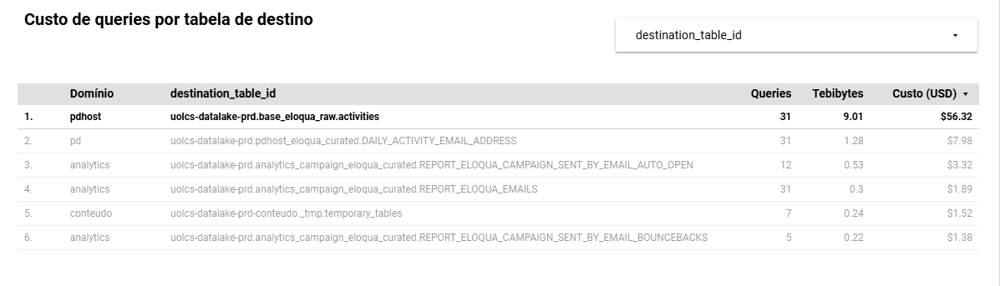
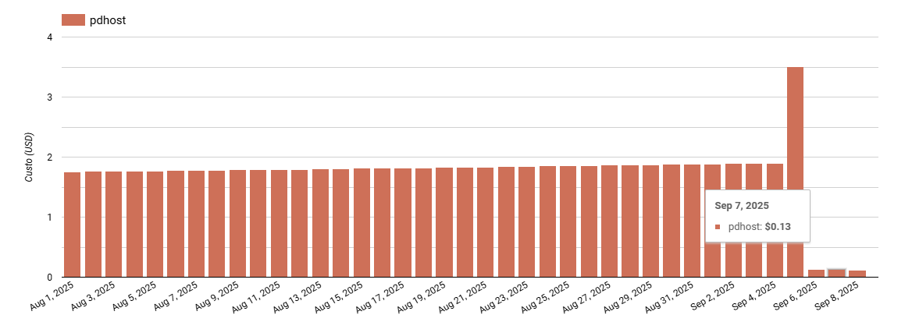

[Documentação](../../../../../documentacao.md) > [GCP - Google Cloud Platform](../../../../gcp-google-cloud-platform.md) > [Data Lake - GCP](../../../data-lake-gcp.md) > [Otimizacao de recursos](../../otimizacao-de-recursos.md) > [Acoes pontuais](../acoes-pontuais.md)

# 2025-09-05 Otimizacao da deduplicacao do base-eloqua-raw.activities

## Ajuste no fluxo de deduplicação para utilizar MERGE e alteração de cluster

**O que:**

O fluxo utilizava o cleaner sem MERGE, então a cada execução era lida toda a camada ingestion para realizar a deduplicação dos dados.

**Alteração:**

Alterado cleaner para utilizar MERGE, alterada as colunas de Cluster da tabela para as PK e adicionado SEARCH INDEX no antigo cluster.

Mais detalhes: <https://stash.uol.intranet/projects/IDELTA/repos/app-eloqua/pull-requests/7/overview>

**Custo:**

|                                                                                  | Antes                   | Depois               | Redução   |
|:---------------------------------------------------------------------------------|:------------------------|:---------------------|:----------|
| **Mensal**                                                                       | **~USD 56 (R$ 340)**    | **~USD 4 (R$ 24)**   | **-92%**  |
| **Anual \*** (previsto baseado nos últimos 30 dias, desconsiderando crescimento) | **~USD 672 (R$ 4.000)** | **~USD 48 (R$ 288)** | **-92%**  |

O custo vinha em crescimento:

Mês de Agosto, antes da alteração:

Após alteração, custo de US$ 0,13 por dia:

**Objetos afetados:**

- uolcs-datalake-prd.base\_eloqua\_raw.activities

*Obs.: Análises feitas a partir do [Dashboard Custos GCP](https://lookerstudio.google.com/u/0/reporting/76ccc45b-2307-48e2-9bdd-2839e5e9ce13/page/p_76jl9l1buc).*
