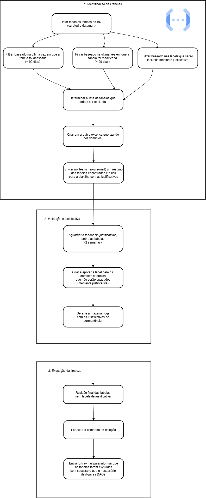
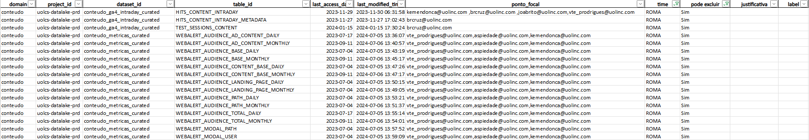

[Documentação](../../../../../documentacao.md) > [GCP - Google Cloud Platform](../../../../gcp-google-cloud-platform.md) > [Data Lake - GCP](../../../data-lake-gcp.md) > [Otimizacao de recursos](../../otimizacao-de-recursos.md) > [Recorrencias](../recorrencias.md)

# Processo de limpeza de tabelas inativas no BigQuery - purga

Fluxo criado pela squad Caribe para realizar purga de tabelas consideradas inativas no Big Query com o objetivo de  
reduzir o custo de storage e de manter a organização das estruturas de dados no Datalake.     
  
  
**1. Passo a passo do processo de purga**

**2. Regras para identificar tabelas 'inativas'**

- **Tabelas sem atualização há 90 dias**Verificação do 'last\_modified\_time' para garantir que a tabela não foi atualizada recentemente.
- **Tabelas não consultadas há 90 dias**Uso dos logs de auditoria ('vw\_audit\_logs') para verificar se as tabelas não foram acessadas nos últimos 90 dias.
- **Divisão por domínios**Separação das tabelas conforme o mapeamento de domínios para facilitar a análise.

**3. Relatório de tabelas**

- Exportação dos dados para um arquivo Excel com cada domínio específico.
- Envio pelo Teams e e-mail para cada time, de uma mensagem com o resumo das tabelas encontradas e o link para o Excel.

**Validação e justificativa**

Garantia de que as tabelas não são mais necessárias.

- Compartilhamento do relatório gerado com os donos das tabelas e times responsáveis.
- Feedback sobre a necessidade de cada tabela (espera de 2 semanas).
- Criação de uma label para as tabelas ou datasets que não serão apagados, baseada na justificativa do time.

**4. Aplicação de labels para rastreabilidade**

Marcação das tabelas que já passaram pelo processo de avaliação.

- Inserção de uma label para as tabelas que devem ser mantidas
- Criação de log através do armazenamento em uma tabela do BigQuery de controle relacionada as tabelas ou datasets que foram justificados para não serem excluídos.

**5. Labels**

 Label: purge\_skip ​

Valores:

- true (para tabelas que serão desconsideradas nos próximos processos de limpeza mediante justificativa)
- false​

****L****abel: retention\_reason ​

Valores:

- historical (tabelas históricas)
- backup (tabelas de backup)
- reference (tabelas de/para)
- dependency (tabelas que são dependência para outra tabela)​

​

**6. Execução da limpeza**

Remoção tabelas identificadas para exclusão.

- Revisão final das tabelas sem labels de justificativa.
- Execução do comando de deleção para as tabelas não justificadas.
- Monitoramento da exclusão no BigQuery.
- Envio de um alerta no Teams para informar quais tabelas foram removidas com sucesso.

**7. Remoção das DAGs**

As DAGs referentes às tabelas da purga devem ser excluídas para que elas não recebam mais atualizações.
