[Documentação](../../../documentacao.md) > [GCP - Google Cloud Platform](../../gcp-google-cloud-platform.md) > [Data Lake - GCP](../data-lake-gcp.md)

# Transformacao de dados no Datalake

- [Visão Geral](#vis-o-geral)
  - [Sobre](#sobre)
  - [Requisitos](#requisitos)
  - [Arquitetura](#arquitetura)
- [Query Maker](#query-maker)
  - [Processo](#processo)
    - [Stash](#stash)
      - [Local](#local)
      - [Editando os artefatos](#editando-os-artefatos)
        - [SQL](#sql)
        - [YAML](#yaml)
    - [Jenkins](#jenkins)
  - [Visualizando Erros](#visualizando-erros)
    - [Logging](#logging)
    - [Histórico do projeto (BQ)](#hist-rico-do-projeto-bq)
  - [Dicas](#dicas)

---

# **Visão Geral**

## **Sobre**

O query maker é um componente para orquestrar as transformações dos dados dentro do Datalake baseado em Airflow + dbt.

Como utilizar

Demostração feita para D&A de como utilizar:

- Vídeo: <https://uolinc-my.sharepoint.com/:v:/p/rcastro/EXAJq4EdJXtOlW9fOGZ5nKIBWHlGMtcTMAgpfT4UTj8iZg>

- Slides: [DataLake - Transformação de dados - Jul-23.pptx](https://uolinc.sharepoint.com/:p:/r/sites/SquadCaribe/_layouts/15/Doc.aspx?sourcedoc=%7BAEEC76CB-8209-4425-BC07-D59899B2C528%7D&file=DataLake%20-%20Transforma%C3%A7%C3%A3o%20de%20dados%20-%20Jul-23.pptx&action=edit&mobileredirect=true)

## **Requisitos**

- [ ] Acesso ao **[Stash](https://jirasd.uolinc.com/jira/servicedesk/customer/portal/21/create/1131)**, **Jenkins** e **Airflow**
- [ ] Permissão no repositório: **[app-caribe-transformer](https://stash.uol.intranet/projects/BIBD/repos/app-caribe-transformer/browse)**
- [ ] [**git**](https://git-scm.com/downloads) instalado na máquina

## **Arquitetura**

**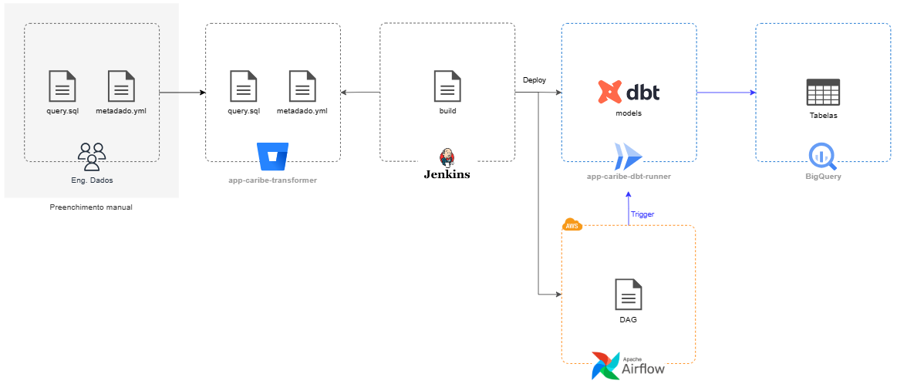**

---

# **Query Maker**

É uma automação que gera os artefatos necessários para fazer a transformação dos dados, baseado em especificações em yml + arquivos SQL gerados pelo Jenkins. Assim não há necessidade de edição de DAGs ou Modelos do dbt diretamente e garante o versionamento dos artefatos.

## **Processo**

### **Stash**

Realiza o versionamento dos artefatos.

#### **Local**

Abra o Stash e faça o login. Procure o repositório [app-caribe-transformer](https://stash.uol.intranet/projects/BIBD/repos/app-caribe-transformer/browse).

Clique no ícone que corresponde ao clone. Faça um git clone para sua máquina local.

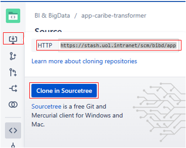

Caso já tenha o arquivo em sua máquina, faça um pull.

#### **Editando os artefatos**

Abra o projeto app-caribe-transformer, no editor de sua preferência, por exemplo Visual Studio Code. Vá até a pasta com o nome queries.

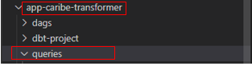

Crie uma pasta com o nome do domínio dentro de queries. Caso já esteja criado, passe para a próxima etapa.

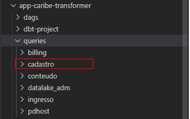

Crie uma pasta com o nome do modelo. É aqui que estarão os artefatos SQL e YAML.

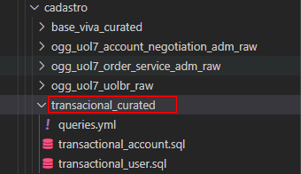

##### **SQL**

Aqui vão as queries que farão as transformações dos dados.

- - - - **Nome do arquivo:** é nome da tabela que será gerada no Big Query.
      - **Extensão:** A extensão do arquivo precisa ser sql. **Exemplo: nome\_do\_arquivo.sql**
      - **Conteúdo:** É a própria query.

##### **YAML**

Aqui vão as configurações necessárias para o Jenkins criar as tabelas/visões para cada query. Não necessário criar um arquivo pra cada configuração, basta um de modo estruturado.

- - - - **Nome do arquivo:** por padrão colocamos o nome do arquivo como "queries".
      - **Extensão:** A extensão do arquivo precisa ser yml. **Exemplo: queries.yml**
      - **Conteúdo:** São as configurações das queries para o Jenkins.

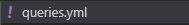

Exemplo de um arquivo YAML:

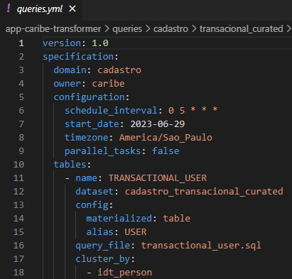

Para mais informações sobre YAML e seus parâmetros leia o arquivo [README.md](https://stash.uol.intranet/projects/BIBD/repos/app-caribe-transformer/browse)

### **Jenkins**

É uma aplicação web de Integração Contínua que serve para executar os testes e criar os artefatos de um projeto de software.

Após fazer o versionamento dos arquivos no Stash, abra o  [Jenkins](https://jenkinsbibd.intranet:8443/login?from=%2F) e faça o login.

Abra a pasta “DAGS”.

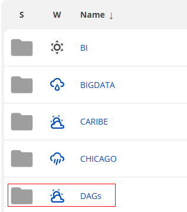

Clique em “query\_maker”.

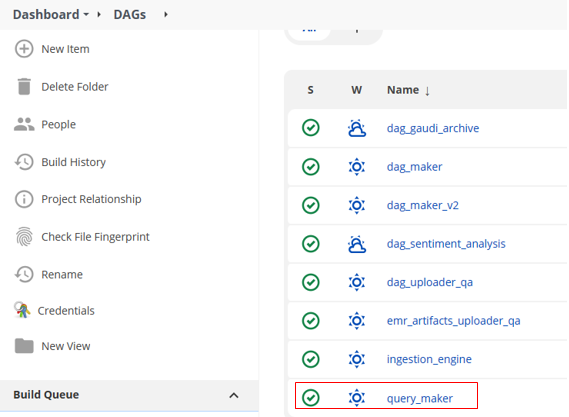

Clique em “Build with Parameters”.

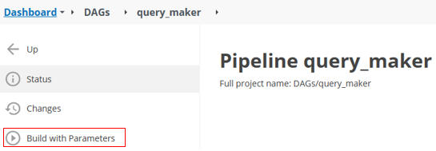

Escolha o ambiente do airflow, a Branch que o arquivo está no Stash e coloque caminho da pasta do Stash que está o arquivo yml. Despois clique em "Build".

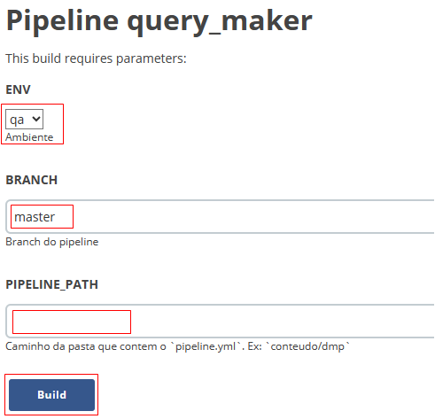

**Airflow**

Abra o airflow correspondente, se tiver subido em qa abra o de [QA](https://airflow.qa.data.intranet:8080/), se for de prd (produção) abra o de [PRD](https://airflow.data.intranet:8080/) e faça o login.

Depois que o Jenkins fizer o deploy da DAG, espere **1min em QA** e **5min em PRD** para que a DAG esteja no aiflow.

Vá na barra de pesquisa de tags e faça uma busca pelo nome do domínio, por exemplo “cadastro”.

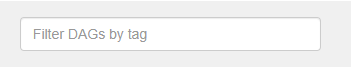

Isso filtra todas as DAGs que tem tag “billing”.

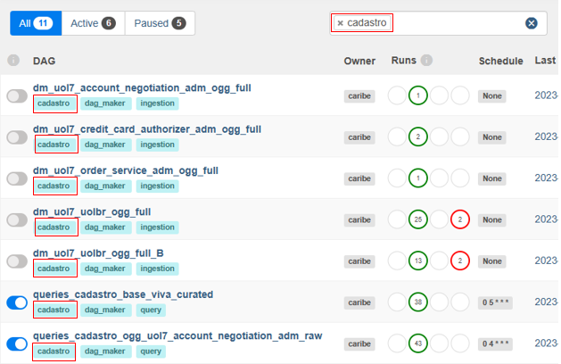

Por padrão a DAG vem desligada.

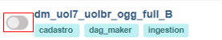

Então será necessário ligar a DAG que acabou de ser gerada pelo Query Maker, ela vai começar com “queries\_nomedodomínio\_....” Quando o botão está azul, significa que ela está ligada.

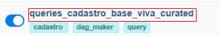

Após ligar a DAG ela rodar pela primeira vez, pode demorar um pouco, mas vai começar a rodar. Caso não rode, clique no play e escolha “trigger DAG”, isso fará com que a DAG comece a funcionar.

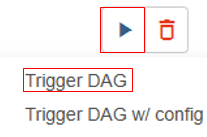

Para acompanhar a DAG é possível por dois modos. Pela aba “Tree”, habilite o auto-refresh para acompanhar, cada bolinha é uma etapa.

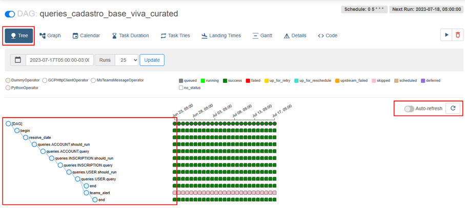

O outro método é pela aba “Graph”, habilite o auto-refresh, aqui é um modo mais gráfico onde cada caixa é uma etapa. Para abrir as “caixas” basta clicar nelas, para fechar, basta clicar na área azul em volta (seta).

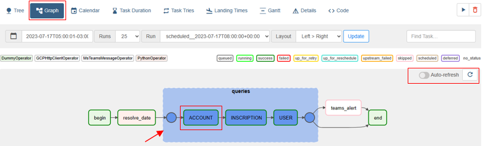

**Big Query**

Se tudo ocorrer bem, uma ou mais tabelas serão criadas no dataset destino.

Abra o [Google Cloud](https://console.cloud.google.com/welcome?project=uolcs-datalake-prd) e faça login, então abra o Big Query.

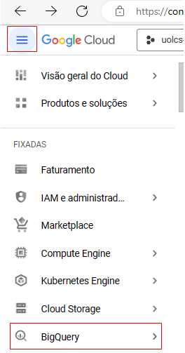

Escolha o projeto de destino que foram criadas as tabelas e o dataset. Clique em "Selecionar um projeto", isso abrirá uma janela com possíveis projetos. Caso o projeto o projeto não esteja em "recentes", é possível fazer uma busca a partir do nome do projeto ou navegar pela aba "todos", quando achar basta clicar nele.

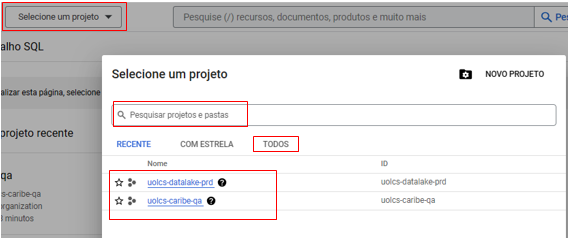

Com projeto selecionado, abrirá um menu lateral chamado "Explorer", lá estão todos os datasets e tabelas do projeto, a visualização de mais ou menos datasets e/ou tabelas vai depender do nível de acesso.

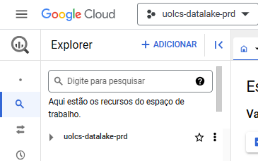

Na barra de pesquisa, escreva o nome do dataset ou tabela, ou navegue até achá-lo dentro do projeto.

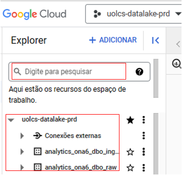

## **Visualizando Erros**

Para qualquer tipo de erro que seja gerado pelo dbt/cloud run, é possível vê-los pelo Logging, mas caso o erro seja exclusivamente de query, é mais fácil vê-los pelo histórico do projeto do Big Query.

### **Logging**

Fazer a busca pela barra de pesquisa do GCP e digitar Logging

Selecionar o recurso (Cloud Run Revision/Revisão do Cloud Run), tipo de serviço "app-caribe-dbt-runner" e clicar em apply/aplicar.

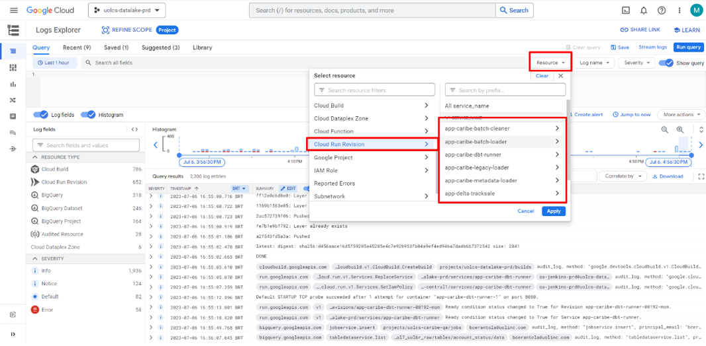

Expandir uma linha com data

  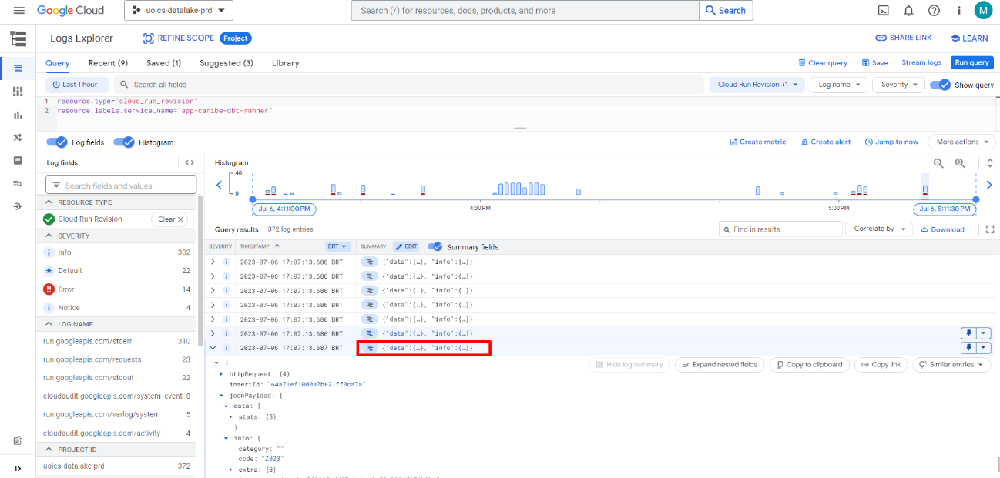

 

Navegar pela árvore ou clique em "expandir campos aninhados",  e procure por msg

 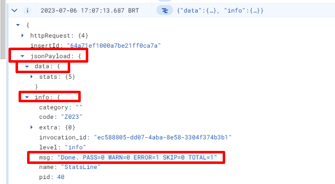

  

Clicar em add field to summary line/adicionar campo à linha de resumo

 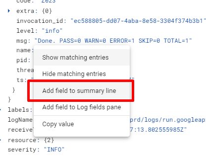

  

As linhas com a mensagem de erro serão destacadas em verde para facilitar a visualização 

  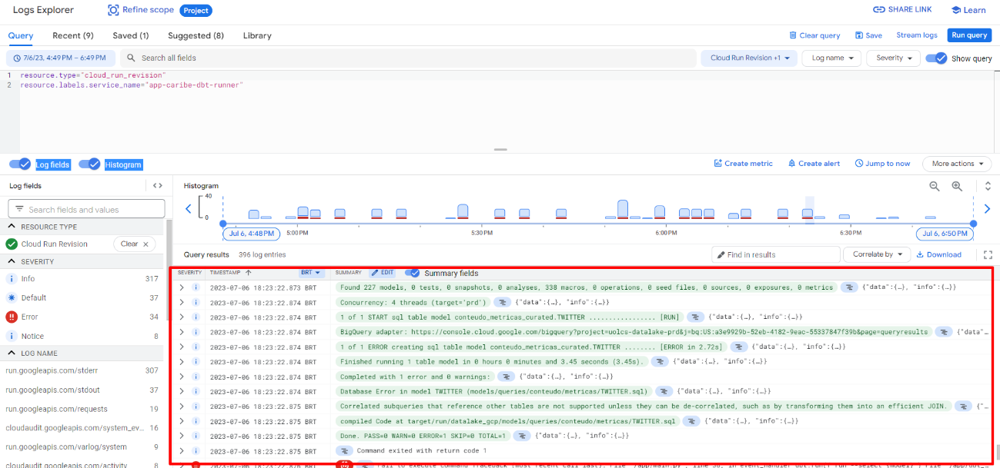

 

### **Histórico do projeto (BQ)**

Com o Big Query aberto, selecione o projeto de destino da query, clique nele.

Em baixo, tem duas abas “Histórico pessoal” e “Histórico do Projeto”. Clique em Histórico do projeto, abrindo uma lista de logs de query que aquele projeto teve.

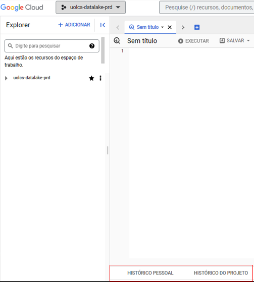

Clique em "Filtro", isso vai abrir um menu de seleção, então escolha “status” e depois “error”, clique em algum lugar fora do campo filtro.

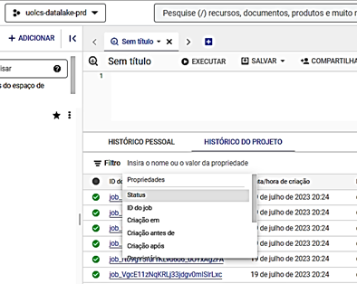

Gerando assim uma lista de logs de erros

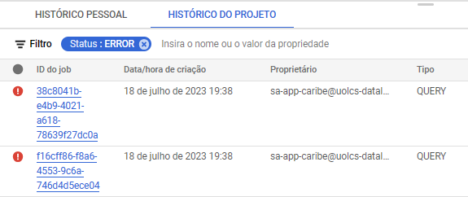

## **Dicas**

- Se estiver utilizando o Visual Studio Code, habilite a extensão YAML. Com ela será mais fácil de ver erros de indentação do arquivo “queries.yml”.
- Se quiser, na hora de filtrar os erros, também é possível filtrar por “proprietário” junto com o status do projeto. Para os erros vindos do Query Maker, o proprietário é o sa-app-caribe@uolcs-datalake-prd.iam.gserviceaccount.com, mas basta colocar “sa-app” que vai achar
