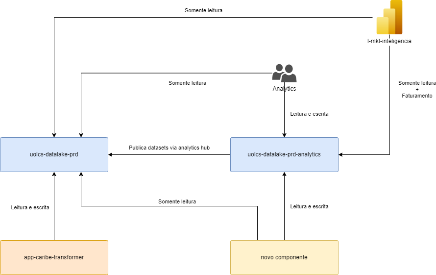
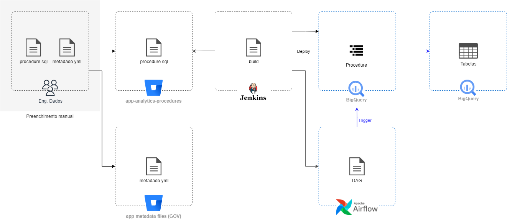
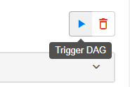
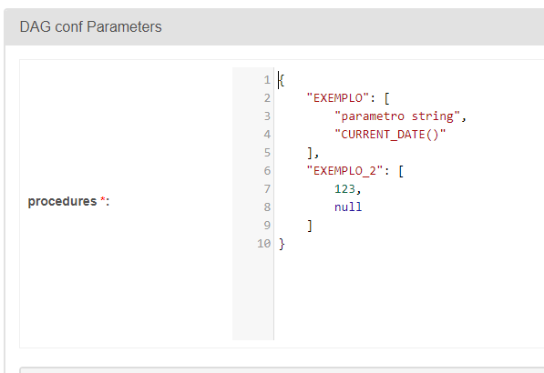

[Documentação](../../../../documentacao.md) > [GCP - Google Cloud Platform](../../../gcp-google-cloud-platform.md) > [Data Lake - GCP](../../data-lake-gcp.md) > [Transformacao de dados no Datalake](../transformacao-de-dados-no-datalake.md)

# Analytics - Agendamento de procedures

**- [Introdução](#introdu-o)
  - [Visão geral](#vis-o-geral)
  - [Arquitetura do componente](#arquitetura-do-componente)
  - [Requisitos](#requisitos)
- [Agendamento de procedures](#agendamento-de-procedures)

  - [1. Cadastrar procedure](#key-1-cadastrar-procedure)
  - [2. Jenkins](#key-2-jenkins)
  - [3. Airflow](#key-3-airflow)- [Procedures com parâmetros](#procedures-com-par-metros)
- [Referências](#refer-ncias)**

# **Introdução**

Este fluxo foi construído para acelerar a migração dos fluxos de dados dos times de Analytics para o BigQuery.

Mais detalhes sobre as motivações em: [ADR - Migracao de Procedures](../../../padroes-e-diretrizes-tecnicas/adr-migracao-de-procedures.md)

## **Visão geral**



## **Arquitetura do componente**



## **Requisitos**

- [ ] Acesso ao **Stash**, **Jenkins** e **Airflow**
- [ ] Permissão no repositório: **[app-caribe-transformer](https://stash.uol.intranet/projects/BIBD/repos/app-caribe-transformer/browse)**
- [ ] [**git**](https://git-scm.com/downloads) instalado na máquina

# **Agendamento de procedures**

Procedures serão entregues no projeto "uolcs-datalake-prd-analytics" e no dataset "procedures\_curated",

### **1. Cadastrar procedure**

Mais detalhes no README: <https://stash.uol.intranet/projects/BIBD/repos/app-procedures-analytics/browse/README.md>

### **2. Jenkins**

Job: <https://jenkinsbibd.intranet:8443/job/ANALYTICS/job/procedure_maker_analytics/>

Disparar job para cadastro da procedure e criação da DAG

### **3. Airflow**

DAGs serão geradas com o padrão:  **procedures\_analytics\_<contexto>\_<procedure>**

## **Procedures com parâmetros**

É possível cadastrar procedures com parâmetros. Porém, no agendamento a chamada será passando todos os argumentos como "NULL".

**Exemplo de cadastro no procedures.yml:**

```yml
  procedures:
    - name: EXEMPLO
      parameters:
        - name: ver
          type: STRING
        - name: teste
          type: DATETIME
      query_file: EXEMPLO.sql
```

Para invocar uma procedure passando parâmetros, basta utilizar a opção "Trigger" do Airflow. A lista de procedures e o número de parâmetros esperados já virá preenchida, basta alterar os valores que for preciso:





# **Referências**

- <https://cloud.google.com/bigquery/docs/procedures>
- <https://cloud.google.com/bigquery/docs/reference/standard-sql/procedural-language>
