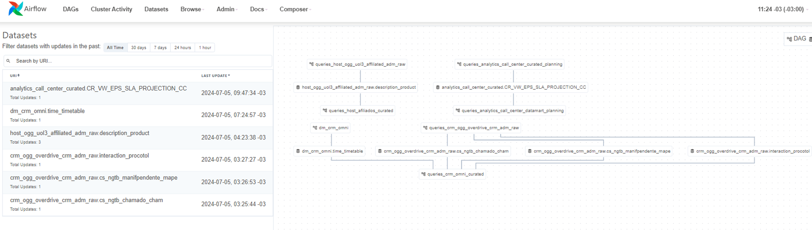
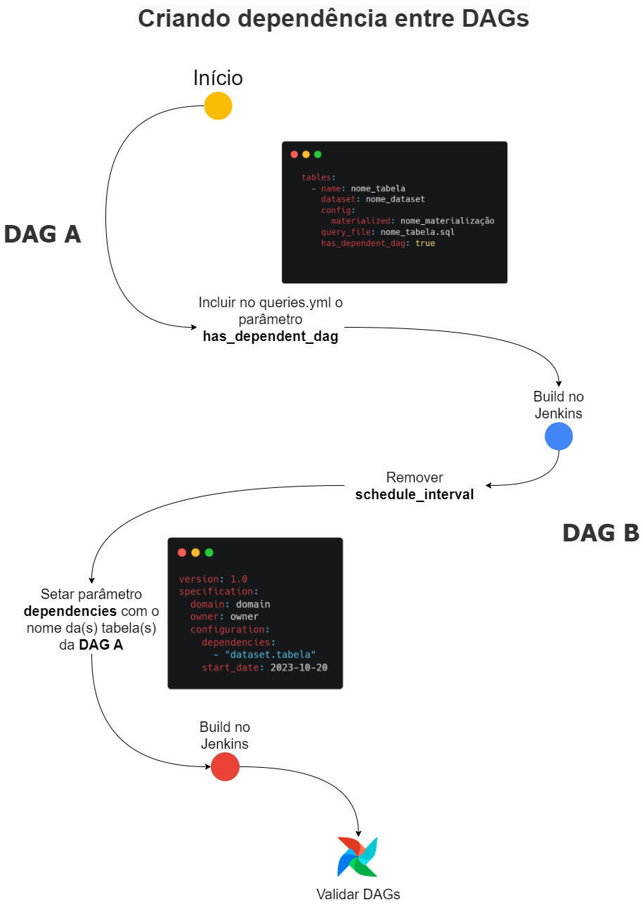
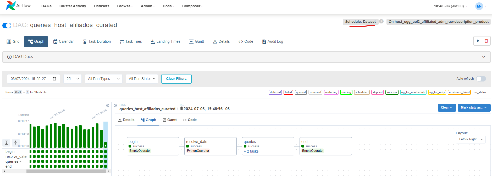
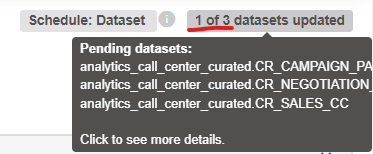

[Documentação](../../../../documentacao.md) > [GCP - Google Cloud Platform](../../../gcp-google-cloud-platform.md) > [Data Lake - GCP](../../data-lake-gcp.md) > [Transformacao de dados no Datalake](../transformacao-de-dados-no-datalake.md)

# Criar dependencia entre DAGs

- [Visão geral](#vis-o-geral)
  - [Sobre](#sobre)
- [Como utilizar](#como-utilizar)
  - [Implementação do app-caribe-pipelines](#implementa-o-do-app-caribe-pipelines)
    - [Gerar dependência](#gerar-depend-ncia)
    - [Utilizar dependência em uma dag de transformação](#utilizar-depend-ncia-em-uma-dag-de-transforma-o)
  - [Implementação no app-caribe-transformer](#implementa-o-no-app-caribe-transformer)
    - [Guia de utilização](#guia-de-utiliza-o)
- [FAQ](#faq)
  - [Dag com mais de uma dependência](#dag-com-mais-de-uma-depend-ncia)
  - [Trigger por Dataset ou horário](#trigger-por-dataset-ou-hor-rio)
  - [Dags customizadas como gatilho](#dags-customizadas-como-gatilho)

## Visão geral

### Sobre

A partir da versão 2.4 do Airflow, existe uma funcionalidade chamada "data-aware scheduling". É uma maneira diferente de programar uma DAG para ser executada.

Ao invés de setar um intervalo de execução, por exemplo usando o cron " 0 4 \* \* \* " para que a DAG execute diariamente as 4h, é possível utilizar uma task de outra DAG como gatilho.

Para que isso ocorra, o airflow gera um "Dataset" para cada task que tiver o parâmetro "*outlets*" com uma string específica.

O Airflow não valida o conteúdo dos dados desse Dataset; ele apenas verifica se a data de atualização foi modificada. É importante garantir que os Datasets tenham nome único.

Na interface do Airflow, na guia Datasets, é possível visualizar as dependências criadas:



## Como utilizar

### Implementação do app-caribe-pipelines

Para utilizar essa funcionalidade em Dags de ingestão de dados criadas pelo Dag-Maker, será necessário modificar o arquivo **pipelines.yml**, para designar uma ou mais tasks da DAG como produtoras de dependências.

#### Gerar dependência

- Acrescentar o parâmetro "***has\_dependent\_dag***" na task que deverá gerar uma dependência:

```yml
specification:
  domain: crm
  owner: caribe
  configuration:
    schedule_interval: 0 7 * * *
    start_date: 2023-11-14
    timezone: America/Sao_Paulo
    parallel_tasks: False
  properties:
    database_type: sqlserver
    database: uol_0b1a9k
    secret: batch_loader_crm_omni
  tables:   
    - name: core_user
      schema: dbo
      primary_key:
        - ID_USERS
      ingestion_type: query_based
      query_file: core_user.sql
	  has_dependent_dag: true
```

- Fazer commit da alteração e novo build da DAG pelo Jenkins.

O dataset gerado no airflow seguirá o padrão:

```sql
`dag_name.table_name`
```

#### Utilizar dependência em uma dag de transformação

Uma DAG no **app-caribe-transformer** pode ser iniciada somente quando uma DAG de ingestão tiver terminado.

Para isso, é necessário apenas **remover o *schedule\_interval***e incluir o parâmetro "dependencies", contendo a lista de dependências.

O exemplo abaixo é um arquivo **queries.yml**. A dag gerada só iniciará quando as 4 dependências finalizarem com sucesso:

```java
version: 1.0
specification:
  domain: crm
  owner: caribe
  configuration:
    dependencies:
      - "dm_crm_omni.time_timetable"
      - "crm_ogg_overdrive_crm_adm_raw.interaction_procotol"
      - "crm_ogg_overdrive_crm_adm_raw.cs_ngtb_manifpendente_mape"
      - "crm_ogg_overdrive_crm_adm_raw.cs_ngtb_chamado_cham"
    start_date: 2023-11-21
    timezone: America/Sao_Paulo
    parallel_tasks: false
  tables:
    - name: TICKET_COMPOSITION
      dataset: crm_omni_curated
      config:
        materialized: table
        cluster_by:
          - des_case_reason_category
      query_file: ticket_composition.sql
```

### Implementação no app-caribe-transformer

Nós implementamos no Query Maker a capacidade de lidar com esse tipo de dependência, sendo necessário apenas modificar alguns parâmetros nos arquivos queries.yml



#### Guia de utilização

- No .yml da **DAG A,** setar o parâmetro **has\_dependent\_dag** em cada tabela que deverá ser usada como gatilho. Nesse exemplo, somente a tabela *ae\_event\_log* será utilizada como dependência de outra DAG:

```yml
specification:
  domain: host
  owner: caribe
  configuration:
    schedule_interval: 0 4 * * *
    start_date: 2024-01-01
    timezone: America/Sao_Paulo
  tables:
    - name: ae_report_event
      dataset: host_ogg_uol3_affiliated_adm_raw
      config:
        materialized: table
      query_file: ae_report_event.sql
    
    - name: ae_event_log
      dataset: host_ogg_uol3_affiliated_adm_raw
      config:
        materialized: table
      query_file: ae_event_log.sql
      has_dependent_dag: true
```

- No .yml da **DAG B**, que depende da query *ae\_event\_log* da **DAG A***,* é necessário remover o *schedule\_interval* e incluir o parâmetro *dependencies.* Este parâmetro deverá estar no padrão "dataset.tabela":

```yml
specification:
  domain: host
  owner: caribe
  configuration:
    dependencies:
      - "host_ogg_uol3_affiliated_adm_raw.ae_event_log"
    start_date: 2024-01-01
    timezone: America/Sao_Paulo
```

- Fazer o deploy via jenkins das duas DAGs para que essas modificações sejam aplicadas.

Como resultado, na interface do airflow será possível observar que a **DAG B** agora tem o schedule do tipo "Dataset", conforme exemplo realizado com uma DAG de afiliados:



## FAQ

### Dag com mais de uma dependência

É possível incluir dois ou mais itens no parâmetro "*dependencies*" e não é necessário que essas dependências estejam em uma mesma DAG de origem.

Exemplo:

```yml
specification:
  domain: host
  owner: caribe
  configuration:
    dependencies:
      - "host_ogg_uol3_affiliated_adm_raw.ae_event_log"
	  - "base_affiliates_curated.PRODUCT_SOURCE"
    start_date: 2024-01-01
    timezone: America/Sao_Paulo
```

**Atenção!**

Ao inserir mais de um dataset como dependência de sua DAG, atente-se ao schedule de todas as Dags que geram essa dependência.

Se durante o dia somente uma delas for executada, o contador da DAG que depende desses datasets será sensibilizado, gerando esse cenário:



Se uma das dependências for executada manualmente durante o dia, o contador da DAG dependente também será sensibilizado. Hoje não há uma forma automática de "zerar" esse contador.

Uma solução paliativa é remover a DAG interface do airflow manualmente. Quando a DAG for carregada novamente, o contador de dependências estará zerado, porém o histórico de execuções da DAG será perdido.

### Trigger por Dataset ou horário

Em nossa versão do Airflow, não é possível configurar uma DAG para iniciar em um horário específico e também iniciar com base no sucesso de uma task de outra DAG simultaneamente. É necessário escolher uma das duas opções.

### Dags customizadas como gatilho

É possível usar qualquer DAG do Airflow como gatilho para iniciar uma DAG de transformação.

Para isso, basta configurar o parâmetro "*outlets*" na task apropriada da DAG customizada e utilizar o nome do Dataset gerado pelo Airflow no parâmetro "*dependencies*" no arquivo **queries.yml.**

**Dags de procedures como gatilho**

Para que a DAG de procedure seja gatilho para outra DAG é necessário incluir o parâmetro *has\_dependent\_dag = True* no arquivo *procedures.yml.*

A nomenclatura adotada para esse tipo de dependência é *"nome\_da\_dag.nome\_da\_proc".* Veja o exemplo abaixo, onde uma DAG de transformação depende da finalização de uma procedure:

```yml
    dependencies:
      - "procedures_analytics_analytics_projection_curated.CANCELLATION_PROJECTION"
```

Nesse caso, o nome da DAG de procedures é *procedures\_analytics\_analytics\_projection\_curated* e o nome da proc é *CANCELLATION\_PROJECTION*.

Caso a DAG de procedure precise ser iniciada a partir de uma transformação, remova o *schedule\_interval do yml* e inclua o parâmetro *dependencies* (assim como é feito no fluxo de transformação).

**Referência**: <https://airflow.apache.org/docs/apache-airflow/2.7.3/authoring-and-scheduling/datasets.html>
