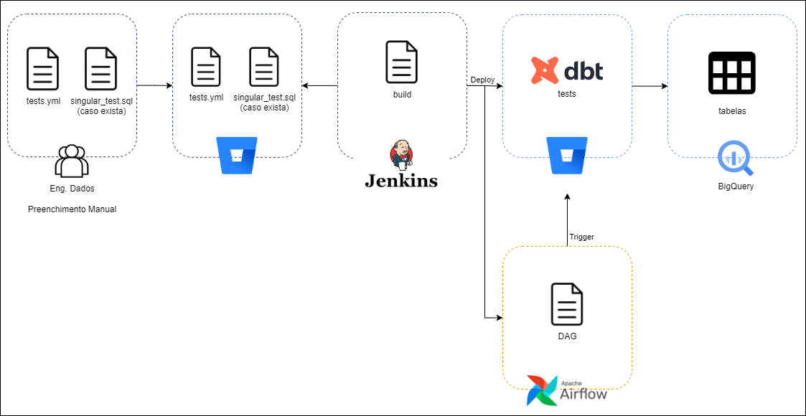
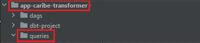
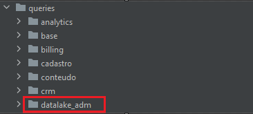
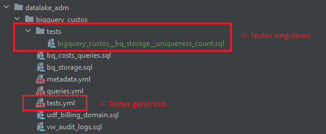
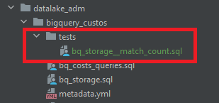
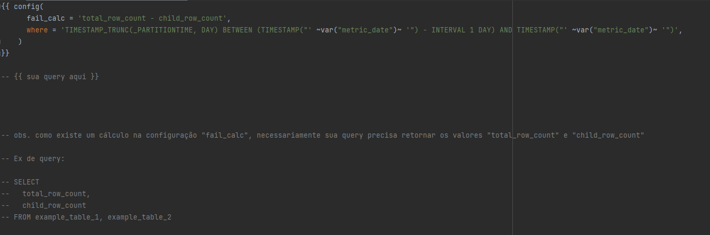
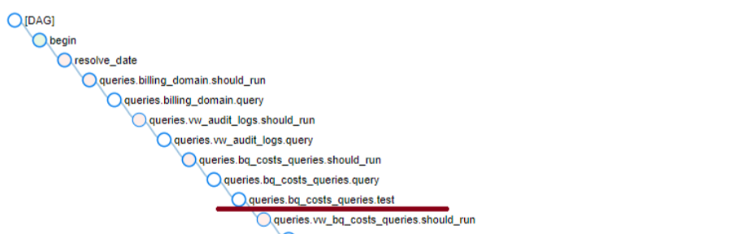

[Documentação](../../../../documentacao.md) > [GCP - Google Cloud Platform](../../../gcp-google-cloud-platform.md) > [Data Lake - GCP](../../data-lake-gcp.md) > [Transformacao de dados no Datalake](../transformacao-de-dados-no-datalake.md)

# Data Quality com dbt - testes genericos e singulares

**- [Visão Geral](#vis-o-geral)
  - [Sobre](#sobre)
  - [Requisitos](#requisitos)
  - [Arquitetura](#arquitetura)
- [Processo de Utilização](#processo-de-utiliza-o)
  - [Clone no Stash:](#clone-no-stash)
  - [Editando os artefatos](#editando-os-artefatos)
  - [Criação dos Testes e Arquivos de Configuração YAML:](#cria-o-dos-testes-e-arquivos-de-configura-o-yaml)
  - [Testes singulares:](#testes-singulares)
  - [Start e Visualização das DAGs (Airflow)](#start-e-visualiza-o-das-dags-airflow)
  - [Tabelas de Consulta (BigQuery)](#tabelas-de-consulta-bigquery)**

# **Visão Geral**

### **Sobre**

A funcionalidade de Data Quality visa assegurar a integridade e a qualidade dos dados manipulados pela aplicação. Este documento fornece uma visão detalhada sobre a implementação, os requisitos associados, a arquitetura subjacente e os processos envolvidos.

Alguns testes possuem integração com o Data Quality da área de Governança de Dados, que possuem diversas features a mais. É possível consultá-las aqui: [Data Quality - Regras](../../../../../../governanca-de-dados/governanca-de-dados-uolcs/data-lake-gcp/data-quality-regras.md)

### **Requisitos**

Para utilizar a funcionalidade de Data Quality, é necessário atender aos seguintes requisitos:

| Acesso ao Stash para clonar o repositório.                 | <https://stash.uol.intranet/projects/BIBD/repos/app-caribe-transformer/browse>   |
|:-----------------------------------------------------------|:---------------------------------------------------------------------------------|
| **Permissões no Jenkins para realizar commits e deploys.** | **<https://jenkinsbibd.intranet:8443/job/DAGs/job/query_maker/>**                |
| **Acesso ao Airflow para iniciar e visualizar DAGs.**      | **<https://airflow.data.intranet:8080/home>**                                    |

### **Arquitetura**



# **Processo de Utilização**

1. ## **Clone no Stash:**

   Realiza o versionamento dos artefatos.

   #### **Local**

   Abra o Stash e faça o login. Procure o repositório [app-caribe-transformer](https://stash.uol.intranet/projects/BIBD/repos/app-caribe-transformer/browse).

   Clique no ícone que corresponde ao clone. Faça um git clone para sua máquina local.

   

   Caso já tenha o arquivo em sua máquina, faça um pull.
2. ## **Editando os artefatos**

   Abra o projeto app-caribe-transformer, no editor de sua preferência, por exemplo Pycharm. Vá até a pasta com o nome queries.

   

   Crie uma pasta com o nome do domínio dentro de queries. Caso já esteja criado, passe para a próxima etapa.

   

   Crie uma pasta com o nome do modelo. É aqui que ficará o arquivo de configuração dos testes (tests.yml) e caso necessário, uma pasta chamada tests com os arquivos .sql com os testes singulares

   
3. ## **Criação dos Testes e Arquivos de Configuração YAML:**

   1. #### **Testes aceitos:**

      - **match\_count** ( integração com DQ de Gov )
        - Compara a contagem de linhas inseridas tabela de destino com a quantidade de linhas da partição da tabela de origem e retorna a diferença entre elas ( o ideal seria 0 )
      - **not\_null** ( integração com DQ de Gov )
        - Checa a quantidade de linhas nulas em uma coluna específica. Retorna o total de linhas nulas encontradas na partição checada.
      - **timeliness\_count**
        - Métrica usada para checar a periodicidade de ingestão da tabela. Quando testado, retorna um booleano ( 1 quando dados foram inseridos na tabela e 0 quando nada foi inserido )
      - **conformity\_cnpj**
        - Checa se uma coluna contendo CNPJs está com o formato correto ( regex ). Retorna o total de linhas com o formato incorreto na partição checada.
      - **conformity\_cpf**
        - Checa se uma coluna contendo CPFs está em conformidade ( regex ) e se é um CPF válido. Retorna o total de linhas com o formato incorreto na partição checada.
      - **conformity\_email**
        - Checa se uma coluna contendo emails está com o formato correto ( regex ). Retorna o total de linhas com o formato incorreto na partição checada.
      - **conformity\_ip**
        - Checa se uma coluna contendo ips está com o formato correto ( regex ) obs. válido para IPv4 e IPv6. Retorna o total de linhas com o formato incorreto na partição checada.
      - **conformity\_url**
        - Checa se uma coluna contendo URLs está com um formato aceito ( regex ). Retorna o total de linhas com o formato incorreto na partição checada.
      - **conformity\_uuid**
        - Checa se uma coluna contendo UUIDs está com o formato correto ( regex ). Retorna o total de linhas com o formato incorreto na partição checada.
   2. **Parâmetros necessários no .yml ( exemplos na imagem acima ):**
      - **origin\_table**: caminho da tabela de origem no bigquery.
      - **origin\_where**: cláusula where usada pela tabela de origem para buscar uma partição específica ( podendo utilizar a variável relative\_date do dbt para checar sempre a partição que será executada pelo modelo ).
      - **config:** sempre existirá em todos os testes. podendo possuir os parâmetros where e meta.
      - **meta:** metadados usados pelo app para popular a tabela de resultados dos testes.
      - **layer:** camada em que a tabela ou coluna checada se encontram ( raw/curated/datamart ).
      - **frequency:** frequência de ingestão da tabela ou coluna checada ( diaria / semanal / mensal ).
      - **schema\_target:** nome do dataset do seu modelo.
      - **table\_target:** nome da tabela do seu modelo.
      - **where:** cláusula where usada pela tabela para buscar uma partição específica ( podendo utilizar a variável relative\_date do dbt para checar sempre a partição que será executada pelo modelo ).
      - **technology\_origin:** nome da ferramenta de origem ( se houver ). Ex: Bigquery, MySQL, Oracle...
      - **database\_origin:** nome do projeto de origem ( se houver ).
      - **schema\_origin:** nome do schema/dataset de origem ( se houver ).
      - **table\_origin:** nome da tabela de origem ( se houver ).
      - **column\_origin:** nome da coluna de origem ( se houver ).

        |     | Obrigatório apenas para o teste de match\_count                                                                         |
        |:----|:------------------------------------------------------------------------------------------------------------------------|
        |     | **Obrigatório para todos os testes**                                                                                    |
        |     | **Opcionais apenas para quando existir tais metadados** <br/> **Where: não colocar quando quiser checar a tabela toda** |
   3. #### **Arquivo .yml de exemplo**

      - Crie o arquivo de configuração YAML para especificar os parâmetros dos testes:

        **tests.yml**

        ```yml
        version: 2

        models:
          - name: HITS
            tests:
              - match_count:
                  origin_table: uolcs-caribe-qa.base_ga4_total_raw.HITS
                  origin_where: 'TIMESTAMP_TRUNC(_PARTITIONTIME, DAY) = TIMESTAMP("{{ var("relative_date") }}")'
                  config:
                    where: 'TIMESTAMP_TRUNC(_PARTITIONTIME, DAY) = TIMESTAMP("{{ var("relative_date") }}")'
                    meta:
                      layer: "raw"
                      frequency: "diaria"
                      schema_target: "base_ga4_total_raw"
                      table_target: "HITS"
                      technology_origin: "BigQuery"
                      database_origin: "uolcs-datalake-prd"
                      schema_origin: "ga4_total_raw"
                      table_origin: "HITS"
                      column_origin: "uol_id"
              - timeliness_count:
                  config:
                    where: 'TIMESTAMP_TRUNC(_PARTITIONTIME, DAY) = TIMESTAMP("{{ var("relative_date") }}")'
                    meta:
                      layer: "raw"
                      frequency: "diaria"
                      schema_target: "base_ga4_total_raw"
                      table_target: "HITS"
            columns:
              - name: dataset_id
                tests:
                  - not_null:
                      config:
                        where: 'TIMESTAMP_TRUNC(_PARTITIONTIME, DAY) = TIMESTAMP("{{ var("relative_date") }}")'
                        meta:
                          layer: "raw"
                          frequency: "diaria"
                          schema_target: "base_ga4_total_raw"
                          table_target: "HITS"
        ```
      - Existem 2 tipos de testes, um diretamente na tabela ex: match\_count, e outro testando uma coluna específica ex: not\_null.
      - Exsite um template no README do app-transformer para facilitar o preenchimento.
4. ## **Testes singulares:**

   Caso os testes genéricos não comportarem  alguma regra de negócio específica da(s) sua(s) tabela(s), é possível criar o seu próprio teste singular da seguinte forma:
   - - - Dentro da pasta do seu modelo ( onde estão os arquivos de configuração .yml ) Crie uma pasta com o nome "tests" e dentro dela, crie arquivos .sql com os testes singulares:  
           
         - O nome do seu teste singular deve seguir o seguinte padrão:   <tabela testada>\_\_<nome do teste>.sql     Ex: hits\_\_match\_count.sql
       - A configuração do teste singular deve ser feita dessa forma no início do arquivo SQL :  
         
       - Existe um template da configuração no README do app-transformer para facilitar o preenchimento
       - Configuração específica para testes singulares:  
           
         - **fail\_calc:** esta configuração permite manipular o retorno do teste. O retorno padrão é um count \* no que retornar da sua query.  
           Ex:  
           SELECT parent\_count, child\_count   
           FROM exemplo   
             
           fail\_calc = "parent\_count - child\_count"  **←** O resultado do seu teste será a subtração da quantidade de linhas encontradas na tabela pai, pela quantidade de linhas encontradas na tabela filha.  
             

           **Obs. O dbt considera como falha sempre que a quantidade de linhas retornadas pela query for > 0**

           |    |                                                                                                                         |
           |:---|:------------------------------------------------------------------------------------------------------------------------|
           |    | **Opcionais apenas para quando existir tais metadados** <br/> **Where: não colocar quando quiser checar a tabela toda** |

## **Start e Visualização das DAGs (Airflow)**

1. **Visualização no Airflow:**
   - Utilize a interface do Airflow para visualizar o step de teste logo após a execução da query da tabela testada  
     

## **Tabelas de Consulta (BigQuery)**

1. **Testes sem integração com GOV:**
   - Os resultados dos testes com e sem integração com GOV serão disponibilizados no dataset **"**uolcs-datalake-prd.datalake\_dbt\_test\_audit\_raw" **;**
   - Na primeira vez que um teste falhar, será criada uma tabela com o nome do seu teste neste dataset, e nas demais vezes que ocorrerem falhas, serão adicionadas linhas nessa tabela.
2. **Testes com integração com GOV:**
   - Além do passo anterior, os resultados dos testes genéricos **not\_null** e **match\_count** serão adicionados nas tabelas de Data Quality da área de GOV;
   - Os dados raw dos resultados serão inseridos nas tabelas do dataset "uolcs-datalake-prd.govdados\_data\_quality\_management\_raw", para posteriormente serem tratados e manipulados pela área de governança a fim de trazer uma visualização das métricas de consistência e qualidade dos dados
