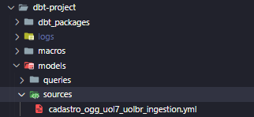
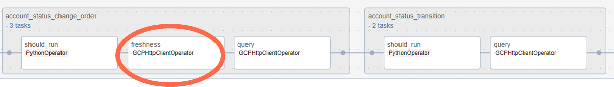
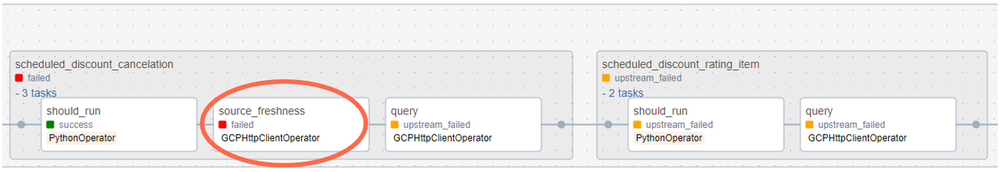
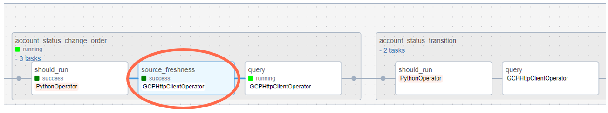

[Documentação](../../../../documentacao.md) > [GCP - Google Cloud Platform](../../../gcp-google-cloud-platform.md) > [Data Lake - GCP](../../data-lake-gcp.md) > [Transformacao de dados no Datalake](../transformacao-de-dados-no-datalake.md)

# DBT - Source Freshness

- [Para que serve?](#para-que-serve)
- [Guia de utilização](#guia-de-utiliza-o)
  - [Resumo](#resumo)
  - [Passo-a-passo](#passo-a-passo)
- [Resultado final](#resultado-final)

# Para que serve?

Uma configuração de ***freshness*** no dbt define o **período de tempo** tolerável entre o dado mais recente de uma tabela e o momento atual para que a tabela seja considerada "atualizada".

É possível emitir alertas ou erros conforme configurado no arquivo .yml de definição do source.


# Guia de utilização

## Resumo

- Criar arquivo .yml em app-caribe-transformer-artifacts com as definições do **source.** (Criar 1 arquivo source para cada dataset)
- No arquivo de query (.sql), em app-caribe-transformer, na clausula FROM utilizar o source criado. Exemplo: **FROM** {{ **source**('source\_name', 'table') }}
- No arquivo queries.yml em app-caribe-transformer, setar o parâmetro **source\_freshness** como true nas tabelas onde houver um critério de freshness cadastrado.
- Buildar a DAG pelo query\_maker normalmente

## Passo-a-passo

1 - Criar arquivo .yml onde será definido o *source* e seu critério de *freshness* (atualização):

**sources.yml**

```yml
sources:
  - name: cadastro_ogg_uol7_uolbr_ingestion #manter o mesmo nome do arquivo e dataset
    schema: cadastro_ogg_uol7_uolbr_ingestion #nome do dataset onde a tabela está
    loaded_at_field: TIMESTAMP_MICROS(timestampmicro)
    tables:
      - name: account_status_change_order
        freshness:
          warn_after: {count: 1, period: day}  #minute | hour | day
          error_after: {count: 1, period: day} #minute | hour | day
		  filter: DATE(_PARTITIONTIME) >= DATE_SUB(CURRENT_DATE, INTERVAL 1 DAY) OR _PARTITIONTIME IS NULL
```

- O nome do yml é indiferente para o DBT, mas por padrão, utilizaremos o nome do dataset tanto para o nome do arquivo quanto para o nome do source
- O campo **loaded\_at\_field** não é obrigatório, porém se ele não for inserido no yml, o DBT irá verificar se a tabela está atualizada pela data da última atualização dela
  - Este campo pode ser definido a nível de source ou de tabela
- O campo **filter** não é obrigatório,mas **deve ser usado** sempre que a tabela em questão estiver particionada, a fim de reduzir o custo de query
- O critério de **freshness** pode ser passado a nível de tabela ou a nível de source

Em nossa implementação, esse arquivo deve ser versionado em **[app-caribe-transformer-artifacts](https://stash.uol.intranet/projects/BIBD/repos/app-caribe-transformer-artifacts/browse)**, na pasta sources. Vamos criar um *source* por dataset de origem:



*\*Necessário fazer um PR no repositório.*

2 - No arquivo .sql, utilizar o ***source*** nas queries (ao invés de acessar a tabela diretamente):

**account\_status\_change\_order.sql**

```sql
WITH
ogg AS (
  SELECT
    position,
    deleted,
    DATETIME(TIMESTAMP_MICROS(timestampmicro), 'America/Sao_Paulo') as dat_ingestion,
    IDT_USER_ORDER,
    IDT_INSCRIPTION_ACCOUNT,
    IDT_SCHEDULED_OPERATION,
  FROM {{ source('cadastro_ogg_uol7_uolbr_ingestion', 'account_status_change_order') }}
)
SELECT * FROM ogg
```

3 - No arquivo queries.yml setar o parâmetro *source\_freshness* como True nas tabelas que tiverem um critério previamente cadastrado:

**queries.yml**

```yml
version: 1.0
specification:
  domain: cadastro
  owner: caribe
  configuration:
    schedule_interval:
    start_date: 2024-05-25
    timezone: America/Sao_Paulo
    parallel_tasks: false
  tables:
    - name: account_status_change_order
      dataset: cadastro_ogg_uol7_uolbr_raw
      config:
        materialized: table
      query_file: account_status_change_order.sql
      source_freshness: true
```

Após fazer build da DAG pelo query\_maker uma task chamada ***source\_freshness*** será acrescentada dentro do task group de cada query:



*Nessa imagem, vemos que o task group account\_status\_change\_order possui uma task de freshness, enquanto o task group seguinte não possui.*

# Resultado final

Quando o comando *source\_freshness* for executado, uma query semelhante a essa será executada no BigQuery, e o resultado dela é comparado com o critério de *freshness* cadastrado no .yml sources:

```sql
select
      max(dat_ingestion) as max_loaded_at,
      current_timestamp() as snapshotted_at
from `uolcs-caribe-qa`.`cadastro_ogg_uol7_uolbr_ingestion`.`account_status_change_order`
    
```

***Atenção**: Se o campo **loaded\_at\_field** não for cadastrado no arquivo .yml sources, nenhuma query será executada no BigQuery. Via API será verificada a data de última atualização da tabela e isso será usado para comparar com o critério de freshness.*

*Dessa forma, se uma informação de metadado, for feita na tabela, isso contará como data de update para a comparação.*

Se o teste de atualização falhar, a task no airflow ficará vermelha, impedindo que a query (task seguinte) execute sem dados novos



Caso contrário, a query executará normalmente:



Doc Oficial: <https://docs.getdbt.com/reference/resource-properties/freshness>
