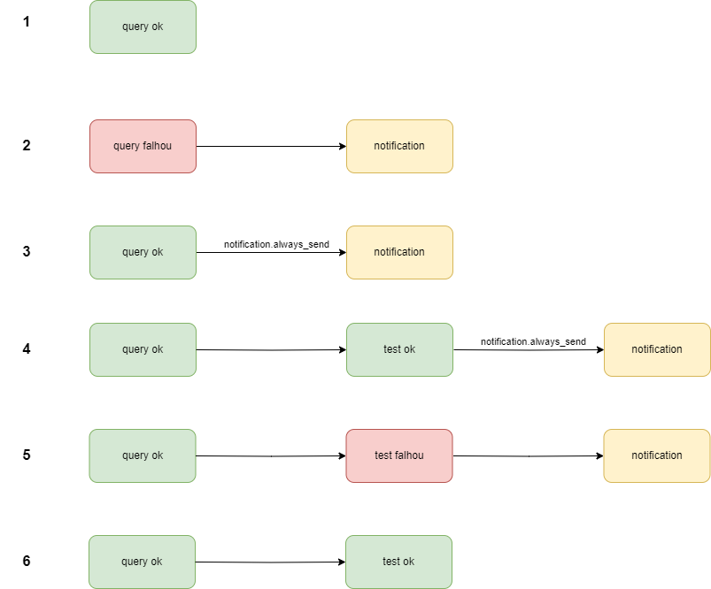

[Documentação](../../../../documentacao.md) > [GCP - Google Cloud Platform](../../../gcp-google-cloud-platform.md) > [Data Lake - GCP](../../data-lake-gcp.md) > [Transformacao de dados no Datalake](../transformacao-de-dados-no-datalake.md)

# Envio de notificacoes para o Teams

- [Canal de notificações](#canal-de-notifica-es)
- [Cenários de envio do alerta](#cen-rios-de-envio-do-alerta)
- [Criar um webhook](#criar-um-webhook)

O Transformer suporta o envio de notificações durante a execução da DAG.

Por padrão o envio ocorre somente ao ocorrer algum erro, mas é possível enviar em todas as execuções.

# **Canal de notificações**

O canal que receberá pode ser configurado em três níveis:

- Caso não seja especificado, utilizará o canal padrão baseado no "owner" da DAG
- Configurar em: **specification.configuration.teams\_webhook**
- Configurar em: **specification.tables.<nome\_tabela>.notification.teams\_webhook**

# **Cenários de envio do alerta**

****

**Exemplo de yml representando os casos acima**

**queries.yml**

```yml
version: 1.0
specification:
  domain: datalake_adm
  owner: caribe
  configuration:
    schedule_interval: 0 2 * * *
    start_date: 2023-01-12
    timezone: America/Sao_Paulo
    retries: 0
    teams_webhook: https://uolinc.webhook.office.com/webhookb2/d9beaec3-d0b6-4b51-8e4f-bf0d0eb8bbdf@7575b092-fc5f-4f6c-b7a5-9e9ef7aca80d/IncomingWebhook/33424682b77d4f87a119746a4a6f68aa/e5687ccb-a21d-42d4-832e-b63422d72ef3
  tables:
    # query ok, sem testes: não envia notificação
    - name: tabela1
      dataset: exemplo
      config:
        materialized: table
      query_file: tabela1.sql

    # query quebrada, sem testes: envia notificação
    - name: tabela2
      dataset: exemplo
      config:
        materialized: table
      query_file: tabela2.sql

	# query ok, sem testes, mas com always_send=true: envia notificação
    - name: tabela3
      dataset: exemplo
      config:
        materialized: table
      query_file: tabela1.sql
      notification:
        always_send: true
		message: >
          Mensagem customizada
		  Pode conter várias linhas e HTML
		# Mudando o canal do teams somente para essa notificação
	 	teams_webhook: https://uolinc....


 	# query ok, testes ok, mas com always_send=true: envia notificação
    - name: tabela4
      dataset: exemplo
      config:
        materialized: table
      query_file: tabela1.sql
      notification:
        always_send: true
		message: >
          Mensagem customizada
		  Pode conter várias linhas e HTML 

 	# query ok, testes falhando: envia notificação
    - name: tabela5
      dataset: dbt_damiao_curated
      config:
        materialized: table
      query_file: tabela5.sql
          
	# query e testes ok: não envia notifação
    - name: tabela6
      dataset: exemplo
      config:
        materialized: table
      query_file: tabela6.sql


```

**tests.yml**

```yml
version: 2
models:
# testes ok
- name: tabela4
  columns:
  - name: data_atual
    tests:
    - not_null:
        config:
          meta:
            layer: curated
            frequency: diaria

# testes falhando
- name: tabela5
  columns:
  - name: data_atual
    tests:
    - not_null:
        config:
          meta:
            layer: curated
            frequency: diaria  

# testes falhando
- name: tabela6
  columns:
  - name: data_atual
    tests:
    - not_null:
        config:
          meta:
            layer: curated
            frequency: diaria  
```

---

# **Criar um webhook**

Veja: [Como criar um webhook no Teams](../../../how-to/como-criar-um-webhook-no-teams.md)
