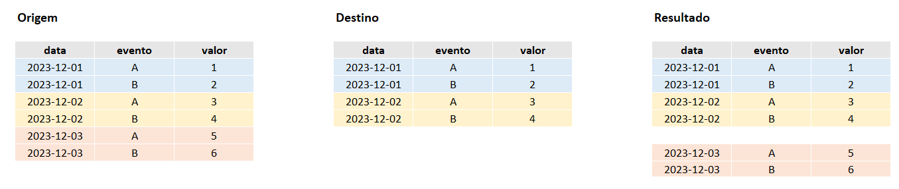
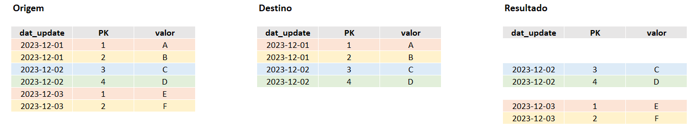

[Documentação](../../../../documentacao.md) > [GCP - Google Cloud Platform](../../../gcp-google-cloud-platform.md) > [Data Lake - GCP](../../data-lake-gcp.md) > [Transformacao de dados no Datalake](../transformacao-de-dados-no-datalake.md)

# Otimizacao com queries incrementais

**Tópicos**

- [TL;DR](#tl-dr)
- [Eventos imutáveis com data](#eventos-imut-veis-com-data)
  - [Particionar por uma coluna de data](#particionar-por-uma-coluna-de-data)
  - [Particionar pela pseudocoluna \_PARTITIONTIME](#particionar-pela-pseudocoluna-partitiontime)
- [Bases relacionais com PK e data de atualização](#bases-relacionais-com-pk-e-data-de-atualiza-o)
  - [MERGE + cluster na PK](#merge-cluster-na-pk)
- [Referências:](#refer-ncias)

---

# TL;DR

| Formado dos dados                                                                                                                                                 | Exemplos de bases                                                                                                            | Formas de otimizar                                                                                                                                                                                                                   | Consumo                                                                    |
|:------------------------------------------------------------------------------------------------------------------------------------------------------------------|:-----------------------------------------------------------------------------------------------------------------------------|:-------------------------------------------------------------------------------------------------------------------------------------------------------------------------------------------------------------------------------------|:---------------------------------------------------------------------------|
| **Eventos imutáveis com data** São dados que são gerados e registros nunca sofrem alteração                                                                       | <ul style="list-style-type: square;"><li>Google Analytics</li><li>Search Console</li><li>Métricas de redes sociais</li></ul> | **[Particionar por uma coluna de data](https://confluence.intranet.uol.com.br/confluence/pages/viewpage.action?pageId=457896363#Otimiza%C3%A7%C3%A3ocomqueriesincrementais-Particionarporumacolunadedata)**                          | query + scan na tabela de destino para verificar existência das partições. |
|                                                                                                                                                                   |                                                                                                                              | **[Particionar pela *pseudocoluna* \_PARTITIONTIME](https://confluence.intranet.uol.com.br/confluence/pages/viewpage.action?pageId=457896363#Otimiza%C3%A7%C3%A3ocomqueriesincrementais-Particionarpelapseudocoluna_PARTITIONTIME)** | Somente query                                                              |
| **Bases relacionais com PK e data de atualização** São tabelas que possuem chaves primárias e não é possível sobrescrever uma partição ao processar atualizações. | <ul style="list-style-type: square;"><li>Cadastro</li><li>Assinantes</li><li>Billing</li></ul>                               | **[MERGE](https://confluence.intranet.uol.com.br/confluence/pages/viewpage.action?pageId=457896363#Otimiza%C3%A7%C3%A3ocomqueriesincrementais-MERGE+clusternaPK)**                                                                   | query +full scan na tabela de destino                                      |
|                                                                                                                                                                   |                                                                                                                              | **[MERGE + cluster na PK](https://confluence.intranet.uol.com.br/confluence/pages/viewpage.action?pageId=457896363#Otimiza%C3%A7%C3%A3ocomqueriesincrementais-MERGE+clusternaPK)**                                                   | query + scan dos clusters das PK alteradas                                 |

---

# **Eventos imutáveis com data**

São dados que são gerados e registros **nunca sofrem alteração**, somente chegam novos e ao reprocessar uma data é possível **sobrescrever todos os registros daquela data no destino** com os dados da origem.

**Exemplo de dados:**

- GA



## **Particionar por uma coluna de data**

Nesse caso tanto a tabela de **origem** quanto de **destino** tem uma **coluna com a data do evento** e essa coluna é usada como **partição**.

**Comportamento:**

- O resultado da query será usado para sobrescrever partições no destino

**Dados escaneados:**

- Origem: Partições da origem referenciada na query. No exemplo somente a "relative\_date"

- Destino: Query na tabela de destino para identificar partições a serem substituídas. Se a tabela destino for muito grande, pode gerar muitos dados escaneados.

**queries.yml**

```yml
    - name: TABELA_DESTINO
      dataset: dataset_exemplo
      config:
        materialized: incremental
		incremental_strategy: insert_overwrite
        partition_by:
          field: data
          granularity: DAY
          data_type: date
      query_file: tabela_destino.sql
```

**query.sql**

```sql
SELECT *
FROM TABELA_ORIGEM
WHERE data = DATE('{{ var("relative_date") }}')
```

## **Particionar pela pseudocoluna [\_PARTITIONTIME](https://cloud.google.com/bigquery/docs/partitioned-tables#ingestion_time)**

Nesse caso tanto a tabela de **origem** quanto de **destino** tem uma **coluna com a data do evento** que é usada como partição.

A diferença desse método com o partição por coluna é a possibilidade de otimizar os dados escaneados ao sobrescrever a partição. Utilizando os parâmetros "**time\_ingestion\_partitioning**" e "**copy\_partitions**" fará o dbt utilizar a API do BigQuery para sobrescrever as partições no destino, **não gerando dados escaneados no destino.**

É necessário adicionar uma coluna da query para representar a coluna **\_PARTITIONTIME** no destino. No exemplo foi adicionada a coluna **\_PARTITION\_TIME** (\_PARTITIONTIME é palavra reservada) usando a data do evento.

**Comportamento:**

- O resultado da query será usado para sobrescrever partições no destino

**Dados escaneados:**

- Origem: Partições da origem referenciada na query. No exemplo somente a "relative\_date"

- Destino: não escaneia nada

**queries.yml**

```yml
    - name: TABELA_DESTINO
      dataset: dataset_exemplo
      config:
        materialized: incremental
		incremental_strategy: insert_overwrite
        partition_by:
          field: _PARTITION_TIME
          granularity: DAY
          data_type: timestamp
          time_ingestion_partitioning: true
          copy_partitions: true
      query_file: tabela_destino.sql
```

**query.sql**

```sql
SELECT *, data as _PARTITION_TIME
FROM TABELA_ORIGEM
WHERE data = DATE('{{ var("relative_date") }}')
```

---

# **Bases relacionais com PK e data de atualização**

São tabelas que possuem chaves primárias e não é possível sobrescrever uma partição ao processar atualizações.

**Exemplos de bases:**

- Base cadastral (Plataforma)



## **MERGE + cluster na PK**

Nesse caso a melhor forma de reduzir consumo de dados escaneados é utilizar o comando DML [MERGE](https://docs.getdbt.com/reference/resource-configs/bigquery-configs#the-merge-strategy).

**Comportamento:**

- As PKs retornadas na query serão usadas como entrada no MERGE

**Dados escaneados:**

- **Origem:** Partições da origem referenciada na query, geralmente uma coluna "dat\_update" que é partição na origem.

- **Destino:** No destino podem ter dois cenários:  
  - **Tabela não tem cluster:** Será **escaneada tabela completa** para identificar quais PKs precisam ser atualizadas
  - **Tabela com cluster na PK:** Serão escaneados **somente clusters das PKs** que sofreram atualização

**queries.yml**

```yml
    - name: TABELA_DESTINO
      dataset: dataset_exemplo
      config:
        materialized: incremental
		incremental_strategy: merge
		unique_key:
			- PK
        cluster_by:
			- PK
      query_file: tabela_destino.sql
```

**query.sql**

```sql
SELECT dat_update, pk, valor
FROM TABELA_ORIGEM
WHERE dat_update = DATE('{{ var("relative_date") }}')
```

---

# Referências:

**dbt**

- <https://docs.getdbt.com/reference/resource-configs/bigquery-configs#merge-behavior-incremental-models>

**BigQuery**

- <https://cloud.google.com/bigquery/docs/partitioned-tables#ingestion_time>
