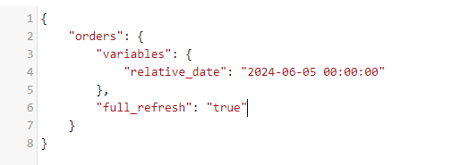

[Documentação](../../documentacao.md) > [GCP - Google Cloud Platform](../gcp-google-cloud-platform.md)

# Datalake release notes

## 26 de Fevereiro de 2026

### FEATURE Suporte a adição de campos em colunas STRUCT no MERGE do app-caribe-batch-cleaner

Componentes:   APP-CARIBE-BATCH-CLEANER

- Agora quando usado o MERGE na deduplicação de dados, o cleaner tentará adicionar todas as colunas da INGESTION que ainda não existem na RAW, inclusive campos dentro de STRUCTs
- São adicionadas campos em qualquer nível da STRUCT, inclusive STRUCTS aninhadas
- Caso uma coluna STRUCT na ingestion já exista na RAW com outro tipo, o schema não será alterado e resultará em erro no MERGE

## 13 de Fevereiro de 2026

### FEATURE Opção de utilizar a data do DagRun em conjunto com relative\_date no query\_maker

Componentes:  APP-CARIBE-DAG-MAKER  APP-CARIBE-TRANSFORMER DBT QUERY\_MAKER

- Adicionado novo parâmetro de configuração:
  - `configuration.use_airflow_data_interval_end`
- Caso habilitado, a DAG utilizará o **data\_inverval\_end** para calcular o **relative\_date**.
- Dessa forma, ao reprocessar uma execução no passado, ele respeitará o relative\_date usado naquela execução
- Sem a flag, em alguns casos o relative\_date é calculado novamente usando a data atual como referência
- <https://stash.uol.intranet/projects/BIBD/repos/app-caribe-batch/pull-requests/380/overview>

## 11 de Fevereiro de 2026

### CHANGE Upgrade do Airflow para versão 2.10.5

Componentes:  AIRFLOW COMPOSER

- Atualizado versão devido ao fim do suporte da versão do composer em fevereiro/26:
  - `composer-2.11.3-airflow-2.10.2` → `composer-2.16.3-airflow-2.10.5`

- Mais infos:
  - <https://airflow.apache.org/docs/apache-airflow/stable/release_notes.html>
  - <https://cloud.google.com/composer/docs/release-notes>

## 15 de Janeiro de 2026

### FEATURE Suporte a partition pruning no batch-cleaner

Componentes:   APP-CARIBE-BATCH-CLEANER

- Quando usado MERGE e a tabela de destino é particionada, por padrão o BigQuery acaba escaneando a tabela inteira mesmo sem necessidade
- Para evitar, é necessário fazer um filtro estático nas partições
- Adicionamos um mecanismo no batch-cleaner que verifica:
  - Se a tabela raw é particionada
  - Se a partição faz parte da PK
- Em caso positivo, é adicionada na query uma etapa que obtém o MIN e MAX dos dados da ingestion que irão para raw
- Em seguida adicionado um filtro estático no MERGE com esses valores, fazendo o BigQuery reduzir o consumo da raw
- Essa feature é aplicada por padrão em todas as queries passíveis de otimização

## 17 de Novembro de 2025

### FEATURE Novas funcionalidades no sharepoint-loader e file-loader

Componentes:   APP-CARIBE-FILE-LOADER APP-CARIBE-SHAREPOINT-LOADER

- Suporte a arquivos `HTML`
- Suporte ao parâmetro `skip_rows` : Pula as primeiras linhas de um arquivo. Útil em casos de CSV que contém comentários no cabeçalho.
- Normalização dos nomes de colunas:
  - Remoção de acentos e caracteres especiais
  - Substituição de espaços por underline

Detalhes de como usar no README: <https://stash.uol.intranet/projects/BIBD/repos/app-caribe-schema-files/browse>

## 31 de Outubro de 2025

### FEATURE Suporte a adição de colunas no MERGE do app-caribe-batch-cleaner

Componentes:   APP-CARIBE-BATCH-CLEANER

- Agora quando usado o MERGE na deduplicação de dados, o cleaner adicionará as **novas colunas** da INGESTION na RAW
- São adicionadas somente colunas na raiz da tabela, de qualquer tipo.
- Colunas STRUCTS existentes não são modificadas caso tenham um novos campos.

## 17 de Outubro de 2025

### FEATURE Adicionada visão de créditos ao relatório de faturamento GCP

Componentes:   LOOKER STUDIO

- Agora é possível acompanhar os detalhes dos créditos lançados na fatura do GCP.
- Também é possível filtrar pelo **tipo** e **nome** do créditos, sendo possível por exemplo saber o crédito específico que gerou o desconto.
- Links:
  - Visão Mensal: <https://lookerstudio.google.com/reporting/76ccc45b-2307-48e2-9bdd-2839e5e9ce13/page/p_ns21mcw91c>
  - Visão Diária: <https://lookerstudio.google.com/reporting/76ccc45b-2307-48e2-9bdd-2839e5e9ce13/page/p_12h9vtzt3c>

## 04 de Setembro de 2025

### FEATURE Ingestão de métricas de uso do GitHub Copilot

Componentes:   INGESTÃO

- Dados de toda organização coletados via REST API do Github Copilot
- Tabela: uolcs-datalake-prd.base\_github\_raw.COPILOT\_METRICS
- Repositório: <https://stash.uol.intranet/projects/BIBD/repos/app-caribe-github-metrics-collector/browse>

## 03 de Setembro de 2025

### FEATURE Suporte para mysql-connector no batch-loader

Componentes:  APP-CARIBE-BATCH-LOADER DAG\_MAKER

- Por padrão o batch-loader utiliza o driver  **[PyMySQL](https://docs.sqlalchemy.org/en/14/dialects/mysql.html#module-sqlalchemy.dialects.mysql.pymysql)** para conectar em bancos MySQL.
- Porém ele possui algumas limitações, como problemas para usar senhas com carateres especiais.
- Agora adicionamos a opção de utilizar o [**MySQL Connector/Python**](https://docs.sqlalchemy.org/en/14/dialects/mysql.html#module-sqlalchemy.dialects.mysql.mysqlconnector), driver mantido pela Oracle.
- Para utilizar, basta adicionar o parâmetro ao secret com as credenciais:

  **secret.json**

  ```js
   {
    "driver": "mysqlconnector",
    "username": "",
    "password": "",
    "host": "",
    "port": "",
    "database_name": ""
  }
  ```

## 18 de Agosto de 2025

### FEATURE Suporte para Table-Valued Functions (TVF) do BigQuery no dbt

Componentes:  APP-CARIBE-DAG-MAKER  APP-CARIBE-TRANSFORMER DBT QUERY\_MAKER

- Adicionamos suporte para criação de Table-Valued Functions (TVF) no BigQuery pelo dbt
- TVF tem um funcionamento similar ao de Views, porém com possibilidade de receber parâmetros, assim como uma UDF
- Para utilizar, basta utilizar a materialização "tvf", ex:

  **queries.yml**

  ```yml
      - name: tvf_exemplo
        dataset: exemplo
        config:
          materialized: tvf
          args:
            - name: start_date
              type: DATE
            - name: end_date
              type: DATE
        query_file: query.sql
  ```
- Mais detalhes sobre o funcionamento e utilização: <https://cloud.google.com/bigquery/docs/table-functions>

### FEATURE Dashboard para acompanhamento de tabelas sem uso

Componentes:  APP-CARIBE-DAG-MAKER  APP-CARIBE-TRANSFORMER DBT QUERY\_MAKER

- Adicionamos uma nova visão ao Painel do Datalake, listando as tabelas que estão sendo atualizadas, porém não tem utilização
- Com isso poderemos identificar possíveis desperdícios e desligar as queries que estão sem uso
- A visão está disponível como uma Table-valued Function (TVF):
  - uolcs-datalake-prd.datalake\_adm.tvf\_bq\_tables\_overview
  - Exemplo de uso:

    ```sql
    SELECT * FROM `uolcs-datalake-prd.datalake_adm.tvf_bq_tables_overview`('2025-07-01', '2025-08-18')
    WHERE num_usage_queries = 0
    ORDER BY num_update_table_billed_tb DESC;
    ```

- Painel para acompanhamento: <https://lookerstudio.google.com/reporting/76ccc45b-2307-48e2-9bdd-2839e5e9ce13/page/p_usv0ikmj2c>

## 06 de Agosto de 2025

### FEATURE Coleta das execuções de source freshnes e data tests do dbt

Componentes:  APP-CARIBE-DAG-MAKER  APP-CARIBE-TRANSFORMER DBT QUERY\_MAKER

- Estamos coletando os resultados de todas as execuções de source freshness e data tests feitas no dbt
- O resultado está sendo carregado nas tabelas:
  - PROD: uolcs-datalake-prd.govdados\_data\_quality\_management\_raw.QUALITY\_CHECK\_RESULTS
  - QA: uolcs-caribe-qa.govdados\_data\_quality\_management\_raw.QUALITY\_CHECK\_RESULTS
- Painel para acompanhamento dos resultados: <https://lookerstudio.google.com/reporting/76ccc45b-2307-48e2-9bdd-2839e5e9ce13/page/p_wkbc3b4bvd>

## 04 de Agosto de 2025

### FEATURE Utilização de copy\_partitions para cargas incrementais

Componentes:  APP-CARIBE-DAG-MAKER  APP-CARIBE-TRANSFORMER DBT QUERY\_MAKER

- Por padrão, o dbt utiliza uma query de MERGE para sobrescrita de partições, gerando custo de processamento.
- Porém é possível alterar para fazer a sobrescrita via API usando a opção copy\_partitions: true
- Visando otimização de custo, alteramos para que todas as queries com **incremental\_strategy: insert\_overwrite** utilizem a opção **copy\_partitions: true** por padrão
- Caso precise utilizar o MERGE por algum motivo, basta adicionar o parâmetro **copy\_partitions: false**

Mais detalhes: <https://docs.getdbt.com/reference/resource-configs/bigquery-configs#copying-partitions>

## 01 de Agosto de 2025

### FEATURE Suporte a tipos UUID e ARRAY do PostgreSQL no batch-loader

Componentes:  APP-CARIBE-BATCH-LOADER

- Adição do suporte para colunas do tipo UUID, Array de texto e Array de inteiros do Postgres no batch-loader
- Para facilitar os testes locais, foi criado um docker-compose que sobe uma pod Postgres: <https://stash.uol.intranet/projects/BIBD/repos/bigdata-lab/browse/docker/batch-loader/postgres>

## 16 de Junho de 2025

### FEATURE Aviso de custo na entrega de queries via Jenkins

Componentes:  APP-CARIBE-DAG-MAKER  APP-CARIBE-TRANSFORMER DBT QUERY\_MAKER

- A partir de hoje adicionamos ao query\_maker uma etapa de estimar o custos das queries que estão sendo agendadas
- Caso uma das queries agendadas ultrapasse 5TB de processamento mensal, será necessário uma confirmação do próprio usuário
- Esse alerta visa trazer visibilidade de custo antes da entrega e complementa o acompanhamento de custos por tabela

Mais detalhes: [DBT - Alerta de custo na entrega de queries](data-lake-gcp/transformacao-de-dados-no-datalake/dbt-alerta-de-custo-na-entrega-de-queries.md)

## 26 de Maio de 2025

### CHANGE Upgrade do dbt para versão 1.9.4

Componentes:  APP-CARIBE-TRANSFORMER DBT APP-CARIBE-DBT-RUNNER

- Atualizado versões devido ao fim do suporte da versão 1.8 em maio/25:
  - dbt-core: 1.8;6 → 1.9.4
  - dbt-bigquery: 1.8.2 → 1.9.1
- Principal mudança:
  - Adição de nova estratégia de modelos incrementais, chamada "**microbatch**".
  - Mais detalhes: <https://docs.getdbt.com/docs/build/incremental-microbatch>
- Mais detalhes sobre a atualização: <https://docs.getdbt.com/docs/dbt-versions/core-upgrade/upgrading-to-v1.9>

### FEATURE Adição de labels automaticamente em tabelas do query\_maker

Componentes:  APP-CARIBE-DAG-MAKER  APP-CARIBE-TRANSFORMER

- A partir de agora, novos builds do query\_maker incluirão as seguintes labels ao metadados automaticamente:
  - dag: nome da dag que gerou a tabela
  - frequency\_ingestion: intervalo de execução (intraday, daily, weekly, monthly)
  - type\_ingestion: estratégia de atualização da tabela (delta, full)
- Antes as tags eram adicionadas somente se passasse pelo fluxo de IA para gerar metadados e nunca mais eram atualizadas
- Agora serão atualizadas a cada execução do Jenkins, se necessário

## 15 de Maio de 2025

### FEATURE Identificação dinâmica da partição na ingestion pelo batch-cleaner

Componentes:  APP-CARIBE-BATCH-CLEANER

- O batch-cleaner só suportava partição por tempo de ingestão (\_PARTITIONTIME) na camada ingestion
- A partir de agora, ele identifica automaticamente a coluna da partição, suportando usar partição por uma coluna da tabela ingestion
- Essa funcionalidade é útil para deduplicações que usam use\_merge=true, pois se for usada mesma coluna de partição na ingestion e raw, ocorrerá *partition pruning*, reduzindo o volume de dados escaneados.

## 27 de Março de 2025

### CHANGE Upgrade do Airflow para versão 2.10.2

Componentes:  AIRFLOW COMPOSER

- Atualizado versão devido ao fim do suporte da versão `composer-2.7.0-airflow-2.7.3` em abril/25:
  - `composer-2.7.0-airflow-2.7.3` → `composer-2.11.3-airflow-2.10.2`
  - `apache-airflow-providers-google: 10.16.0 → 10.22.0`
  - `apache-airflow-providers-amazon: 8.23.0 → 8.28.0`

- Mais infos:
  - <https://airflow.apache.org/docs/apache-airflow/stable/release_notes.html#airflow-2-10-2-2024-09-18>
  - <https://cloud.google.com/composer/docs/release-notes>

## 20 de Fevereiro de 2025

### FEATURE Automação para criação de listing no Analytics Hub via Terraform

Componentes:  GCP-AUTOMATION  TERRAFORM

- Desenvolvemos uma automação para criação de listings e subscriptions no Analytics Hub via Terraform
- Essa feature permite criar link de datasets em outros projetos para o Datalake e também compartilhamento de datasets para consumo externo, como o caso dos dados do GA da Folha e Parceiros.
- Job: <https://jenkins-dados.data.intranet/job/BIGDATA/job/INFRA/job/gcp-biquery-analytics-hub/>
- Repositório e referência: <https://stash.uol.intranet/projects/DEVOPSDADOS/repos/gcp-automation/browse/bigquery/analytics-hub>

## 19 de Fevereiro de 2025

### CHANGE Policy Tags - Pedidos de acesso a dados sensíveis via IDM

Componentes:  SAILPOINT / IDM

- Agora o pedido de acesso a dados sensíveis protegidos por Policy Tags pode ser feito via IDM. Os perfis possuem o prefixo: **Datalake - GCP - Policy Tag <nome\_policy\_tag>**
- <https://idm.uolcorp.intranet/identityiq/accessRequest/accessRequest.jsf#/accessRequest/manageAccess/add?quickLink=Request%20Access>

## 17 de Janeiro de 2025

### FEATURE Aplicação de metadados para sources

Componentes:  SOURCE\_MAKER  APP-CARIBE-TRANSFORMER  APP-CARIBE-TRANSFORMER-ARTIFACTS

- Agora o job  [source\_maker](https://jenkinsbibd.intranet:8443/job/DAGs/job/source_maker/) consegue aplicar os metadados nas tabelas e datasets
- A aplicação dos metadados é realizado somente no momento do build do Jenkins
- Com isso o versionamento de metadados será unificado no repositório **app-caribe-transformer,** deixando de usar o app-metadata-files
- Documentação:
  - [Preenchimento de metadados](data-lake-gcp/disponibilizacao-de-dados-no-datalake/preenchimento-de-metadados.md)

### DEPRECATED app-metadata-files descontinuado

Componentes:  APP-METADATA-FILES

- Com a unificação dos metadados no app-caribe-transformer, o repositório app-metadata-files será descontinuado

## 13 de Janeiro de 2025

### FEATURE Permissionamento de Policy Tags via Terraform

Componentes:  GCP-AUTOMATION  TERRAFORM

- Foi criado um job no Jenkins para aplicar permissões em Policy Tags do BigQuery
- Essa feature faz parte da automação do pedido de acesso aos dados sensíveis que será disponibilizado pelo IDM
- Job: <https://jenkins-dados.data.intranet/job/BIGDATA/job/INFRA/job/gcp-bigquery-policy-tags-iam/>
- Repositório: <https://stash.uol.intranet/projects/DEVOPSDADOS/repos/gcp-automation/browse/bigquery/policy-tags/vars>

## 07 de Janeiro de 2025

### FEATURE Adição do pacote dbt-utils

Componentes:  DBT-RUNNER  APP-CARIBE-TRANSFORMER

- Foi adicionado o pacote **dbt-utils** ao **app-caribe-dbt-runner**
- Esse pacote possui diversas macros utilitárias, principalmente voltadas para testes de Data Quality
- Documentação: <https://github.com/dbt-labs/dbt-utils>

### FEATURE Trava de remoção de metadados e policy tags

Componentes:  QUERY\_MAKER  APP-CARIBE-TRANSFORMER  JENKINS

- Foi incluido ao job query\_maker no Jenkins algumas validações para impedir remoção indevida de metadados
- As principais validações são:
  - Remoção do arquivo metadata.yml
  - Exclusão de uma tabela do metadata.yml que ainda existe no queries.yml
  - Remoção de Policy Tag de coluna
- Para casos válidos de remoção, será necessário abrir um Pull Request (PR) no repositório **app-caribe-transformer-artifacts** editando o arquivo **\_models.yml**

## 02 de Janeiro de 2025

### FEATURE Suporte a sources no app-caribe-transformer

Componentes:  APP-CARIBE-TRANSFORMER  DBT  DATA-QUALITY

- Foi adicionado o suporte a cadastro de **sources** no **dbt** pelo repositório **app-caribe-transformer**
- Sources para o dbt são tabelas que são geradas por processos externos, geralmente de ingestão de dados.
- Com o cadastro de uma tabela como source, é possível utilizar features como:
  - **source\_freshness**: para verificar a recência dos dados antes de disparar uma query
  - **data\_tests**: adicionar testes nos dados para serem executados antes da query e validar a integridade da ingestão
- Documentação:
  - <https://stash.uol.intranet/projects/BIBD/repos/app-caribe-transformer/browse#cadastro-de-sources>
  - <https://docs.getdbt.com/docs/build/sources>

## 17 de Dezembro de 2024

### FEATURE OGG - Automação para entrega de replicats

Componentes:  OGG-REPLICAT-MAKER  DATALAKE-ARTIFACTS

- Agora a criação e atualização de replicats no OGG serão feitas via automação
  - Job: <https://jenkins-dados.data.intranet/job/Caribe/job/ogg-replicat-maker/>
  - Repositório: <https://stash.uol.intranet/projects/BIBD/repos/datalake-artifacts/browse/oracle-golden-gate/replicats>
- A automação entrega:
  - Criação do dataset no BigQuery
  - Criação das tabelas no BigQuery
  - Arquivo .properties
  - Arquivo .prm
  - Criação do replicat
- Documentação de como utilizar o fluxo novo: [Fluxo de Adição de nova tabela no OGG](https://confluence.intranet.uol.com.br/confluence/pages/viewpage.action?pageId=443295911#FluxodeAdi%C3%A7%C3%A3odenovatabelanoOGG-2.Cadastrarouatualizarumreplicatparaincluiratabela)

## 18 de Novembro de 2024

### CHANGE Pedidos de acesso à buckets via IDM

Componentes:  SAILPOINT / IDM

- Agora o pedido de acesso a buckets de exportação de dados pode ser feito via IDM: **Datalake - GCP - Bucket**
- <https://idm.uolcorp.intranet/identityiq/accessRequest/accessRequest.jsf#/accessRequest/manageAccess/add?quickLink=Request%20Access>

## 16 de Outubro de 2024

### CHANGE Separação das contas de serviço do app-batch-cleaner por domínio

Componentes:  APP-CARIBE-BATCH-CLEANER

- Agora o cleaner utilizará uma conta de serviço diferente dependendo do domínio que a tabela pertence;
- Com isso conseguimos separar as quotas e uma área não afetar outra
- As contas de serviço são as mesmas usadas também no dbt
- A separação atualmente utiliza cinco contas de serviço:  
  - **Critical**: Tabelas core do datalake (cadastro, billing, etc)
  - **Analytics**
  - **Conteúdo**
  - **Publicidade**
  - **Demais domínios**

## 14 de Outubro de 2024

### FEATURE Monitoração de replicats do Oracle Golden Gate

### Componentes:  APP-CARIBE-OGG-REPLICATS-MONITOR

- Criado novo componente responsável por monitorar o status dos replicats do OGG
- Notificações no canal [D&A Datalake - Notificações | [Alertas] OGG | Microsoft Teams](https://teams.microsoft.com/l/channel/19%3Ace6c6ecbb70e44769634e5155063c37f%40thread.tacv2/%5BAlertas%5D%20OGG?groupId=d9beaec3-d0b6-4b51-8e4f-bf0d0eb8bbdf&tenantId=7575b092-fc5f-4f6c-b7a5-9e9ef7aca80d)

app-caribe-ogg-replicats-monitor: <https://stash.uol.intranet/projects/BIBD/repos/app-caribe-batch/browse/app-caribe-ogg-replicats-monitor>

Documentação API do OGG: <https://docs.oracle.com/goldengate/c1230/gg-winux/OGGRA/rest-endpoints.html>

## 23 de Setembro de 2024

### FEATURE Metadados gerados por IA no pipeline de entrega de queries

### Componentes:  APP-CARIBE-TRANSFORMER AI-METADATA-GENERATOR JENKINS

- Ao fazer o deploy de uma query via query\_maker, os metadados faltantes serão preenchidos automaticamente usando IA;
- Os metadados são gerados usando a Cloud Function **ai-metadata-generator**
- Alterações nos metadados serão commitadas no **metadata.yml** e registradas na tabela **`uolcs-datalake-prd.govdados_metadata_raw.ai_metadata_generator_log`**

AI Metadata Generator: <https://stash.uol.intranet/projects/BIBD/repos/app-caribe-ai-metadata-generator/browse/google_function/ai-metadata-generator>

## 12 de Setembro de 2024

### FEATURE Troca automática do modelo de cobrança de datasets

### Componentes:  APP-CARIBE-DATASETS-HANDLER AIRFLOW

- Foi criada uma Cloud Function específica para gerenciar alterações nos datasets do BigQuery.
- A única modificação programada até o momento, é a configuração do modelo de cobrança.
- Uma  **[DAG](https://882cb9da1a7e4cd1a8d54968ff2335fc-dot-us-central1.composer.googleusercontent.com/dags/app_caribe_switch_bq_storage_billing/grid)** será executada a cada 15 dias para acionar essa Cloud Function.
- Somente datasets onde **compensar** a mudança de modelo de cobrança serão afetados.

Mais detalhes sobre essa implementação: <https://stash.uol.intranet/projects/BIBD/repos/app-caribe-batch/browse/app-caribe-datasets-handler>

Documentação Oficial: <https://cloud.google.com/bigquery/docs/datasets-intro#dataset_storage_billing_models>

## 03 de Setembro de 2024

### CHANGE Upgrade do dbt para versão 1.8.6

Componentes:  APP-CARIBE-TRANSFORMER DBT APP-CARIBE-DBT-RUNNER

- Atualizado versões devido ao fim do suporte da versão 1.7 em novembro:
  - dbt-core: 1.7.8 → 1.8.6
  - dbt-bigquery: 1.7.6 → 1.8.2
- Principal mudança:
  - Mudança no nome do parâmetro "tests" para "data\_tests", devido ao futuro suporte a testes unitários.
- Mais infos: <https://docs.getdbt.com/docs/dbt-versions/core-upgrade/upgrading-to-v1.8>

## 26 de Agosto de 2024

### ANNOUNCEMENT Liberação de Acesso no Dataplex via Jenkins

Componentes:  JENKINS  TERRAFORM DATAPLEX

Os acessos a dados no Dataplex, dentro do projeto uolcs-datalake-prd, agora podem ser realizados através de automação com Jenkins e Terraform.

As ações contempladas neste momento são:

- Criar e remover zonas
- Incluir e remover datasets ou buckets nas zonas
- Incluir e remover usuários, grupos e contas de serviço nas zonas

Para utilizar essa automação, é necessário abrir uma pull request (PR) no repositório [app-caribe-dataplex-zones](https://stash.uol.intranet/projects/BIBD/repos/app-caribe-dataplex-zones/browse).

Após a aprovação da PR, utilize o pipeline no Jenkins para executar as ações "Plan" e "Apply".

## 19 de Agosto de 2024

### FEATURE Atualização MsTeamsMessageOperator para suportar webhooks Workflow

Componentes:  APP-CARIBE-BATCH-DAG-MAKER  APP-CARIBE-TRANSFORMER AIRFLOW

- O Teams deixará de suportar webhook via Conectores para unificar nos Workflows:
  - A partir de agosto/24 não será possível gerar Webhooks via Conectores
  - A partir de dezembro/24 Webhooks gerados via Conectores deixarão de funcionar
- Webhooks gerados via Workflows não suportam ConnectorCards, que era o formato usado pelo Operador
- Atualizamos o Operador para utilizar AdaptiveCard, formato suportado pelos dois webhooks (Conectores e Workflows)

Mais detalhes e exemplos:

- [Envio de notificacoes para o Teams](data-lake-gcp/transformacao-de-dados-no-datalake/envio-de-notificacoes-para-o-teams.md)
- [README MsTeamsMessageOperator.py](https://stash.uol.intranet/projects/BIBD/repos/datalake-artifacts/browse#msteams)

Sobre a descontinuação dos conectores do Teams:

- [Retirement of Office 365 connectors within Microsoft Teams](https://devblogs.microsoft.com/microsoft365dev/retirement-of-office-365-connectors-within-microsoft-teams/)

## 29 de Julho de 2024

### FEATURE Customização de notificações do teams no transformer

Componentes:  APP-CARIBE-BATCH-DAG-MAKER  APP-CARIBE-TRANSFORMER AIRFLOW

- No app-caribe-transformer, agora é possível customizar a notificação enviada para o teams
- Novas funcionalidades:
  - **table.stop\_dag\_on\_test\_failure:** Não parar DAG em caso de falha nos testes
  - **table.notification.aways\_send:** Enviar notificação em toda execução, e não somente em caso de falha
  - **table.notification.teams\_webhook:** Alterar canal do teams para a tabela específica
  - **table.notification.message:** Mensagem a ser incluida no alerta
  - **table.notification.query:** Query que será executada e incluida no corpo da mensagem. Só pode consumir 30GB e retorna somente as primeiras 50 linhas.

Mais detalhes e exemplos:

- <https://stash.uol.intranet/projects/BIBD/repos/app-caribe-transformer/browse/README.md>
- [Envio de notificacoes para o Teams](data-lake-gcp/transformacao-de-dados-no-datalake/envio-de-notificacoes-para-o-teams.md)

## 01 de Julho de 2024

### FEATURE Agendamento de DAGs baseado em dependências

Componentes:  APP-CARIBE-BATCH-DAG-MAKER  APP-CARIBE-TRANSFORMER AIRFLOW

- No app-caribe-transformer, agora é possível mudar o schedule de uma DAG para que ela seja iniciada somente após o fim de uma ou mais tasks
- Para criar essa dependência entre 2 dags do app-caribe-transformer, é necessário:
  - setar o parâmetro *has\_dependent\_dag* na query da **DAG A**;
  - remover o *schedule\_interval* da **DAG B**;
  - setar o parâmetro *dependencies* na **DAG B**, contendo o nome do dataset e tabela da **DAG A**

Mais detalhes sobre nossa implementação: [Criar dependencia entre DAGs](data-lake-gcp/transformacao-de-dados-no-datalake/criar-dependencia-entre-dags.md)

Documentação oficial: <https://airflow.apache.org/docs/apache-airflow/2.7.3/authoring-and-scheduling/datasets.html>

## 06 de Junho de 2024

### FEATURE Suporte para o comando source\_freshness no DBT

Componentes:  APP-CARIBE-BATCH-DAG-MAKER DBT APP-CARIBE-TRANSFORMER

- Este comando nativo do DBT pode ser usado para forçar uma **validação na atualização** dos dados de determinadas tabelas declaradas como "*sources*" (origens)
- Ao definir como "source" uma tabela no dbt, será possível cadastrar nela um critério de atualização esperado **(em dias, horas ou minutos)**
- Caso esse critério não seja atendido, a task na DAG do airflow falhará e a query que utiliza essa tabela não será executada
- Para utilizar essa trava, é necessário:
  - Cadastrar a tabela como um source e definir o **critério de atualização**(freshness)
  - No modelo (arquivo .sql) fazer as queries nos sources ao invés de acessar diretamente a tabela. Exemplo: FROM {{ source('source\_name', 'table') }}
  - No arquivo queries.yml setar o parâmetro source\_freshness como true, para que na DAG uma task para essa verificação seja criada

Mais detalhes sobre a implementação: [DBT - Source Freshness](data-lake-gcp/transformacao-de-dados-no-datalake/dbt-source-freshness.md)

Documentação oficial: <https://docs.getdbt.com/reference/resource-properties/freshness>

## 05 de Junho de 2024

### FEATURE Suporte para full\_refresh de modelos no dbt

Componentes:  APP-CARIBE-BATCH-DAG-MAKER DBT APP-CARIBE-TRANSFORMER

- Agora é possível forçar um "full\_refresh" de uma tabela
- Esse parâmetro só deve ser utilizado para modelos incrementais que implementam o filtro de data usando a macro **[is\_incremental()](https://docs.getdbt.com/docs/build/incremental-models#understand-the-is_incremental-macro)**
- Com a flag full\_refresh=true, o dbt irá dropar a tabela de destino e recriar usando o resultado da query
- A flag pode ser passada no trigger da DAG. Ex:
- 

Documentação:

- <https://docs.getdbt.com/reference/resource-configs/full_refresh>
- <https://docs.getdbt.com/docs/build/incremental-models#how-do-i-rebuild-an-incremental-model>
- <https://docs.getdbt.com/docs/build/incremental-models#understand-the-is_incremental-macro>

## 15 de Maio de 2024

### ANNOUNCEMENT Implementação do Airflow Composer

- Versão 2.7
- Documentação:
  - [Airflow Composer - Entrega de artefatos](data-lake-gcp/interno-devs/airflow-composer/airflow-composer-entrega-de-artefatos.md)[Airflow Composer - Entrega de artefatos](data-lake-gcp/interno-devs/airflow-composer/airflow-composer-entrega-de-artefatos.md)[Airflow Composer - Entrega de artefatos](data-lake-gcp/interno-devs/airflow-composer/airflow-composer-entrega-de-artefatos.md).
  - [Airflow Composer - Interface](data-lake-gcp/interno-devs/airflow-composer/airflow-composer-interface.md)
- Url para acesso:
  - PROD: <http://composer.data.intranet>
  - QA: <https://console.cloud.google.com/composer/environments?project=uolcs-dados-dev>

## 25 de Março de 2024

### FEATURE Suporte para testes genéricos e singulares do dbt

Componentes:  APP-CARIBE-BATCH-DAG-MAKER DBT APP-CARIBE-TRANSFORMER

- Agora é possível adicionar testes em modelos do dbt, para serem executados após a execução da query;
- Caso o teste falhe, a DAG enviará um alerta e não executará as queries posteriores;
- Mais detalhes de como utilizar na documentação: [Data Quality com dbt - testes genericos e singulares](data-lake-gcp/transformacao-de-dados-no-datalake/data-quality-com-dbt-testes-genericos-e-singulares.md)
- [AP11CAR-725](https://jira.intranet.uol.com.br/jira/browse/AP11CAR-725), AP11RM-1035

## 20 de Março de 2024

### FEATURE Suporte para customizar canal do teams para alertas em DAGS criadas pelo Dag Maker e Transformer

Componentes:  APP-CARIBE-BATCH-DAG-MAKER APP-CARIBE-TRANSFORMER

- Agora é possível alterar o canal do teams que receberá os alertas em caso de falhas na DAG;
- Funciona para template de ingestão e queries;
- Aplicável para novas DAGs geradas a partir de hoje;
- Para isso, basta preencher a URL do webhook no parâmetro: **specification.configuration.teams\_webhook**
- Caso não seja especificado o "teams\_webhook", será utilizada a variável "domain" para determinar qual canal do Teams receberá o alerta

## 18 de Março de 2024

### CHANGE Remoção das pastas dags e dbt-project do app-caribe-transformer

Componentes:  APP-CARIBE-TRANSFORMER DBT APP-CARIBE-DBT-RUNNER

- A partir de hoje, as pastas dags e dbt-project geradas pelo Jenkins ficarão versionadas no repositório **app-caribe-transformer-artifacts**.

## 13 de Março de 2024

### FEATURE Agendamento de procedures para uolcs-datalake-prd-analytics

Componentes:  APP-CARIBE-PROCEDURES APP-PROCEDURES-ANALYTICS APP-CARIBE-BATCH-DAG-MAKER

- Agora é possível fazer agendamento de procedures no BigQuery do projeto uolcs-datalake-prd-analytics;
- Esta feature foi desenvolvida para acelerar a migração do SQLServer para o BigQuery, principalmente para processos que são inviáveis de reescrever via dbt;
- Mais detalhes sobre as motivações e como utilizar em:
  - [ADR - Migracao de Procedures](../padroes-e-diretrizes-tecnicas/adr-migracao-de-procedures.md)
  - [Analytics - Agendamento de procedures](data-lake-gcp/transformacao-de-dados-no-datalake/analytics-agendamento-de-procedures.md)
  - <https://stash.uol.intranet/projects/BIBD/repos/app-procedures-analytics/browse/README.md>

## 26 de Fevereiro de 2024

### CHANGE Upgrade do dbt para versão 1.7.8

Componentes:  APP-CARIBE-TRANSFORMER DBT APP-CARIBE-DBT-RUNNER

- Atualizado versão:
  - dbt-core: 1.4.4 para 1.7.8
  - dbt-bigquery: 1.4.1 para 1.7.6

### FEATURE Separação de contas de serviço no dbt por domínio

Componentes:  APP-CARIBE-TRANSFORMER DBT APP-CARIBE-DBT-RUNNER

- Agora o transformer utilizará uma conta de serviço diferente dependendo do domínio que a query pertence;
- Com isso conseguimos separar as quotas e uma área não afetar outra
- A separação atualmente foi feita em quatro contas de serviço:  
  - **Critical**: Queries core do datalake (cadastro, billing, etc)
  - **Analytics**
  - **Conteúdo**
  - **Demais**

## 08 de Fevereiro de 2024

### FEATURE Suporte a carga intraday usando "merge\_ogg"

Componentes:  APP-CARIBE-TRANSFORMER DBT

- Adicionando suporte a cargas intraday.
- Lista atualizada dos parâmetros aceitos na macro:  
  - **dataset\_ingestion**: Dataset que contém a tabela de eventos do OGG.
  - **dataset\_history\_raw**: Dataset raw com dados de histórico.
  - **dataset\_ogg\_raw:** Dataset que contém os dados finais. A réplica da origem.
  - **table\_name:**  Tabela que será criada ou atualizada.
  - **table\_ogg\_ingestion\_partitioned:** (True/False) A tabela de eventos do OGG pode ter sido ou não criada com particionamento.
  - **primary\_key:** colunas que compõem a chave primária da tabela.
  - **list\_columns:** Lista de colunas da tabela.
  - **intraday\_load**: (opcional) (True/False) Flag se a carga será feita intraday, considerando a última hora cheia no momento da execução.

## 01 de Fevereiro de 2024

### FEATURE Suporte para ingestão de arquivos .xlsx

Componentes: APP-CARIBE-FILE-LOADER APP-CARIBE-SHAREPOINT-LOADER

- Adicionado suporte a arquivos .xlsx na [Sharepoint Loader](data-lake-gcp/disponibilizacao-de-dados-no-datalake/fontes-externas/arquivos/sharepoint-loader.md) via sharepoint.
- Mais detalhes e exemplo no [README.md](https://stash.uol.intranet/projects/BIBD/repos/app-caribe-schema-files/browse/README.md)

## 24 de Janeiro de 2024

### FEATURE Suporte a ingestão de dados via Cloud Run Job - timeout 24h

Componentes: APP-CARIBE-BATCH-DAG-MAKER APP-CARIBE-BATCH-PIPELINES

- A partir de agora é possível criar pipelines de ingestão com timeout de 24h.
- Para utilizar, esses são os parâmetros que devem estar no [arquivo de configurações](https://stash.uol.intranet/projects/BIBD/repos/app-caribe-batch-pipelines/browse) (.yml):
  - **specification → configuration →** **use\_cloud\_run\_jobs**: True
- Nenhuma configuração adicional é necessária
- Exemplo: [pipeline.yml](https://stash.uol.intranet/projects/BIBD/repos/app-caribe-batch-pipelines/browse/pipelines/host/conecte/webcard_adm/pipeline.yml)

## 17 de Janeiro de 2024

### FEATURE Estratégia de incremento "merge\_ogg"

Componentes: APP-CARIBE-BATCH-DAG-MAKER APP-CARIBE-TRANSFORMER DBT

- Nativamente, o [DBT tem 2 tipos de incremental\_strategy](https://docs.getdbt.com/reference/resource-configs/bigquery-configs#merge-behavior-incremental-models)**:** `insert\_overwrite` e `merge`.
- Limitação: Estratégia `merge` padrão do DBT não suporta exclusão de registros.
- Uma nova opção foi criada para atender o caso de uso dos dados do OGG: `merge\_ogg`
- Para utilizar, esses são os parâmetros que devem estar no [arquivo de configurações](https://stash.uol.intranet/projects/BIBD/repos/app-caribe-transformer/browse) (.yml):
  - **materialized**=incremental
  - **incremental\_strategy**=merge\_ogg
  - **unique\_key**=<chave da tabela>
- Extra: A macro  *[create\_merge\_ogg\_model](https://stash.uol.intranet/projects/BIBD/repos/app-caribe-transformer/browse/dbt-project/macros/create_merge_ogg_model.sql)* foi criada exclusivamente para ser utilizada nesse contexto e facilitar a criação do arquivo .sql
- A macro precisa dos seguintes parâmetros para funcionar corretamente:
  - **dataset\_ingestion**: Dataset que contém a tabela de eventos do OGG.
  - **dataset\_history\_raw**: Dataset raw com dados de histórico.
  - **dataset\_ogg\_raw:** Dataset que contém os dados finais. A réplica da origem.
  - **table\_name:**  Tabela que será criada ou atualizada.
  - **table\_ogg\_ingestion\_partitioned:** (True/False) A tabela de eventos do OGG pode ter sido ou não criada com particionamento.
  - **primary\_key:** colunas que compõem a chave primária da tabela.
  - **list\_columns:** Lista de colunas da tabela.

## 16 de Janeiro de 2024

### FEATURE Exportação de tabelas para o Google Cloud Storage (ETL Reverso)

Componentes: APP-CARIBE-EXPORT-TABLE  APP-CARIBE-BATCH-DAG-MAKER APP-CARIBE-TRANSFORMER

- A partir de agora é possível exportar tabelas para o GCS utilizando o *app-caribe-transformer*, utilizando o parametro **export** no yml de configuração da tabela.
- Parâmetros suportados pelo export:
  - **destination**: Uri de destino do Google Cloud Storage
    - obs: suporta datas customizadas no path de destino utilizando: `$date(<formato\_customizado\_python>)`. Ex. "<gs://bucket_test/$date(%Y-%m-%d)/file.csv>"
  - **format**: Formato do arquivo a ser gerado
  - **compression**: Tipo de compressão a ser utilizado
  - **header**: Incluir um cabeçalho no arquivo
  - **delimiter**: Delimitador a ser utilizado

## 05 de Janeiro de 2024

### FEATURE Importação de múltiplos arquivos para mesma tabela no file-loader

Componentes: APP-CARIBE-SHAREPOINT-LOADER  APP-CARIBE-FILE-LOADER  APP-CARIBE-SCHEMA-FILES

- A partir de agora um mesmo schema pode referenciar uma pasta e todos os arquivos da pasta são enviados para mesma tabela no BigQuery.
- Para isso, é necessário incluir a flag **`config.is_folder`** no yml. Mais detalhes e exemplo no [README.md](https://stash.uol.intranet/projects/BIBD/repos/app-caribe-schema-files/browse/README.md)
- Novos parâmetros suportados:
  - **is\_folder**: Indica se schema representa uma pasta com mais de um arquivo
  - **separator**: Carácter utilizado como separador de colunas no CSV
  - **encoding**: Encode que deve ser utilizado para leitura do arquivo
  - **compression**: Compressão utilizada no arquivo
  - **format**: Formato da coluna de data. Utiliza o padrão do [python strptime](https://docs.python.org/3/library/datetime.html#strftime-and-strptime-behavior). Aplicável somente para colunas DATE ou DATETIME.
- Tabela no BigQuery agora incluem duas novas colunas:
  - **dat\_ingestion**: Data e hora da importação do arquivo
  - **nam\_source\_file**: Nome do arquivo que originou a tabela

## 13 de Dezembro de 2023

### FEATURE [VertexNotebookExectutionOperator](https://stash.uol.intranet/projects/BIBD/repos/datalake-artifacts/browse/airflow/plugins/operators/VertexNotebookExecutionOperator.py)

- Operador para disparar execuções de notebooks no Vertex AI a partir de arquivos .ipynb ([Exemplo de uso](https://stash.uol.intranet/projects/BIBD/repos/datalake-artifacts/browse/README.md))
- Utiliza [Vertex AI Workbench: API Notebooks](https://cloud.google.com/vertex-ai/docs/workbench/reference/rest/v1/projects.locations.executions/create)

## 11 de Dezembro de 2023

### FEATURE use\_merge

- Aplicada no componente **[app-caribe-batch-cleaner](https://stash.uol.intranet/projects/BIBD/repos/app-caribe-batch/browse/app-caribe-batch-cleaner)** do **[Dag Maker](data-lake-gcp/disponibilizacao-de-dados-no-datalake/fontes-externas/dag-maker.md)****,** sendo útil para cargas batch dos tipos "*incremental*", "*incremental\_id*" e "*query\_based*".
- Possibilita a utilização de uma *query***[MERGE](https://cloud.google.com/bigquery/docs/reference/standard-sql/dml-syntax#merge_statement) [no BigQuery](https://cloud.google.com/bigquery/docs/reference/standard-sql/dml-syntax#merge_statement)** para transferir dados da tabela *\_ingestion* para a *\_raw*.
- Se for a primeira execução, o MERGE não será usado automaticamente, sendo utilizada a função padrão **[row\_number](https://cloud.google.com/bigquery/docs/reference/standard-sql/numbering_functions#row_number)**.
- Dessa forma só é cobrado o *scan* da tabela *\_raw* + o tamanho da última partição da *\_ingestion*.
- Em casos onde a tabela *\_raw* é maior que a *\_ingestion*, não compensará usar esse método.
- Se a tabela *\_raw* estiver clusterizada, o *scan* nela será ainda menor.
- **[Para utilizar a *feature*](https://stash.uol.intranet/projects/BIBD/repos/app-caribe-batch-pipelines/browse/README.md)****,** deve-se acrescentar o parâmetro **use\_merge = True** no arquivo .yml de ingestão.

## 29 de Novembro de 2023

### FEATURE Duet AI (Preview)

- Conseguimos entrar no preview fechado do Duet AI
- Disponível no projeto **uolcs-caribe-qa** para testes
- Referências:
  - <https://cloud.google.com/bigquery/docs/write-sql-duet-ai>

**Índice**

- [26 de Fevereiro de 2026](#key-26-de-fevereiro-de-2026)
- [13 de Fevereiro de 2026](#key-13-de-fevereiro-de-2026)
- [11 de Fevereiro de 2026](#key-11-de-fevereiro-de-2026)
- [15 de Janeiro de 2026](#key-15-de-janeiro-de-2026)
- [17 de Novembro de 2025](#key-17-de-novembro-de-2025)
- [31 de Outubro de 2025](#key-31-de-outubro-de-2025)
- [17 de Outubro de 2025](#key-17-de-outubro-de-2025)
- [04 de Setembro de 2025](#key-04-de-setembro-de-2025)
- [03 de Setembro de 2025](#key-03-de-setembro-de-2025)
- [18 de Agosto de 2025](#key-18-de-agosto-de-2025)
- [06 de Agosto de 2025](#key-06-de-agosto-de-2025)
- [04 de Agosto de 2025](#key-04-de-agosto-de-2025)
- [01 de Agosto de 2025](#key-01-de-agosto-de-2025)
- [16 de Junho de 2025](#key-16-de-junho-de-2025)
- [26 de Maio de 2025](#key-26-de-maio-de-2025)
- [15 de Maio de 2025](#key-15-de-maio-de-2025)
- [27 de Março de 2025](#key-27-de-mar-o-de-2025)
- [20 de Fevereiro de 2025](#key-20-de-fevereiro-de-2025)
- [19 de Fevereiro de 2025](#key-19-de-fevereiro-de-2025)
- [17 de Janeiro de 2025](#key-17-de-janeiro-de-2025)
- [13 de Janeiro de 2025](#key-13-de-janeiro-de-2025)
- [07 de Janeiro de 2025](#key-07-de-janeiro-de-2025)
- [02 de Janeiro de 2025](#key-02-de-janeiro-de-2025)
- [17 de Dezembro de 2024](#key-17-de-dezembro-de-2024)
- [18 de Novembro de 2024](#key-18-de-novembro-de-2024)
- [16 de Outubro de 2024](#key-16-de-outubro-de-2024)
- [14 de Outubro de 2024](#key-14-de-outubro-de-2024)
- [23 de Setembro de 2024](#key-23-de-setembro-de-2024)
- [12 de Setembro de 2024](#key-12-de-setembro-de-2024)
- [03 de Setembro de 2024](#key-03-de-setembro-de-2024)
- [26 de Agosto de 2024](#key-26-de-agosto-de-2024)
- [19 de Agosto de 2024](#key-19-de-agosto-de-2024)
- [29 de Julho de 2024](#key-29-de-julho-de-2024)
- [01 de Julho de 2024](#key-01-de-julho-de-2024)
- [06 de Junho de 2024](#key-06-de-junho-de-2024)
- [05 de Junho de 2024](#key-05-de-junho-de-2024)
- [15 de Maio de 2024](#key-15-de-maio-de-2024)
- [25 de Março de 2024](#key-25-de-mar-o-de-2024)
- [20 de Março de 2024](#key-20-de-mar-o-de-2024)
- [18 de Março de 2024](#key-18-de-mar-o-de-2024)
- [13 de Março de 2024](#key-13-de-mar-o-de-2024)
- [26 de Fevereiro de 2024](#key-26-de-fevereiro-de-2024)
- [08 de Fevereiro de 2024](#key-08-de-fevereiro-de-2024)
- [01 de Fevereiro de 2024](#key-01-de-fevereiro-de-2024)
- [24 de Janeiro de 2024](#key-24-de-janeiro-de-2024)
- [17 de Janeiro de 2024](#key-17-de-janeiro-de-2024)
- [16 de Janeiro de 2024](#key-16-de-janeiro-de-2024)
- [05 de Janeiro de 2024](#key-05-de-janeiro-de-2024)
- [13 de Dezembro de 2023](#key-13-de-dezembro-de-2023)
- [11 de Dezembro de 2023](#key-11-de-dezembro-de-2023)
- [29 de Novembro de 2023](#key-29-de-novembro-de-2023)
